# TryHackMe — Olympus


---

# Informações da Máquina

| Nome | Plataforma | OS |
| ---- | ---------- | -- |
| Olympus | TryHackMe | Linux |

---

# Superfície de ataque

1. Enumeração inicial com **Nmap** no host principal  
2. Descoberta da aplicação web em **olympus.thm**  
3. Enumeração de conteúdo com **Feroxbuster**  
4. Identificação de um parâmetro vulnerável a **SQL Injection** em `category.php`  
5. Dump das tabelas sensíveis com **sqlmap**  
6. Obtenção de credenciais e contexto operacional via banco de dados  
7. Descoberta do subdomínio **chat.olympus.thm**  
8. Acesso ao chat com credenciais reutilizadas  
9. Upload de web shell e obtenção de shell como **www-data**  
10. Abuso do binário **cputils** para copiar a chave privada de **zeus**  
11. Crack da passphrase da chave SSH  
12. Acesso via SSH como **zeus**  
13. Enumeração local e descoberta de um backdoor / binário SUID  
14. Escalação para **root** e coleta das flags finais  

---

# Reconhecimento

A primeira etapa foi a enumeração de portas e serviços com Nmap para entender a superfície exposta pela máquina.

```bash
nmap -sC -sV -A -T4 10.65.146.182
```

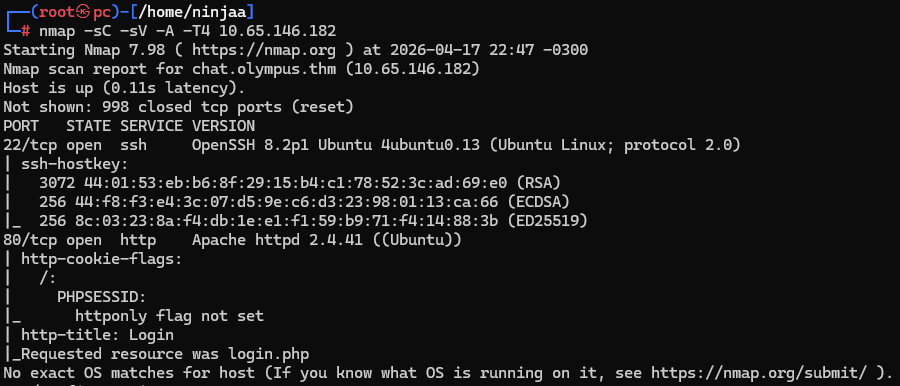

O scan mostrou dois serviços principais:

- **22/tcp (SSH)** → provavelmente útil depois da obtenção de credenciais
- **80/tcp (HTTP)** → principal ponto de entrada inicial

A linha de raciocínio aqui foi simples: com uma superfície pequena, o serviço web se torna o melhor candidato para enumeração mais profunda.

---

# Enumeração Web no Host Principal

Com o HTTP identificado, o próximo passo foi fazer brute force de conteúdo para encontrar diretórios, arquivos e áreas administrativas.

```bash
feroxbuster -u http://olympus.thm -w /usr/share/seclists/Discovery/Web-Content/big.txt -s 200
```

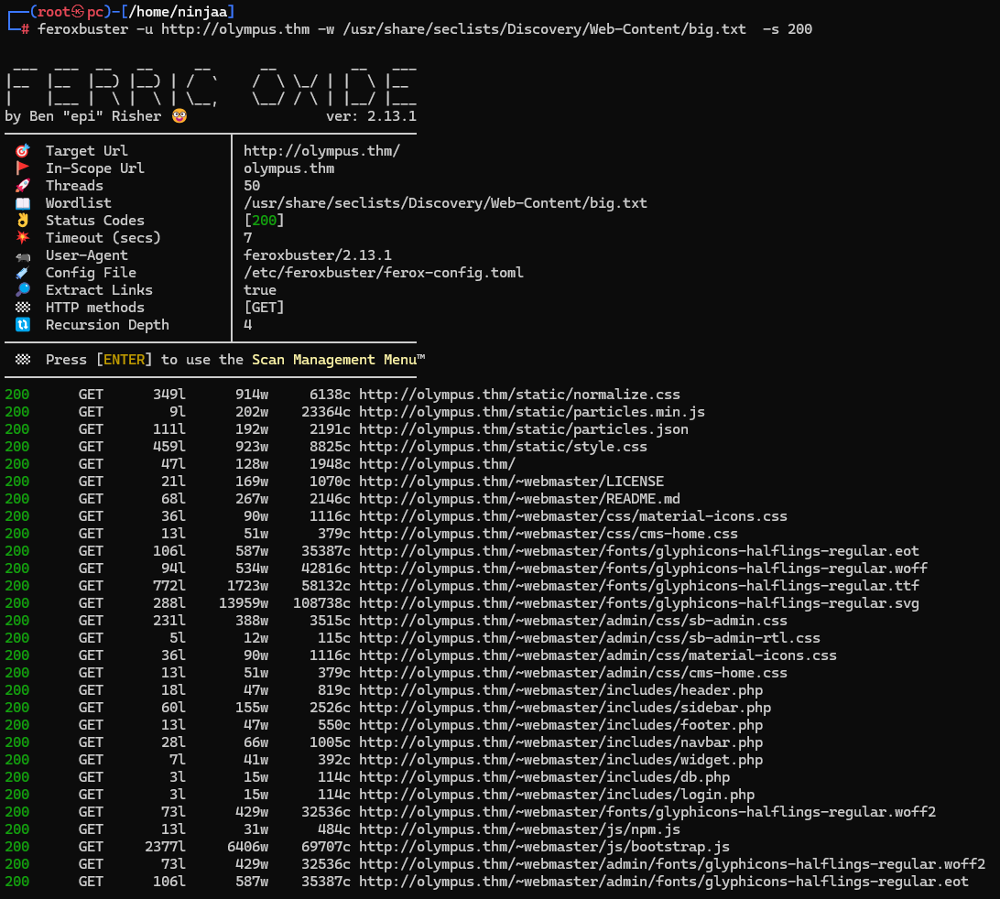

A enumeração revelou vários artefatos interessantes dentro de `~webmaster`, incluindo:

- `category.php`
- `includes/db.php`
- `login.php`
- estruturas administrativas e arquivos PHP expostos

Isso muda a hipótese inicial: em vez de uma página estática simples, existe uma aplicação com backend e provável interação com banco de dados. O arquivo `category.php?cat_id=` chamou atenção porque parâmetros numéricos em páginas dinâmicas frequentemente são bons candidatos a SQL Injection.

---

# SQL Injection em `category.php`

Com o parâmetro `cat_id` identificado, a próxima decisão lógica foi validar se a aplicação era vulnerável a SQLi e, em caso positivo, enumerar o banco.

```bash
sqlmap -u "http://olympus.thm/~webmaster/category.php?cat_id=1" \
-p cat_id -D olympus --tables --batch
```

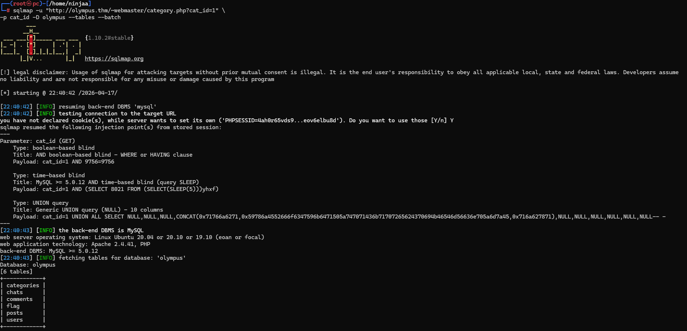

O `sqlmap` confirmou múltiplos vetores de injeção no parâmetro `cat_id` e enumerou as tabelas do banco `olympus`:

- `categories`
- `chats`
- `comments`
- `flag`
- `posts`
- `users`

A partir daqui, a estratégia passou a ser **coletar o máximo de contexto possível** antes de tentar exploração direta. Em CTFs e labs, tabelas como `users`, `chats` e `flag` geralmente entregam credenciais, caminhos ou pistas de pivot.

---

# Coleta de Dados do Banco

## Tabela `users`

O dump da tabela `users` revelou contas importantes da aplicação.

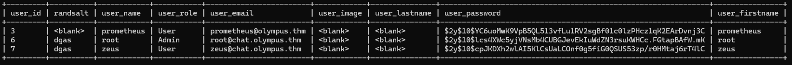

Foi possível identificar, entre outras informações:

- usuário **prometheus**
- usuário **zeus**
- usuário **root**
- hashes bcrypt no campo `user_password`

Esse resultado foi importante por dois motivos:

1. mostrou nomes de usuários válidos para tentativas futuras de login/SSH;
2. indicou que o caminho talvez passasse por reaproveitamento de senha ou crack offline.

## Tabela `chats`

Ao consultar a tabela `chats`, surgiu uma pista ainda mais valiosa.

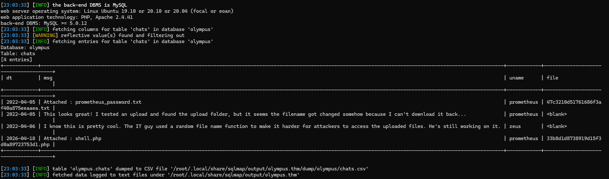

Os registros mostravam mensagens como:

- referência a `prometheus_password.txt`
- menção a um **diretório de upload**
- observação de que o sistema alterava o nome original dos arquivos enviados
- um upload recente de `shell.php`

Essa parte foi decisiva para o raciocínio da exploração. Até aqui, já existiam três hipóteses fortes:

- havia um sistema de chat separado do site principal;
- esse sistema permitia **upload de arquivos**;
- existia chance de conseguir **RCE** se fosse possível descobrir onde os uploads ficavam acessíveis.

---

# Primeira Flag no Banco

Também foi feito dump da tabela `flag`.

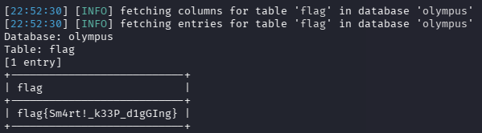

O banco retornou a seguinte flag:

```text
flag{Sm4rt!_k33P_d1gGIng}
```

Além de ser uma flag, a mensagem reforça exatamente o caminho seguido até aqui: ainda havia mais camadas para explorar.

---

# Crack de Credenciais

Com os hashes da tabela `users`, o próximo passo natural foi tentar crack offline.

```bash
john --show hashes.txt
```

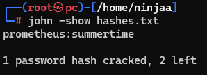

O John revelou a credencial:

```text
prometheus:summertime
```

A linha de raciocínio foi: se existe uma aplicação paralela de chat e o banco expôs usuários reais, essa senha pode ter sido reutilizada em outro ponto do ambiente.

---

# Descoberta do Subdomínio `chat.olympus.thm`

Com a pista da tabela `chats`, foi feita enumeração no subdomínio do chat.

```bash
feroxbuster -u http://chat.olympus.thm -w /usr/share/seclists/Discovery/Web-Content/big.txt -s 200
```

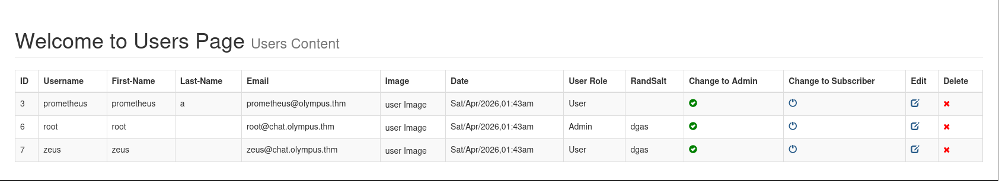

A enumeração mostrou, entre outros pontos:

- a aplicação principal do chat
- diretório `/uploads/`
- recursos estáticos e JavaScript

Ao acessar a interface, foi possível visualizar a tela de login.

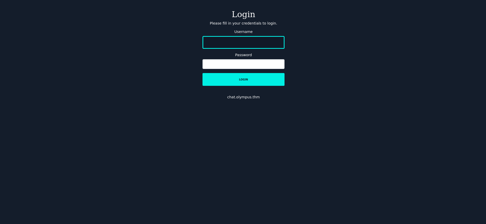

Usando a credencial obtida anteriormente, foi possível autenticar no sistema e acessar as mensagens.

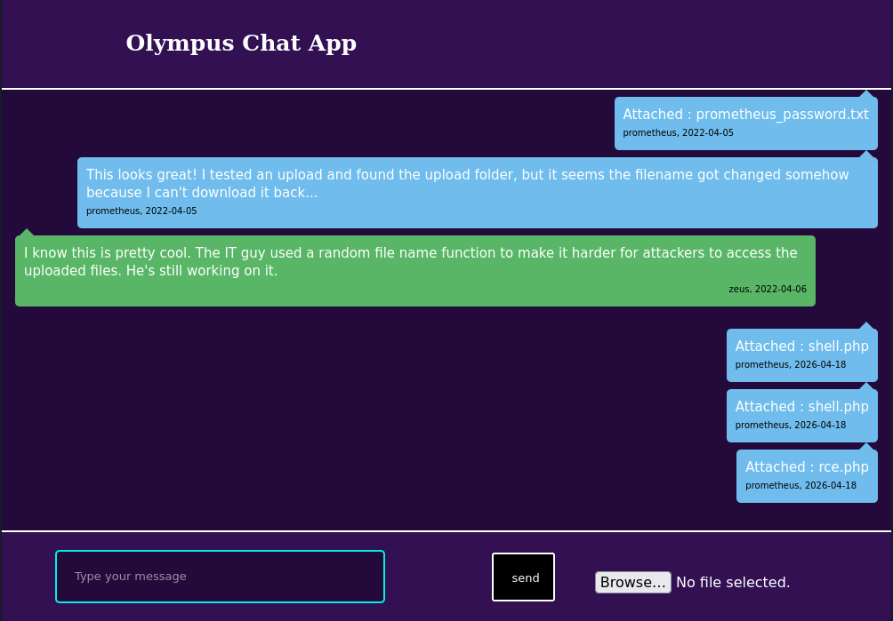

O conteúdo da própria aplicação confirmava as pistas vistas no banco:

- o upload folder realmente existia;
- nomes de arquivos eram randomizados;
- havia anexos recentes com extensões PHP.

---

# Descoberta dos Uploads e Web Shell

A enumeração do diretório de uploads e os nomes aleatórios mostrados no banco/chat permitiram localizar os arquivos enviados.

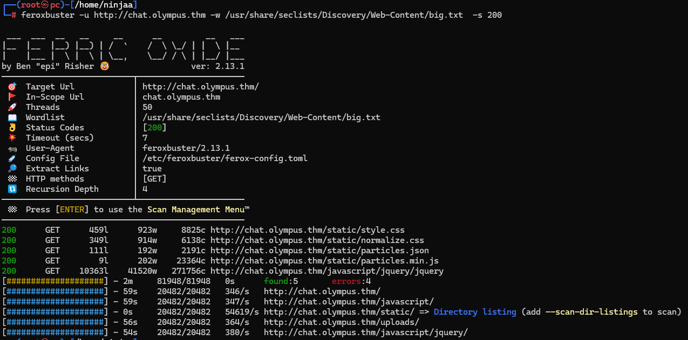

O objetivo aqui foi transformar a funcionalidade de upload em execução de código. Como havia evidência de arquivos `.php` sendo anexados, a hipótese mais promissora era que o servidor estivesse salvando esses arquivos em um local interpretado pelo PHP.

Foi então enviado um payload em PHP para obter uma reverse shell e preparado um listener na máquina atacante.

```bash
nc -vnlp 1337
```

Após acionar o arquivo enviado, foi obtida uma shell como `www-data`.

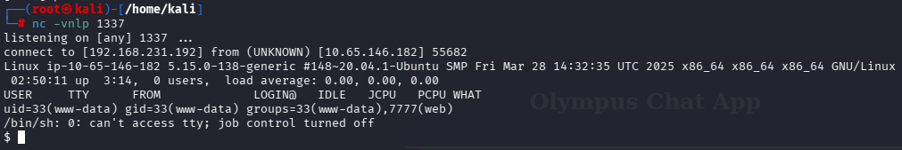

Esse momento é o pivot principal da máquina: o vetor inicial foi web, mas o objetivo agora passa a ser **escalação local**.

---

# Abuso do Binário `cputils`

Durante a enumeração local como `www-data`, foi identificado um binário chamado `cputils`, acessível no contexto do usuário **zeus**. A análise prática mostrou que ele permitia copiar arquivos arbitrários.

A oportunidade explorada foi copiar a chave privada SSH de `zeus`.

```bash
cputils
# source: ./.ssh/id_rsa
# target: id_rsa
```

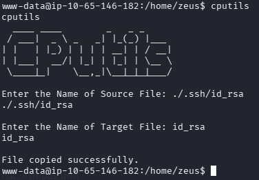

A lógica foi:

1. o serviço web sozinho não entrega uma shell estável;
2. o SSH já tinha sido visto desde o início no Nmap;
3. se fosse possível recuperar uma chave privada, haveria um pivot limpo para acesso persistente.

---

# Crack da Passphrase da Chave SSH

A chave privada recuperada estava protegida por passphrase. Para resolver isso, ela foi convertida para formato compatível com John.

```bash
ssh2john id_rsa > hash
john hash --wordlist=/usr/share/wordlists/rockyou.txt
```

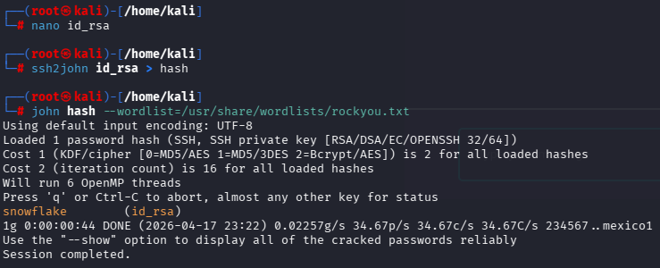

A passphrase encontrada foi:

```text
snowflake
```

Com isso, o próximo passo tornou-se direto: autenticar via SSH como `zeus`.

---

# Acesso como `zeus`

Usando a chave privada e a passphrase crackeada, foi possível obter uma shell estável no host.

```bash
ssh -i id_rsa zeus@olympus.thm
```

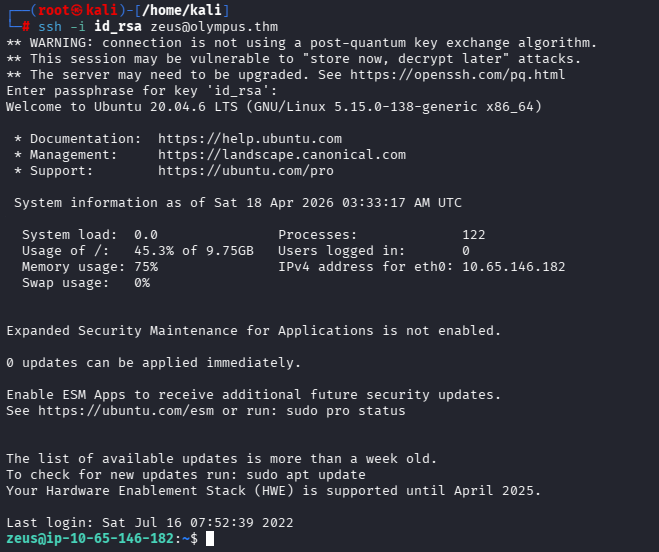

Essa etapa é importante porque muda totalmente a qualidade da enumeração. Em vez de operar a partir de uma web shell frágil, agora era possível investigar o sistema com mais segurança e profundidade.

---

# Enumeração Local e Descoberta do Backdoor

Como `zeus`, a enumeração em `/var/www/html` levou a um diretório com nome aleatório e a um arquivo PHP suspeito.

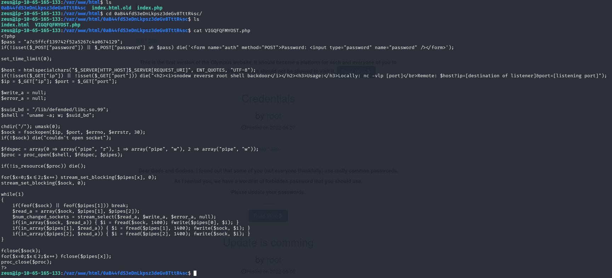

O conteúdo do arquivo mostrava um **backdoor de reverse shell** protegido por senha, com a seguinte característica crítica:

- ele invocava o binário `/lib/defended/libc.so.99`

Além disso, a execução observada no sistema mostrava que esse binário estava funcionando com privilégios elevados.

A linha de raciocínio aqui foi:

- um arquivo PHP escondido com senha sugere mecanismo de manutenção ou acesso clandestino;
- se o backdoor chama um binário fora do padrão em `/lib/defended/`, esse binário merece inspeção imediata;
- se ele estiver com permissões SUID ou comportamento privilegiado, pode ser o caminho de privesc.

---

# Escalação para Root

Ao executar o binário indicado pelo backdoor, foi possível obter contexto privilegiado. O resultado mostrou claramente a transição para **root**.

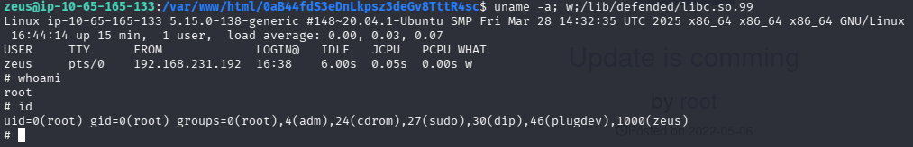

A partir daí, a máquina estava comprometida no nível máximo.

---

# Flag Root

Com privilégios de root, foi possível ler a flag principal deixada no sistema.

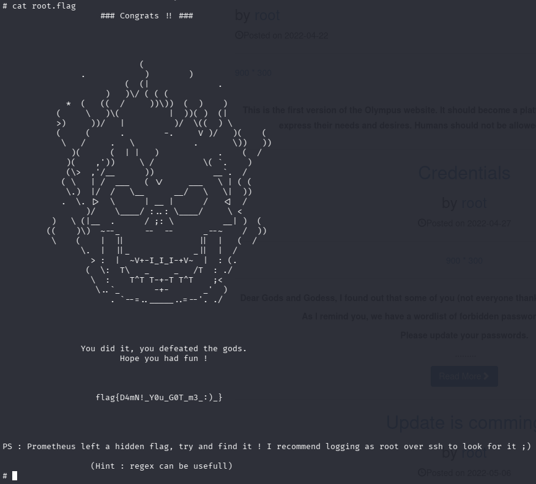

```text
flag{D4mN!_Y0u_GOT_m3.:-)_}
```

A própria mensagem ainda deixava uma pista extra: existia uma flag escondida e o uso de **regex** poderia ajudar a localizá-la.

---

# Bonus Flag

Seguindo a dica, foi feita uma busca por arquivos contendo o padrão `flag{`.

```bash
grep -irl flag{ /
```

O resultado revelou o arquivo bônus:

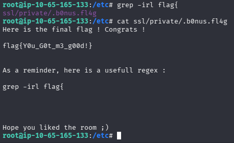

```text
flag{Y0u_G0t_m3_g00d!}
```

---

# Encadeamento da Exploração

O caminho completo da máquina ficou assim:

1. **Nmap** revelou HTTP e SSH  
2. **Feroxbuster** encontrou a área `~webmaster`  
3. `category.php` levou a **SQL Injection**  
4. O **dump do banco** entregou usuários, hashes e pistas sobre o chat  
5. O hash de **prometheus** foi crackeado  
6. A credencial foi reutilizada no **chat.olympus.thm**  
7. O sistema de **upload** foi abusado para ganhar RCE  
8. Como `www-data`, o binário **cputils** permitiu copiar a chave SSH de `zeus`  
9. A passphrase da chave foi crackeada com **John**  
10. O acesso via **SSH** como `zeus` deu uma shell estável  
11. A enumeração local revelou um **backdoor** chamando um binário privilegiado  
12. Esse binário levou à obtenção de **root**  

---

# Vulnerabilidades Identificadas

### SQL Injection
O parâmetro `cat_id` em `category.php` permitia enumeração e exfiltração do banco.

### Exposição de dados sensíveis no banco
Mensagens internas, nomes de arquivos e hashes de senha estavam acessíveis via SQLi.

### Reutilização de credenciais
A senha crackeada foi válida para autenticação no serviço de chat.

### Upload inseguro de arquivos
A aplicação permitia envio de arquivos PHP para um diretório acessível via web.

### Mau uso de binário auxiliar
O `cputils` podia ser abusado para copiar arquivos sensíveis, incluindo chave privada SSH.

### Artefato privilegiado escondido
O backdoor e o binário em `/lib/defended/` abriram o caminho para a escalação final.

---

# Ferramentas Utilizadas

- Nmap  
- Feroxbuster  
- sqlmap  
- John the Ripper  
- Netcat  
- SSH  
- grep  

---

# Principais Aprendizados

- Um parâmetro simples como `cat_id` pode ser suficiente para comprometer toda a aplicação  
- Dumps de banco não servem apenas para extrair usuários; eles também revelam **fluxos internos da aplicação**  
- Mensagens de chat e nomes de arquivos podem entregar o caminho exato para exploração  
- Quando existe SSH aberto, vale sempre pensar em **pivot para uma shell mais estável**  
- Binários “auxiliares” e artefatos fora do padrão costumam esconder o caminho da privesc  
- Dicas deixadas pela própria máquina muitas vezes apontam o próximo passo, mas só fazem sentido quando a enumeração anterior foi bem feita  

---

# Autor
https://github.com/ninjaa-exe
